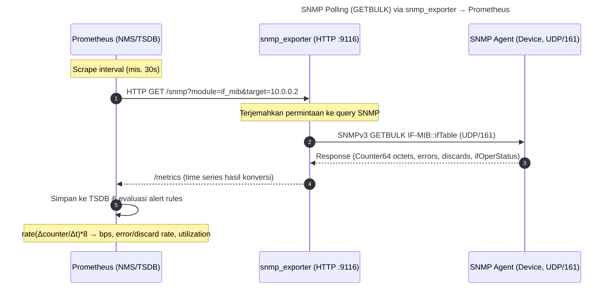
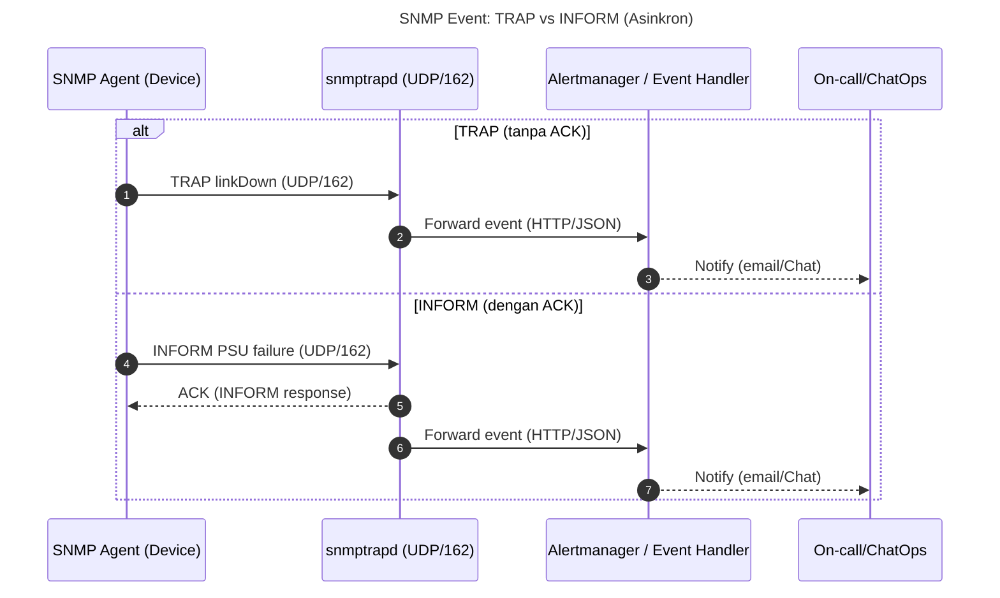
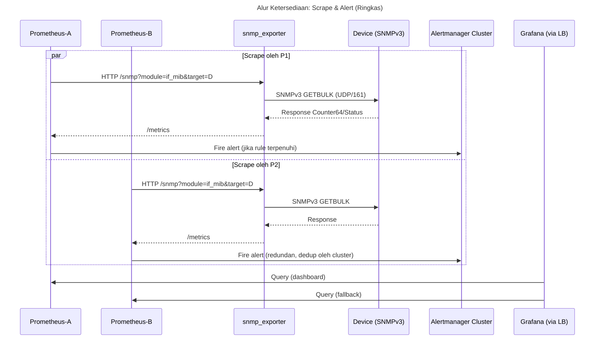

# Handout SNMP Monitoring, Telemetri, dan Observability


## 1) Kerangka Konseptual Singkat
Dalam operasi jaringan, **monitoring** adalah pengawasan indikator kinerja yang sudah ditetapkan (CPU, throughput, loss), **telemetri** adalah data mentah yang dipancarkan sistem (metrics/logs/traces/flows), sedangkan **observability** adalah kemampuan menyimpulkan kondisi internal dari sinyal eksternal (metrics–logs–traces; pada jaringan ditambah **flow records**). Untuk perangkat jaringan, **SNMP** tetap menjadi fondasi telemetri paling luas dukungannya, meski kini dilengkapi model-driven telemetry (gNMI/YANG), flow (NetFlow/IPFIX/sFlow), dan eBPF host-level.

---

## 2) Teori SNMP
**Arsitektur:** model _manager/agent_. **Agent** di perangkat mengekspor objek manajemen via **MIB** (Management Information Base) dengan identitas **OID**; **Manager (NMS)** melakukan **polling** (GET/GETNEXT/GETBULK) dan menerima **TRAP/INFORM** (notifikasi asinkron). Transport standar: **UDP/161** (query) & **UDP/162** (trap).  

**SMI & tipe data:** Counter32/64 (untuk diturunkan menjadi **rate**), Gauge (snapshot), TimeTicks (1/100 detik), OCTET STRING, dsb.  

**Versi & keamanan:**  
- v1/v2c (community string—cleartext; gunakan hanya untuk lab/isolasi).  
- **v3** dengan **USM** (auth: MD5/SHA; priv: DES/AES) & **VACM** (kontrol akses by OID). Mode disarankan: **authPriv**.  

**Operasi esensial:**  
- **GET/GETNEXT/GETBULK** untuk baca (GETBULK efisien menelusuri tabel seperti `ifTable`).  
- **SET** (jarang diaktifkan di produksi).  
- **TRAP** (tanpa ACK) & **INFORM** (dengan ACK, lebih andal).  

**Keterbatasan & mitigasi:**  
- Interval polling: terlalu rapat → beban; terlalu renggang → kehilangan detail. Umum 30–60 dtk; kritis 5–15 dtk dengan seleksi OID.  
- **Counter32** overflow di link cepat → gunakan **Counter64** (`ifHCIn/OutOctets`).  
- Skalabilitas: gunakan polling hierarkis, subset OID, atau kombinasikan dengan telemetry streaming.

---

## 3) Diagram Sequence SNMP

### 3.1 Polling (GETBULK) via snmp_exporter → Prometheus


### 3.2 Notifikasi Asinkron (TRAP vs INFORM)


---

## 4) Topologi Jaringan, Komunikasi, dan Ketersediaan

### 4.1 Topologi Komunikasi End-to-End
```mermaid
flowchart LR
    %% Topologi komunikasi end-to-end
    subgraph Campus_Network[Perangkat Jaringan]
      D1[Router/Switch/Firewall<br/>SNMPv3 Agent]
    end

    subgraph Monitor_VM[Monitor VM / Server]
      E[snmp_exporter<br/>(HTTP :9116)]
      P[Prometheus<br/>(HTTP :9090)]
      G[Grafana<br/>(HTTP :3000)]
      T[snmptrapd<br/>(UDP :162)]
      AM[Alertmanager]
    end

    subgraph Optional_LongTerm[Long-term Storage]
      LT[TSDB/ObjStore<br/>(remote_write)]
    end

    %% Arah komunikasi
    P -- HTTP scrape --> E
    E -- SNMPv3 GET/GETBULK<br/>(UDP :161) --> D1
    D1 -- TRAP/INFORM<br/>(UDP :162) --> T
    T -- Event forward<br/>(HTTP/JSON) --> AM
    P -- Alert (rules) --> AM
    G -- Query (HTTP) --> P
    P -- Remote write --> LT

    %% Keterangan keamanan
    classDef secure fill:#e8f7ff,stroke:#5ab0de,stroke-width:1px;
    class D1,E,P,T,G,AM,LT secure
```

### 4.2 Rancangan Ketersediaan (Availability/HA)
```mermaid
flowchart TB
    %% Rancangan Ketersediaan (Availability/HA)
    subgraph Exporters[Stateless Exporters]
      E1[snmp_exporter-1]
      E2[snmp_exporter-2]
    end

    subgraph Devices[Devices (SNMPv3)]
      D1[Site-A Devices]
      D2[Site-B Devices]
    end

    subgraph PromCluster[Prometheus Layer]
      direction TB
      P1[Prometheus-A]
      P2[Prometheus-B]
      note1[<small>Scrape set identik<br/>Anti SPOF scrape</small>]
    end

    subgraph Storage[Long-term & HA Alerting]
      VM[VictoriaMetrics/Thanos<br/>(remote_write)]
      AMC[Alertmanager Cluster]
    end

    subgraph Viz[Visualization]
      GLB[(LB)]
      G1[Grafana-1]
      G2[Grafana-2]
    end

    %% Edges
    D1 -- UDP/161 --> E1
    D2 -- UDP/161 --> E2
    E1 -- HTTP :9116 --> P1
    E1 -- HTTP :9116 --> P2
    E2 -- HTTP :9116 --> P1
    E2 -- HTTP :9116 --> P2

    P1 -- remote_write --> VM
    P2 -- remote_write --> VM
    P1 --> AMC
    P2 --> AMC

    GLB --- G1
    GLB --- G2
    G1 --> P1
    G1 --> P2
    G2 --> P1
    G2 --> P2

    %% Trap path (opsional)
    T1[snmptrapd-1]
    T2[snmptrapd-2]
    D1 -- TRAP/INFORM :162 --> T1
    D2 -- TRAP/INFORM :162 --> T2
    T1 --> AMC
    T2 --> AMC

    %% Styles
    classDef ha fill:#f4fff0,stroke:#4aa84a,stroke-width:1px;
    class E1,E2,P1,P2,AMC,G1,G2,GLB,VM,T1,T2 ha
```

---

## 5) Praktikum Terstruktur (Langkah-Langkah)

### 5.1 Prasyarat & Topologi Lab
- **VM-1 (monitor):** Prometheus + Grafana + snmp_exporter + (opsional) snmptrapd.  
- **VM-2 (agent):** Ubuntu + **snmpd** (Net-SNMP) bertindak sebagai perangkat.  
- Mode jaringan: NAT/Host-Only; pastikan **ping antar-VM** lancar.  
- Buka port: UDP/161–162, TCP/9090–3000–9116.

### 5.2 Konfigurasi SNMPv3 (Agent/VM-2)
```bash
sudo apt update && sudo apt -y install snmp snmpd
sudo net-snmp-config --create-snmpv3-user -ro -a SHA -A 'AuthPassw0rd' -x AES -X 'PrivPassw0rd' snmpv3lab
sudo systemctl restart snmpd && sudo systemctl enable snmpd
# Uji dari VM-1:
snmpwalk -v3 -l authPriv -u snmpv3lab -a SHA -A 'AuthPassw0rd' -x AES -X 'PrivPassw0rd' <IP_agent> sysUpTime.0
snmpwalk -v3 -l authPriv -u snmpv3lab -a SHA -A 'AuthPassw0rd' -x AES -X 'PrivPassw0rd' <IP_agent> IF-MIB::ifTable
```

### 5.3 Menjalankan snmp_exporter (Monitor/VM-1)
1) Unduh rilis snmp_exporter (biner Linux), siapkan `snmp.yml` (modul **if_mib**)—gunakan contoh bawaan untuk awal.  
2) Jalankan:
```bash
./snmp_exporter --config.file=snmp.yml --web.listen-address=:9116
# Cek: http://localhost:9116/metrics
```

### 5.4 Konfigurasi Prometheus (Monitor/VM-1)
```yaml
# /etc/prometheus/prometheus.yml
global:
  scrape_interval: 30s

scrape_configs:
- job_name: 'snmp'
  static_configs:
  - targets: ['<IP_agent>']       # VM-2
  metrics_path: /snmp
  params:
    module: [if_mib]              # sesuai snmp.yml
  relabel_configs:
  - source_labels: [__address__]
    target_label: __param_target
  - source_labels: [__param_target]
    target_label: instance
  - target_label: __address__
    replacement: 'localhost:9116'
```

### 5.5 Dashboard di Grafana
- Tambah **Prometheus** sebagai data source (`http://localhost:9090`).  
- Buat panel inti:
  - **Throughput RX/TX (bps)**  
    ```promql
    rate(ifHCInOctets[5m])  * 8   # RX
    rate(ifHCOutOctets[5m]) * 8   # TX
    ```
  - **Error/Discard rate**  
    ```promql
    rate(ifInErrors[5m]) + rate(ifOutErrors[5m])
    rate(ifInDiscards[5m]) + rate(ifOutDiscards[5m])
    ```
  - **Uptime (menit)**  
    ```promql
    sysUpTime/6000
    ```
  - Gunakan label `{{instance}} {{ifName}}` untuk legend yang jelas.

### 5.6 Alert Dasar + Runbook
- **Target DOWN (SNMP):**
  ```promql
  up{job="snmp"} == 0
  ```
  *for: 2m*, label `severity: page`.  
- **Error tinggi per antarmuka** (contoh):
  ```promql
  (rate(ifInErrors[5m]) + rate(ifOutErrors[5m])) by (instance, ifName) > 1
  ```

**Runbook ringkas:** cek reachability UDP/161, status `snmpd`, ACL/VACM, `ifOperStatus`, duplex/CRC, kabel/transceiver, dan _recent change_.

### 5.7 TRAP/INFORM Receiver (Opsional)
- Pasang **snmptrapd** (UDP/162) pada VM-1, map ke script/pipeline (mis. kirim ke Alertmanager).  
- Konfigurasikan agent mengirim **INFORM** (lebih andal dari TRAP).  
- Uji: putuskan link virtual / turunkan interface untuk memicu **linkDown**.

### 5.8 Ketersediaan Pipeline (Monitor the Monitoring)
Pantau metrik _internal_:
- **Scrape Health:** `up{job="snmp"}` rasio; `scrape_duration_seconds` (p95) agar tidak melewati `scrape_interval`.  
- **Exporter Health:** `snmp_scrape_duration_seconds`, `scrape_samples_post_metric_relabeling`.  
- **Prometheus HA:** pertimbangkan **remote_write** ke TSDB eksternal, Prometheus kedua untuk _shadow scrape_, dan **Alertmanager cluster**.

---

## 6) Penutup
SNMP menyediakan kerangka ilmiah yang jelas (MIB/SMI/OID, model data terstruktur) dan jejak praktik yang panjang di perangkat jaringan. Dengan **SNMPv3 authPriv**, **Counter64**, dan desain polling yang hemat, kita dapat membangun **time-series** yang kuat untuk **observability**. Diagram **sequence** menegaskan dua pola fundamental—**pull** untuk tren dan **push** untuk notifikasi—sementara **topologi** memperlihatkan jalur komunikasi & titik **ketersediaan** yang perlu digandakan. Hasilnya: pipeline yang bukan hanya melihat gejala, tetapi juga **mengisolasi akar** dan **mengarahkan tindakan** melalui _runbook_ yang rapi.

---

## Lampiran – Sequence HA: Scrape & Alert

