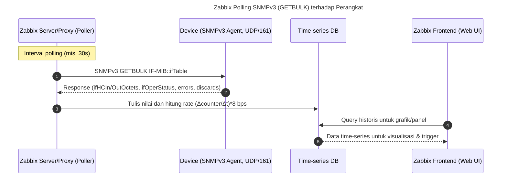
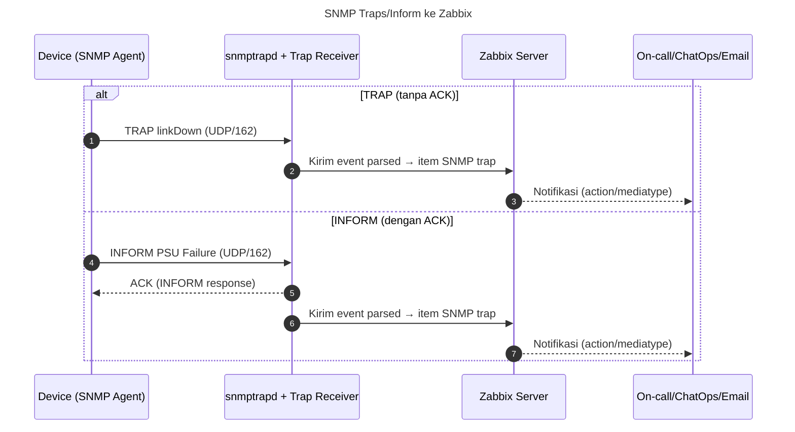
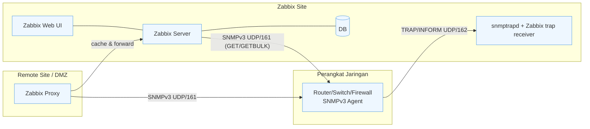
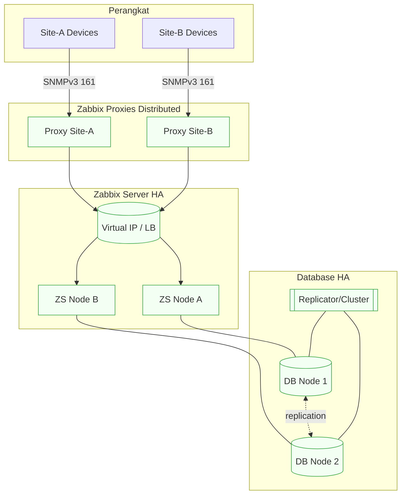
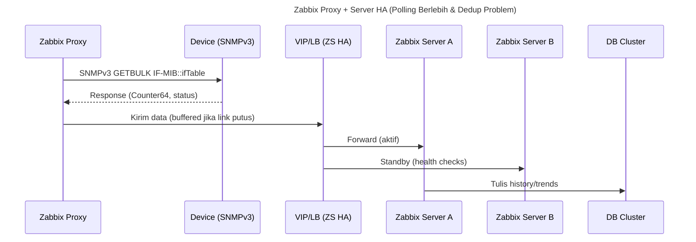
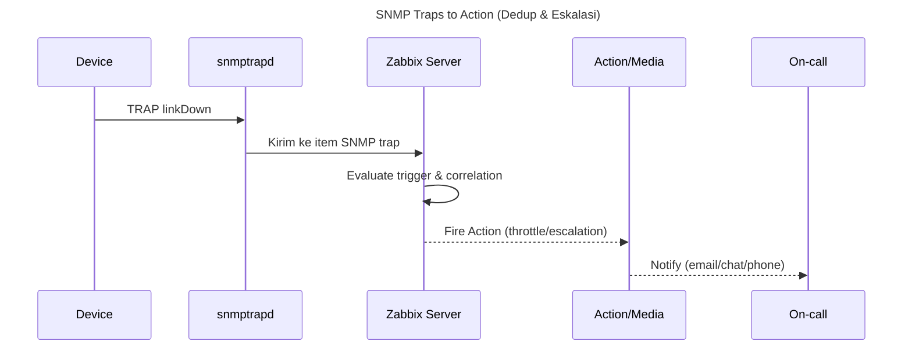

# Handout — SNMP Monitoring & Observability dengan **Zabbix**
---

## 1) Kerangka Konseptual Singkat
Dalam operasi jaringan, **monitoring** mengawasi indikator kinerja yang ditetapkan (CPU, throughput, loss), **telemetri** adalah data mentah yang dipancarkan sistem (metrics/logs/traces/flows), dan **observability** adalah kemampuan menyimpulkan kondisi internal dari sinyal eksternal tersebut. Pada perangkat jaringan, **SNMP** tetap menjadi fondasi telemetri karena dukungan vendor yang luas. **Zabbix** menyediakan platform terpadu untuk _discovery_, _polling_, _traps_, _trigger/alert_, _visualisasi_, dan _distributed monitoring_ (Proxy) tanpa perlu merakit banyak komponen.

---

## 2) Teori SNMP (Ringkas & Operasional)
**Model:** _manager/agent_. **Agent** mengekspor objek dalam **MIB** (Management Information Base) via **OID**; **Manager/NMS** (di sini Zabbix Server/Proxy) melakukan **polling** (GET/GETNEXT/GETBULK) dan menerima **TRAP/INFORM**.  
**Transport:** UDP/161 (query), UDP/162 (trap).  
**SMI & tipe data:** Counter32/64 (turunkan jadi **rate**), Gauge (snapshot), TimeTicks (1/100 detik).  
**Versi & keamanan:**  
- v1/v2c (community string — gunakan hanya pada lab/segmen terisolasi).  
- **v3** (**USM**: auth MD5/SHA; priv DES/AES) + **VACM** (kontrol akses per OID). **Rekomendasi:** **authPriv**.  
**Operasi penting:** **GETBULK** untuk tabel besar (IF-MIB), **INFORM** untuk notifikasi ber-ACK.  
**Praktik:** pilih **Counter64** (ifHCIn/OutOctets) untuk link cepat; atur interval polling 30–60 detik (kritis bisa 10–15 detik dengan subset OID).

---

## 3) Arsitektur Zabbix (Server/Proxy/Agent/Web/DB)
- **Zabbix Server**: otak monitoring; menjalankan _pollers_, _discoverers_, _escenarios_, _trigger evaluation_.  
- **Zabbix Frontend (Web UI)**: administrasi & visualisasi.  
- **Database**: PostgreSQL/MySQL/MariaDB untuk konfigurasi & historis.  
- **Zabbix Proxy (opsional)**: _distributed monitoring_; menyimpan buffer saat link ke Server terputus.  
- **Zabbix Agent/Agent2**: metrik host OS/aplikasi. Untuk perangkat jaringan, gunakan **SNMP** interface pada host.  
- **SNMP traps**: `snmptrapd` → _trap receiver_ Zabbix → item tipe **SNMP trap** di template.

**Keunggulan didaktik:** _template_ bawaan (Low-Level Discovery untuk antarmuka), wizard host, trigger & graf otomat, _macro_ untuk kredensial SNMPv3.

---

## 4) Diagram Mermaid

### 4.1 Sequence — Polling SNMPv3 via Zabbix


### 4.2 Sequence — SNMP Event: TRAP vs INFORM ke Zabbix


### 4.3 Flowchart — Topologi Komunikasi Zabbix + SNMP


### 4.4 Flowchart — Rancangan Ketersediaan (HA) dengan Zabbix


---

## 5) Praktikum: Zabbix + SNMPv3 + Traps (Ubuntu 22.04)

### 5.1 Persiapan
- **VM-1 (Zabbix Server + Web + DB)**: satu VM cukup untuk lab.  
- **VM-2 (Device/Agent SNMPv3)**: Ubuntu dengan `snmpd` sebagai perangkat uji.  
- (Opsional) **VM-3 (Zabbix Proxy)** untuk simulasi remote site.  
- Pastikan antar-VM saling ping. Buka port: UDP/161–162, TCP/10051 (Zabbix server), TCP/80/443 (Web).

### 5.2 Instalasi Zabbix (ringkas, skenario paket repo)
> Gunakan repo resmi Zabbix untuk Ubuntu LTS. Berikut _outline_ tahapan umum (tanpa mengikat versi):
1. Tambahkan repo Zabbix, install paket **server**, **frontend**, **DB client**, **agent2**.  
2. Buat DB dan user (PostgreSQL/MySQL), import skema dari paket `zabbix-sql-scripts`.  
3. Konfigurasi `/etc/zabbix/zabbix_server.conf` (DB host, user, pass).  
4. Start & enable: `zabbix-server`, `zabbix-agent2`, web server (`apache2`/`nginx`), DB.  
5. Akses Web UI → wizard inisialisasi → set _timezone_, kredensial admin.

> Untuk lab cepat: gunakan image Zabbix all-in-one atau kontainer resmi.

### 5.3 Konfigurasi SNMPv3 pada VM-2 (perangkat uji)
```bash
sudo apt update && sudo apt -y install snmp snmpd
sudo net-snmp-config --create-snmpv3-user -ro -a SHA -A 'AuthPassw0rd' -x AES -X 'PrivPassw0rd' snmpv3lab
sudo systemctl restart snmpd && sudo systemctl enable snmpd
# Uji dari Zabbix Server:
snmpwalk -v3 -l authPriv -u snmpv3lab -a SHA -A 'AuthPassw0rd' -x AES -X 'PrivPassw0rd' <IP_VM2> IF-MIB::ifTable
```

### 5.4 Tambahkan Host SNMP di Zabbix
1. **Configuration → Hosts → Create host**.  
2. **Host name** bebas, **Interfaces → Add → SNMP**: isi IP VM-2.  
3. **SNMP**: pilih **SNMPv3**, isi _Security name_, _auth protocol_ (SHA), _auth pass_, _priv protocol_ (AES), _priv pass_, _context_ bila perlu.  
4. **Templates**: tautkan template bawaan untuk perangkat SNMP, misalnya:  
   - *Template Net Network Generic*  
   - *Template Module Interfaces SNMP* (LLD antarmuka)  
   (Nama template dapat sedikit bervariasi per versi; gunakan yang mencakup IF-MIB & LLD.)  
5. **Add** → pastikan status menjadi **Enabled** dan data mulai masuk.

### 5.5 Low-Level Discovery (LLD) Antarmuka
- Template _Interfaces SNMP_ secara otomatis menemukan antarmuka dan membuat item: `In/Out Octets (64-bit)`, `Errors/Discards`, `Oper/Admin status`, dll.  
- Zabbix menerapkan **preprocessing** untuk menghitung per-detik dan menampilkan **bps**. Jika perlu, tambahkan *Calculated item* untuk bps:  
  - Rumus: `(last("ifHCInOctets")-prev("ifHCInOctets"))*8 / (now()-prevtime("ifHCInOctets"))` (atau gunakan preprocessing built-in pada template).

### 5.6 Grafik & Dasbor
- **Monitoring → Latest data**: pilih host → lihat item antarmuka.  
- **Dashboards**: buat widget _Graph_ untuk throughput RX/TX, _SingleStat_ untuk status interface, dan _Problem_ widget untuk trigger aktif.

### 5.7 Triggers (Alert)
Contoh _trigger expressions_ (bisa berasal dari template atau custom):
- **Interface down (operStatus=down)** — tingkat *High*.  
- **High errors/discards** selama 5 menit — tingkat *Warning/High*:  
  - Gunakan item `ifInErrors`, `ifOutErrors`, `ifInDiscards`, `ifOutDiscards` hasil *rate*.  
- **Utilization > 85%** di jendela 10 menit — *Warning*.  
Tambahkan **Action** untuk mengirim notifikasi (email/ChatOps) dengan _maintenance windows_ agar tidak bising saat planned change.

### 5.8 Integrasi SNMP Traps ke Zabbix
1. Instal `snmptrapd` dan paket integrasi traps Zabbix (paket distro umumnya menyediakan `zabbix-snmptraps`).  
2. Konfigurasi `snmptrapd.conf` untuk meneruskan ke skrip penerima Zabbix (mis. `zabbix_trap_receiver.pl`).  
3. Pastikan layanan *trap receiver* berjalan dan Zabbix Server membaca folder _snmptraps_ (direktori log/fifo sesuai paket).  
4. Tambahkan item tipe **SNMP trap** pada host/template untuk pola pesan yang diharapkan (mis. `linkDown`, `authenticationFailure`).  
5. Uji dengan memutus antarmuka VM-2 → pastikan event muncul sebagai _Problem_ tanpa menunggu siklus polling.

### 5.9 Zabbix Proxy (Opsional, disarankan untuk skala/remote)
- Deploy **Zabbix Proxy** di site remote/DMZ.  
- Proxy melakukan polling SNMP lokal dan mengirim ke Server; menyimpan buffer saat link putus.  
- Alokasikan **history storage** & **offline buffer** sesuai kebutuhan site. Tambahkan host di Proxy agar traffic manajemen tidak menyeberangi WAN.

### 5.10 Ketersediaan (Availability/HA) Ringkas
- **Server HA**: gunakan *native HA* (versi modern) atau _cluster manager_ + VIP/LB.  
- **DB HA**: replikasi (PostgreSQL streaming/Patroni, dsb.).  
- **Proxy**: menurunkan risiko data loss di remote site.  
- **SLO jaringan**: tentukan kriteria uptime/loss/latency; sesuaikan _trigger severity_ & _escalation_.

---

## 6) Runbook Singkat (Problem → Diagnose → Resolve)
1. **Problem:** “Interface Gi0/1 High Errors”.  
2. **Diagnose:** verifikasi reachability device; cek _Latest data_ item errors/discards; lihat grafik periode sama; korelasi dengan *traps* (mis. flap).  
3. **Resolve:** cek fiber/copper, transceiver, duplex mismatch, loop; koordinasi dengan tim infrastruktur.  
4. **Post-incident:** tandai _Acknowledgement_ di Zabbix, tambahkan _root cause_ di _Problem update_, dan lakukan _trigger threshold tuning_ bila perlu.

---

## 7) Lampiran: Kueri, Item, & Ekspresi
- **Perhitungan bps (konsep):** `bps = ΔOctets * 8 / Δt` (pakai Counter64).  
- **Utilization (konsep):** `bps / kapasitas_link`.  
- **Trigger contoh:**  
  - Utilization > 85% selama 10 menit.  
  - Discard rate > 0.5% selama 5 menit.  
  - OperStatus berubah dari *up* ke *down* (segera).

---

## 8) Diagram Tambahan (HA Scrape & Traps)
### 8.1 Sequence — HA Scrape via Proxy + Server HA


### 8.2 Sequence — Traps Dedup & Action


---

## 9) Penutup
Dengan **Zabbix**, implementasi monitoring berbasis **SNMP** menjadi lebih sederhana: _template_ siap pakai, _LLD_ otomatis, integrasi **traps**, _action_ terkelola, serta **Proxy** untuk _distributed monitoring_. Dikombinasikan dengan praktik **SNMPv3 authPriv**, pemilihan **Counter64**, dan desain interval yang efisien, pipeline ini mendukung kebutuhan kuliah maupun operasi jaringan kecil–menengah, sekaligus siap diekstensikan ke HA/remote site saat skala bertambah.
