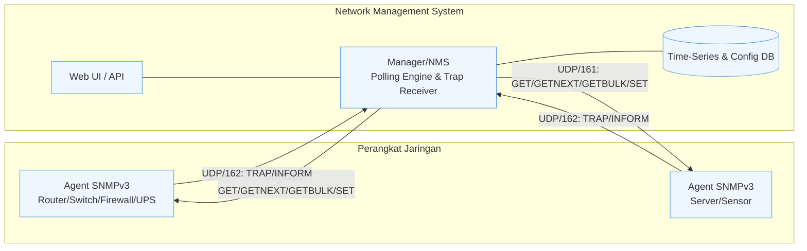
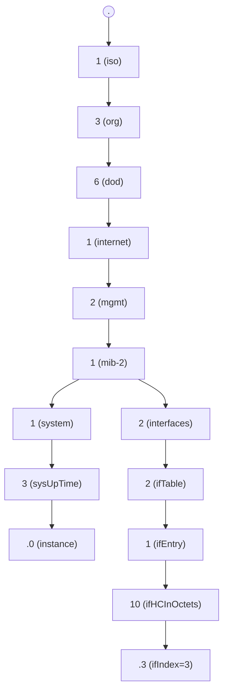
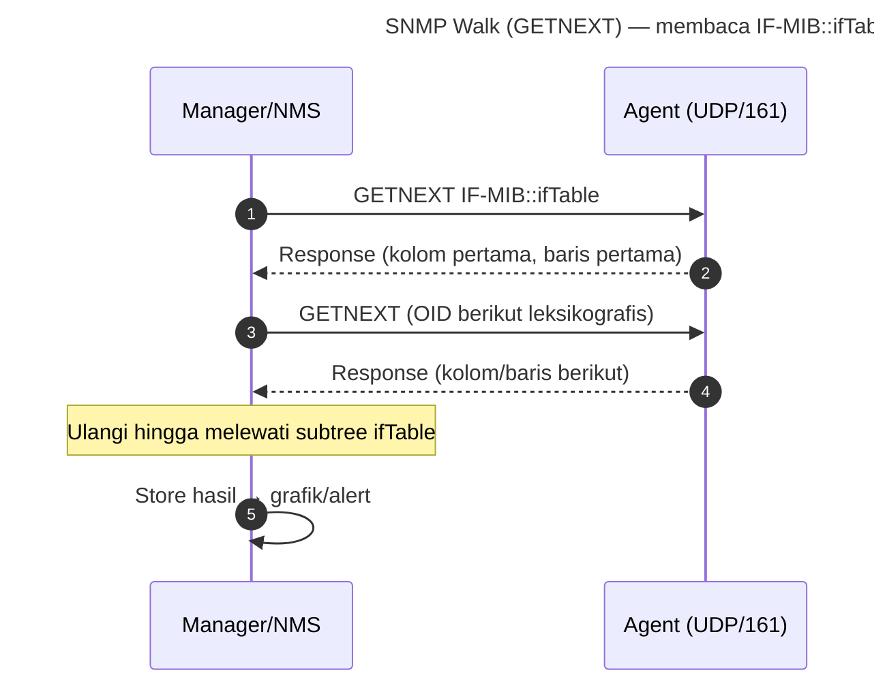
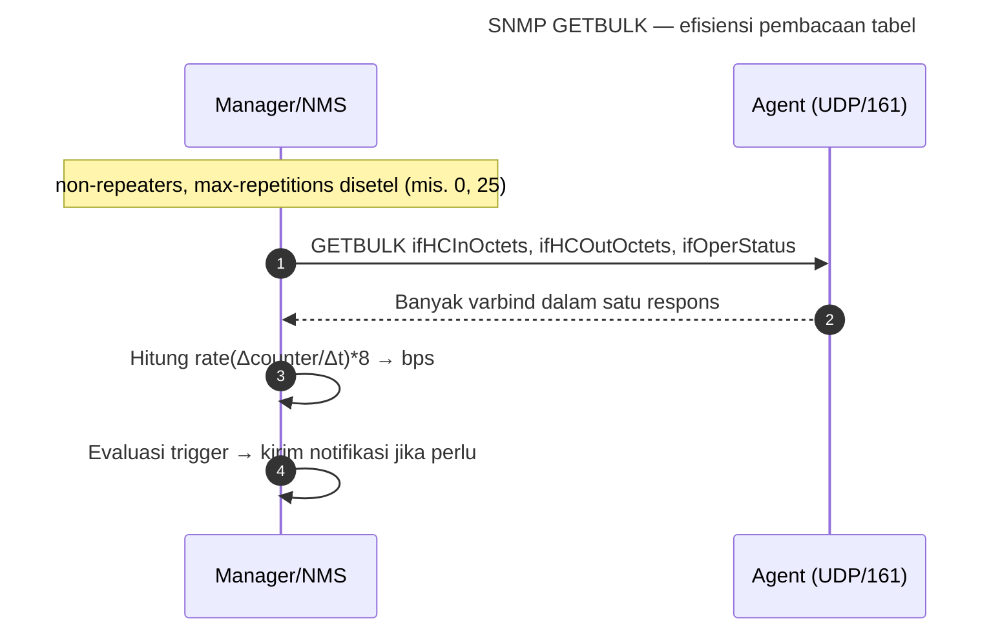
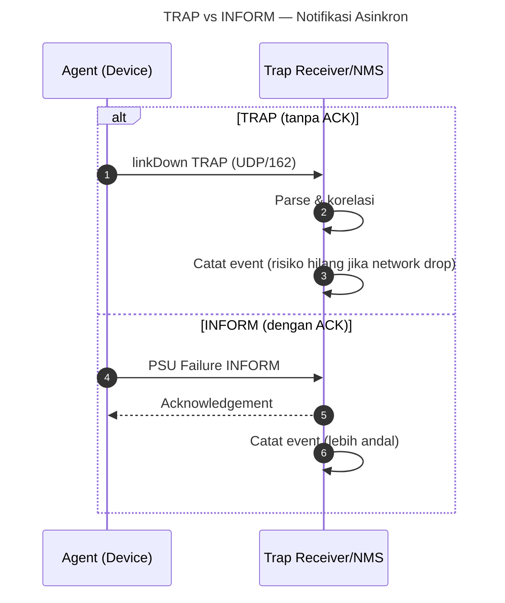
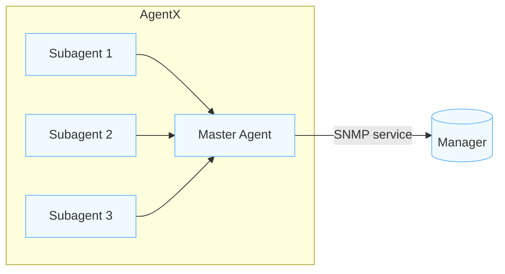
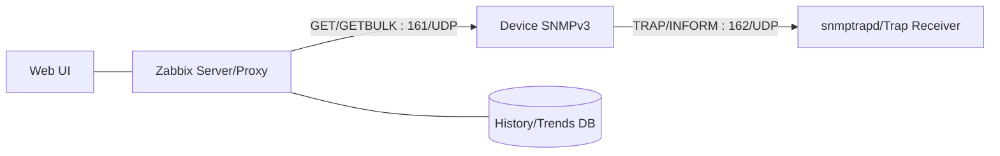

# Dasar Teori SNMP


---

## 1. Pengantar & Motivasi
Jaringan modern—kampus, enterprise, hingga operator—mengoperasikan ratusan hingga puluhan ribu perangkat dengan heterogenitas tinggi. Tanpa standar manajemen, setiap vendor akan memaksakan antarmuka proprietary untuk membaca status dan mengonfigurasi perangkat. SNMP hadir sebagai **bahasa bersama** yang sederhana, efisien, dan cukup terstruktur untuk memantau keadaan perangkat serta mendapatkan notifikasi peristiwa. Walaupun kritik terhadap SNMP mencakup keamanan awal (v1/v2c) dan overhead polling, dua hal ini dapat dimitigasi dengan **SNMPv3** (authPriv), pemilihan OID yang tepat, interval yang moderat, dan kombinasi dengan mekanisme event semisal TRAP/INFORM.

**Tujuan pembelajaran:**  
1) Memahami model arsitektur SNMP dan relasi Manager–Agent.  
2) Memahami MIB/SMI/OID, termasuk scalar, tabel, indeks, dan **Counter64**.  
3) Menjelaskan operasi inti (GET/GETNEXT/GETBULK/SET) serta perbedaan TRAP vs INFORM.  
4) Memahami keamanan SNMPv3 (USM/VACM), *timeliness*, *engineID*, dan pengelolaan kredensial.  
5) Menghitung laju dari counter dan menerapkan pada panel/alert.  
6) Menilai batasan, dampak performa, dan pola skalabilitas pada skenario nyata.  

---

## 2. Model Arsitektur SNMP
Secara konseptual, SNMP menerapkan **paradigma manager/agent**. *Agent* adalah proses yang berjalan pada perangkat untuk mengekspor objek manajemen. *Manager* (kadang disebut NMS — Network Management System) adalah aplikasi pusat yang mengumpulkan data (polling) dan/atau menerima notifikasi (TRAP/INFORM) dari banyak agent.

- **Agent**: membaca data dari kernel/OS/ASIC/perangkat keras; mengeksposnya mengikuti skema **MIB**.  
- **Manager**: melakukan *GET/GETNEXT/GETBULK/SET* ke agent di **UDP/161**; menerima *TRAP/INFORM* di **UDP/162**; melakukan evaluasi *trigger* dan penyimpanan historis.  
- **MIB** (Management Information Base): kamus skema objek; setiap objek diidentifikasi oleh **OID** (Object Identifier) global unik.  
- **SMI** (Structure of Management Information): definisi tipe data dan konvensi untuk MIB.  
- **Transport**: paling umum **UDP**, namun juga ada pemetaan ke **TLS/DTLS** dan bahkan **SSH** pada beberapa implementasi modern.

### 2.1 Diagram Arsitektur Tingkat-Tinggi


**Mengapa bukan REST?** Saat SNMP dirancang, REST/HTTP belum menjadi norma; SNMP memprioritaskan kesederhanaan (header kecil, query sederhana), efisiensi (UDP), dan interoperabilitas lintas-vendor.

---

## 3. Representasi Data: MIB, SMI, OID
### 3.1 OID Hierarki
Setiap objek (mis. “jumlah byte masuk antarmuka 3”) memiliki **OID** unik: pohon angka bertitik (`1.3.6.1.2.1.2.2.1.10.3`), sering juga diberi nama simbolik (`IF-MIB::ifInOctets.3`).

- **Pohon inti**: `1` (ISO) → `3` (org) → `6` (dod) → `1` (internet) → `2` (mgmt) → `1` (mib-2) …  
- **Contoh**: `1.3.6.1.2.1.1.3.0` = `SNMPv2-MIB::sysUpTime.0` (scalar; instance `0`).  
- **Tabel**: `IF-MIB::ifTable` berisi baris per-antarmuka; kolom `ifHCInOctets`, `ifHCOutOctets`, `ifOperStatus`, dll. OID instans tabel mengakhiri dengan **index** (mis. `.10.3` artinya kolom ke-10, index `3`).



### 3.2 SMI dan Tipe Data
**SMI** mendefinisikan tipe dasar seperti `INTEGER`, `OCTET STRING`, `OBJECT IDENTIFIER`, dan tipe numerik khusus jaringan: `Counter32`, `Counter64`, `Gauge32`, `TimeTicks`.  
- **Counter32/64**: monoton naik; *wrap-around* saat penuh; untuk menghitung **rate**, ambil selisih `Δcounter / Δt`.  
- **Gauge32**: nilai sesaat (bisa naik/turun), contoh: temperatur.  
- **TimeTicks**: satuan 1/100 detik; `sysUpTime` = waktu sejak boot.  
- **Textual Conventions** (TC): alias semantik untuk tipe dasar (mis. `PhysAddress`, `TruthValue`).

### 3.3 Scalar vs Table
- **Scalar**: satu nilai per perangkat, instans **.0** (contoh: `sysName.0`).  
- **Table**: berbaris dengan kolom; setiap baris memiliki **index** (bisa angka like `ifIndex` atau gabungan seperti MAC/IP). Kolom akses **read-only** atau **read-write**. Beberapa tabel mendukung operasi **RowStatus** untuk membuat/menghapus baris (konfigurasi dinamis).

### 3.4 Modul MIB
Modul MIB didefinisikan dengan makro `MODULE-IDENTITY`, `OBJECT-TYPE`, `NOTIFICATION-TYPE`. Vendor menempatkan MIB enterprise di cabang `1.3.6.1.4.1.<enterpriseNumber>`. Dokumentasi MIB menjelaskan semantik, skala, dan perilaku counter.

---

## 4. Operasi SNMP & PDU
### 4.1 Operasi Dasar
- **GET**: baca satu atau beberapa OID.  
- **GETNEXT**: baca OID berikut secara leksikografis (digunakan untuk *walk*).  
- **GETBULK** (v2c/v3): ambil banyak OID sekaligus; parameter `non-repeaters` dan `max-repetitions` mengontrol laju _bulkwalk_.  
- **SET**: tulis OID (konfigurasi); jarang diaktifkan pada produksi demi keamanan.  
- **TRAP**: notifikasi asinkron tanpa ACK—risiko hilang.  
- **INFORM**: notifikasi asinkron ber-ACK (disarankan bila didukung).

### 4.2 PDU & Pesan
Frame SNMP minimal berisi **versi**, **keamanan** (community v1/v2c atau v3 header), **PDU** (tipe GET/SET/… + varbind list). Untuk **v3**, ada lapisan **msgGlobalData**, **securityParameters** (USM), dan **scopedPDU** (contextEngineID/contextName) yang menentukan ruang nama objek.

### 4.3 Sequence: GET/GETNEXT


### 4.4 Sequence: GETBULK


### 4.5 TRAP vs INFORM


---

## 5. Keamanan SNMPv3: USM & VACM
SNMPv3 memperkenalkan **USM (User-based Security Model)** untuk autentikasi (**auth**) dan privasi (**priv**/enkripsi), serta **VACM (View-based Access Control Model)** untuk pengendalian akses berdasarkan user, group, context, dan *view* OID.

### 5.1 USM (Auth/Priv, Engine & Timeliness)
- **Entity** memiliki **snmpEngineID** unik; menjaga *boots* (`snmpEngineBoots`) dan *time* (`snmpEngineTime`) untuk **anti-replay**.  
- **Auth**: HMAC berbasis **MD5** atau **SHA** (dan pembaruan SHA-2 pada implementasi modern).  
- **Priv**: enkripsi **DES** atau **AES** (128/192/256 tergantung implementasi).  
- **Timeliness**: pesan v3 memiliki *time window*; jika clock terlalu berbeda atau *engineBoots/time* tidak cocok, paket ditolak.  
- **Key localization**: kunci diturunkan per-engineID sehingga tidak valid lintas agent tanpa re-derive.

```mermaid
flowchart LR
    subgraph USM[USM Processing (SNMPv3)]
      U1[Parse msgGlobalData<br/>engineID, boots, time]
      U2[Verify timeliness<br/>(anti-replay)]
      U3[Check auth (HMAC)]
      U4[Decrypt priv (AES/DES)]
      U5[Extract scopedPDU<br/>contextEngineID/contextName]
    end
    U1 --> U2 --> U3 --> U4 --> U5
    classDef usm fill:#fff7e6,stroke:#e0a100,stroke-width:1px;
    class U1,U2,U3,U4,U5 usm
```

### 5.2 VACM (Views & Access)
**VACM** menetapkan siapa mengakses apa: user → group → akses ke **view** (subtree OID) untuk operasi tertentu (read, write, notify) pada **context** tertentu.

```mermaid
flowchart TB
    subgraph VACM[View-based Access Control Model]
      U[User SNMPv3]
      G[Group]
      C[Context (logical MIB space)]
      Vread[View: read-view (subtree OID)]
      Vwrite[View: write-view (subtree OID)]
      Vnotify[View: notify-view (subtree OID)]
    end
    U --> G
    G --> C
    C --> Vread
    C --> Vwrite
    C --> Vnotify
    classDef vacm fill:#e8f7ff,stroke:#5ab0de,stroke-width:1px;
    class U,G,C,Vread,Vwrite,Vnotify vacm
```

**Kebijakan akademis/produksi:**  
- Gunakan **authPriv** (wajib di luar lab).  
- Batasi *view* hanya pada OID yang diperlukan.  
- Nonaktifkan v1/v2c, atau izinkan hanya pada segmen lab/isolasi.  
- Segmentasi jaringan manajemen; ACL ke IP NMS; audit & rotasi kredensial.

---

## 6. Transport & Interoperabilitas
- **UDP** adalah transport default (port 161/162). Efisien, namun tak andal; mitigasi: retry, INFORM untuk notifikasi, pemilihan *timeout/retry* yang wajar.  
- **TLS/DTLS** (RFC Transport Security): menyediakan channel aman tanpa USM; pemetaan operasional berbeda dan adopsi bervariasi.  
- **AgentX (RFC 2741)**: protokol **subagent** yang memungkinkan beberapa modul pengumpul data mendaftarkan subtree OID ke **master agent** di perangkat/host yang sama.



---

## 7. Performa, Skala, & Tuning
### 7.1 Interval Polling & Beban
- Interval pendek (<=15s) meningkatkan detail tetapi membebani agent/jaringan.  
- Interval umum: **30–60 detik**, dengan pengecualian pada interface kritis.  
- **GETBULK** menurunkan overhead; atur `max-repetitions` sesuai ukuran respons MTU.

### 7.2 Counter Wrap & 64-bit
- **Counter32** pada link >100 Mbps dapat *wrap* cepat; gunakan **ifHCIn/OutOctets** (64-bit).  
- Gunakan jendela `rate()` minimal 2–3 kali interval polling untuk stabilitas.

### 7.3 Walk Selektif & LLD
- Hindari *walk* seluruh MIB; fokus pada subtree penting (system, interfaces, IP, TCP).  
- **LLD** (low-level discovery) di NMS modern (Zabbix) memetakan antarmuka/entitas secara otomatis dan membuat item/graf/trigger per antarmuka.

### 7.4 Ketersediaan & HA
- Redundansi **trap receiver** dan **poller**; simpan _buffer_ jika link ke NMS putus (Zabbix Proxy).  
- Monitor **health** NMS (queue, poller busy %, fetch error).

---

## 8. Rekayasa MIB & Praktik Terbaik
### 8.1 RowStatus & Konfigurasi Dinamis
MIB yang mendukung konfigurasi baris menggunakan **RowStatus** (`active(1)`, `createAndGo(4)`, `destroy(6)`) untuk membuat/menghapus entri. Ini kuat namun berisiko; aktifkan **SET** hanya pada lingkungan terkontrol.

### 8.2 Indexing & Instance OID
- **Index tunggal**: `ifIndex` (integer).  
- **Index gabungan**: misal MAC address (`OCTET STRING`), IP (`IpAddress`), atau string. Penyusunan instance OID mengikuti tipe dan panjang.  
- **Context** memisahkan ruang MIB logis (misal VRF yang berbeda) pada agent.

### 8.3 Textual Conventions & Semantik
Gunakan TC untuk memperjelas satuan (kilo/kibi, Celsius), batasan nilai, dan representasi yang konsisten di lintas vendor.

---

## 9. Perhitungan Laju & Utilization dari Counter
### 9.1 Rumus Dasar
Jika `C(t)` adalah counter (mis. `ifHCInOctets`), maka laju (bytes/s) pada interval `[t1, t2]`:
```
rate_bytes = (C(t2) - C(t1)) / (t2 - t1)
```
Selanjutnya **bps** = `rate_bytes * 8`. Untuk **utilization** pada link `B` bps:  
```
util = bps / B
```
Gunakan **Counter64** untuk akurasi; tangani wrap (jika `C(t2) < C(t1)`, tambahkan modulus).

### 9.2 Jitter & Smoothing
- Gunakan jendela rata-rata bergerak (moving average) atau *exponential smoothing* agar panel tidak “goyang”.  
- Samakan interval polling & waktu pengambilan agar tidak bias.

---

## 10. Studi Kasus Ringkas
1) **Link kampus melambat,** panel menunjukkan `utilization` 92% dan `discard` meningkat: indikasi saturasi + buffer overflow. Solusi: kapasitas lebih tinggi, QoS, atau _traffic engineering_.  
2) **Flapping interface**: TRAP `linkDown/linkUp` menerpa berkali-kali; cek fisik (SFP/kabel), power, atau _storm control_.  
3) **Counter tidak masuk akal**: ternyata NMS memakai `ifInOctets` (32-bit) pada link 1G → ganti ke `ifHCInOctets` (64-bit).  
4) **SNMP timeouts**: VACM menolak context; ACL memblokir; atau timeliness gagal (engineTime/boots).

---

## 11. Integrasi dengan Platform Monitoring (Zabbix)
- **Template SNMP** bawaan mencakup *low-level discovery* antarmuka.  
- Masukkan kredensial **SNMPv3 authPriv** via macro; batasi view via VACM.  
- _Trap receiver_ untuk event cepat (linkDown, PSU fail), *actions* untuk notifikasi terkendali.



---

## 12. Kesalahan Umum & Cara Menghindarinya
- Menggunakan v1/v2c di jaringan produksi tanpa segmentasi → migrasi ke **v3 authPriv**.  
- Memakai Counter32 di link cepat → ganti ke **Counter64 (ifHC*)**.  
- Interval polling terlalu pendek untuk ribuan perangkat → tingkatkan interval & gunakan GETBULK.  
- Tidak mengontrol *view* VACM → ekspos berlebihan.  
- Mengabaikan *time sync* → timeliness v3 gagal (gunakan NTP).

---

## 13. Laboratorium Minimal (CLI)
**Agent (Ubuntu):**
```bash
sudo apt update && sudo apt -y install snmp snmpd
sudo net-snmp-config --create-snmpv3-user -ro -a SHA -A 'AuthPassw0rd' -x AES -X 'PrivPassw0rd' snmpv3lab
sudo systemctl restart snmpd && sudo systemctl enable snmpd
```
**Uji dari Manager:**
```bash
# Scalar
snmpget -v3 -l authPriv -u snmpv3lab -a SHA -A 'AuthPassw0rd' -x AES -X 'PrivPassw0rd' <IP> sysUpTime.0

# Walk tabel antarmuka
snmpwalk -v3 -l authPriv -u snmpv3lab -a SHA -A 'AuthPassw0rd' -x AES -X 'PrivPassw0rd' <IP> IF-MIB::ifTable

# GETBULK (bulkwalk)
snmpbulkwalk -v3 -l authPriv -u snmpv3lab -a SHA -A 'AuthPassw0rd' -x AES -X 'PrivPassw0rd' -Cr25 <IP> IF-MIB::ifXTable
```

---

## 14. Tautan Pembelajaran & Referensi
**RFC inti & Arsitektur:**  
- SNMPv1: _RFC 1157_ — https://www.rfc-editor.org/rfc/rfc1157  
- SNMPv2 (Framework): _RFC 1901–1908_ — https://www.rfc-editor.org/rfc/  
- SNMPv3 Framework & MIB: _RFC 3411–3418_ — https://www.rfc-editor.org/rfc/  
- USM HMAC-SHA-2: _RFC 7860_ — https://www.rfc-editor.org/rfc/rfc7860  
- Transport TLS/DTLS: _RFC 5953_ — https://www.rfc-editor.org/rfc/rfc5953  
- AgentX (subagent): _RFC 2741_ — https://www.rfc-editor.org/rfc/rfc2741  

**MIB referensial:**  
- IF-MIB (antarmuka): https://www.iana.org/assignments/iananumbers/iananumbers.xhtml#if-mib  
- SNMPv2-MIB (system): https://www.rfc-editor.org/rfc/rfc3418  

**Toolkit & Dokumentasi:**  
- Net-SNMP: http://www.net-snmp.org/  
- Zabbix Docs (SNMP): https://www.zabbix.com/documentation/  
- LibreNMS: https://docs.librenms.org/  
- Wireshark SNMP: https://wiki.wireshark.org/SNMP  

**Bacaan lanjutan:**  
- “Understanding SNMP MIBs” (IETF/ops)  
- “Designing SNMP Polling Strategies for Scale” (whitepapers komunitas)  
- Buku teks manajemen jaringan yang membahas SMI/MIB/ASN.1

---

## 15. Ringkasan
SNMP adalah standar manajemen jaringan yang masih kokoh: MIB/SMI/OID memberi representasi data yang konsisten, operasi GET/GETNEXT/GETBULK/SET memungkinkan pembacaan & perubahan (terbatas), sedangkan TRAP/INFORM menyediakan jalur event asinkron. SNMPv3 memperbaiki kelemahan keamanan dengan **USM** (authPriv) dan **VACM** untuk kontrol akses berbasis OID. Dalam praktik, gunakan **Counter64**, atur interval polling berimbang, manfaatkan **GETBULK**, batasi view VACM, sinkronkan waktu (NTP), dan integrasikan dengan NMS yang andal seperti **Zabbix**. Diagram-diagram di atas merangkum alur utama: polling deret waktu, notifikasi, dan kontrol akses. Dengan disiplin rekayasa ini, telemetri SNMP menjadi fondasi kuat menuju **observability** jaringan yang terukur, aman, dan skalabel.

---

*Catatan: contoh kredensial pada lab bersifat ilustratif; gunakan kebijakan kata sandi dan rotasi yang sesuai standar keamanan institusi.*
