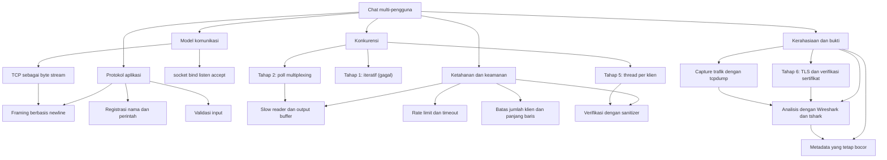
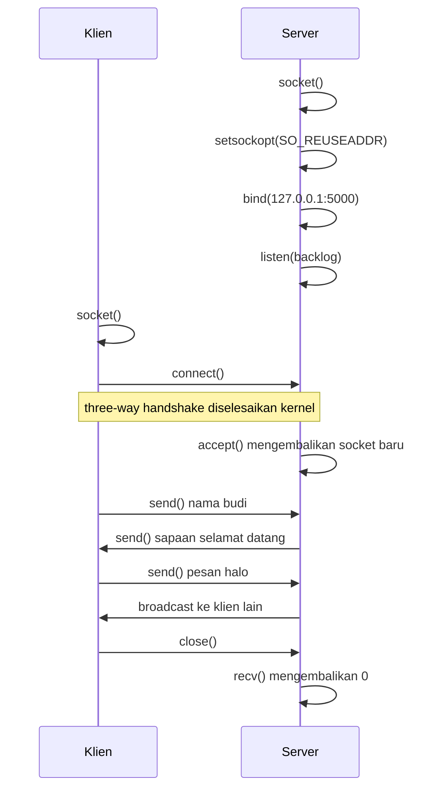
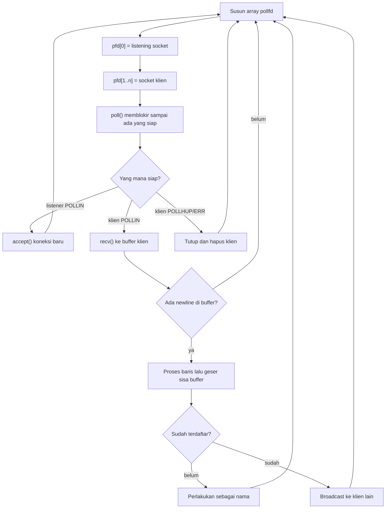
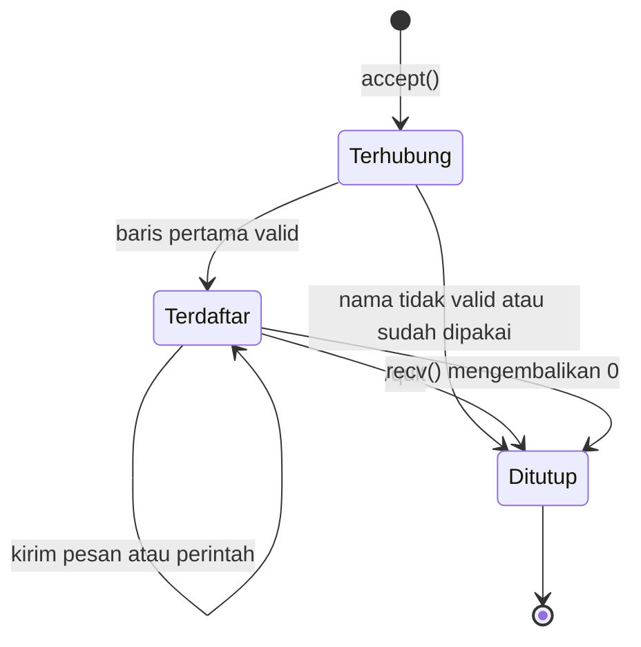
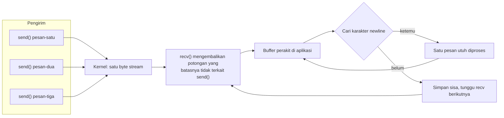
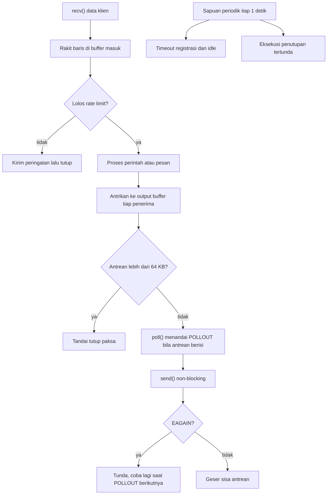
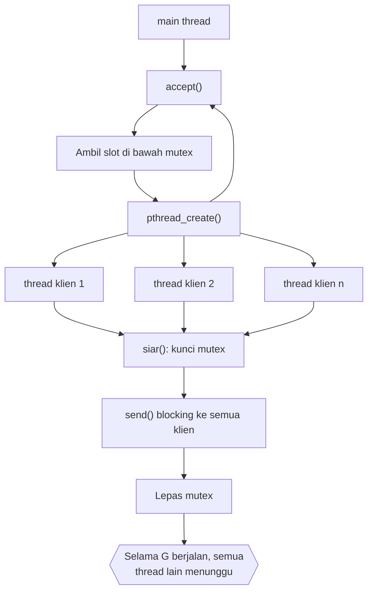
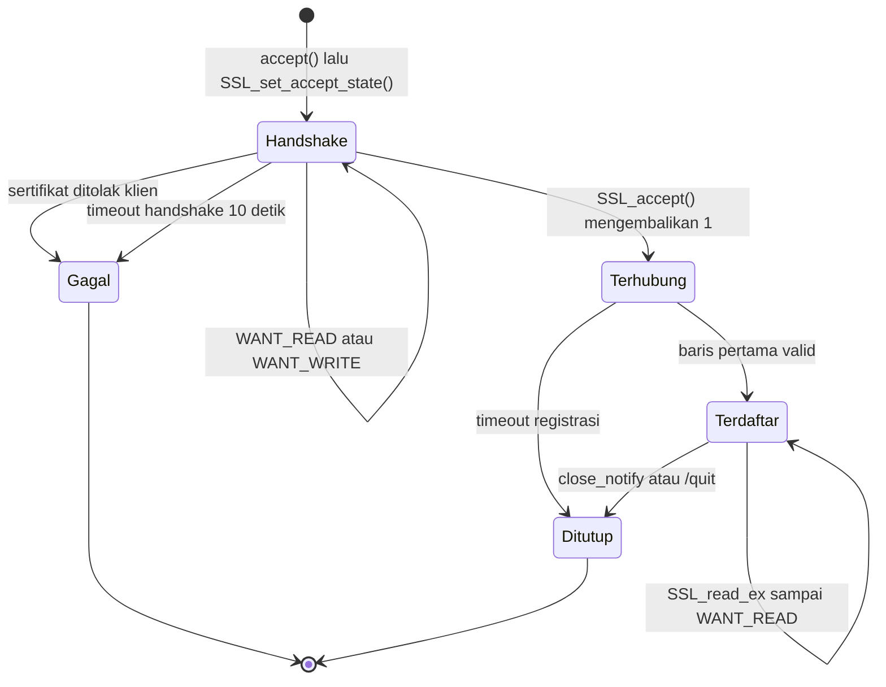
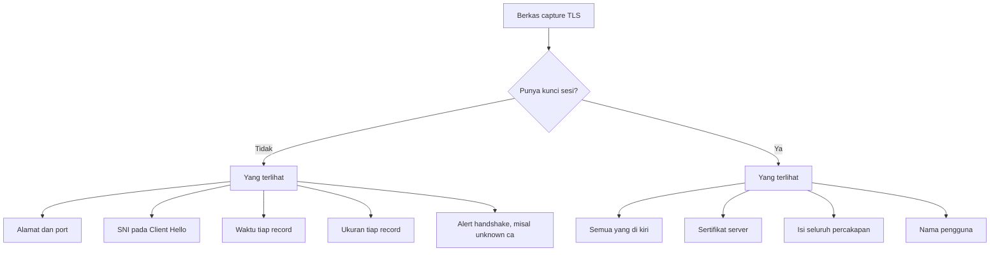

# Tutorial Pemrograman Chat Client-Server Multi-Pengguna dengan Bahasa C

**Program Studi Magister Terapan Forensik Digital dan Keamanan Siber**
Dokumen ajar mandiri · Versi 2.0 · 30 Agustus 2026

| Butir | Keterangan |
|---|---|
| Bentuk | Tutorial praktikum berbasis kode, dapat dipakai sebagai bahan 3 sesi @100 menit |
| Prasyarat | Pemrograman C dasar (pointer, array, struct), Linux command line, konsep TCP/IP |
| Lingkungan uji | Ubuntu 24.04, gcc 13.3.0, glibc 2.39, kernel 6.18, OpenSSL 3.0.13, tcpdump, tshark 4.2.2 |
| Bahasa program | C (C11, POSIX); hanya Tahap 6 memakai OpenSSL |
| Status verifikasi | Seluruh kode dan seluruh angka pada dokumen ini dijalankan pada 2026-08-30 |
| Penomoran sumber | Kode [S1]-[Sn], lokal untuk dokumen ini |

> **Catatan status.** Dokumen ini berdiri sendiri dan belum terikat pada RPS mana pun. Bila kelak diserap menjadi bab buku ajar, penomoran sumber [S1]-[Sn] harus disesuaikan dengan seri [R1]-[Rn] buku, dan bagian Tujuan perlu diturunkan ulang dari Sub-CPMK mata kuliah yang bersangkutan.

> **Catatan penggunaan istilah.** Narasi memakai Bahasa Indonesia. Nama benda teknis dipertahankan dalam Bahasa Inggris, misalnya socket, buffer, non-blocking, backpressure, race condition. Praktisi dan dokumentasi memakai istilah itu, jadi menerjemahkannya justru menambah beban.

---

## Daftar Isi

1. [Tujuan Tutorial](#1-tujuan-tutorial)
2. [Istilah Kunci](#2-istilah-kunci)
3. [Peta Konsep](#3-peta-konsep)
4. [Lingkungan Kerja dan Aturan Main](#4-lingkungan-kerja-dan-aturan-main)
5. [Alur Socket API](#5-alur-socket-api)
6. [Tahap 1: Server Iteratif dan Mengapa Ia Gagal](#6-tahap-1-server-iteratif-dan-mengapa-ia-gagal)
7. [Tahap 2: Multiplexing dengan poll()](#7-tahap-2-multiplexing-dengan-poll)
8. [Tahap 3: TCP Adalah Byte Stream, Bukan Message Stream](#8-tahap-3-tcp-adalah-byte-stream-bukan-message-stream)
9. [Tahap 4: Server yang Tahan Klien Nakal](#9-tahap-4-server-yang-tahan-klien-nakal)
10. [Tahap 5: Model Thread per Klien](#10-tahap-5-model-thread-per-klien)
11. [Evaluasi Keamanan: Apa yang Masih Kurang](#11-evaluasi-keamanan-apa-yang-masih-kurang)
12. [Tahap 6: Menambahkan TLS dengan OpenSSL](#12-tahap-6-menambahkan-tls-dengan-openssl)
13. [Pengamatan Trafik dengan Wireshark dan tshark](#13-pengamatan-trafik-dengan-wireshark-dan-tshark)
14. [Praktikum Terarah](#14-praktikum-terarah)
15. [Latihan Pemahaman](#15-latihan-pemahaman)
16. [Latihan Terapan dan Studi Kasus](#16-latihan-terapan-dan-studi-kasus)
17. [Kunci Jawaban dan Pembahasan](#17-kunci-jawaban-dan-pembahasan)
18. [Hasil Rujukan untuk Dosen dan Asisten](#18-hasil-rujukan-untuk-dosen-dan-asisten)
19. [Batas Keberlakuan Dokumen Ini](#19-batas-keberlakuan-dokumen-ini)
20. [Daftar Sumber](#20-daftar-sumber)

---

## 1. Tujuan Tutorial

Program chat multi-pengguna terlihat sederhana. Satu server, beberapa klien, pesan diteruskan ke semua orang. Justru karena sederhana, program ini memaksa Anda menemui hampir semua masalah dasar pemrograman jaringan. Bagaimana satu proses melayani banyak koneksi sekaligus. Potensi konfigurasi protokol yang tidak kompatibel dengan pesan yang dikirim, client yang "bisa" membuat server "hang", dst.

Sebagian besar tutorial socket di internet berhenti pada "programnya dapat dieksekusi". Server yang jalan tetapi bisa dibekukan"freeze" oleh satu koneksi merupakan salah satu kerentanan yang bisa terjadi. Tutorial ini dirangkai dalam lima tahap. Setiap tahap memperbaiki kelemahan tahap sebelumnya, dan setiap klaim kelemahan dibuktikan dengan hasil analisa pengukuran yang anda lakukan.

Anda juga akan berlatih forensik dan audit. Kode dijalankan sungguhan, keluarannya disimpan, angkanya dibandingkan antar-run.

Setelah menyelesaikan tutorial ini Anda mampu:

1. Menulis server TCP yang melayani banyak klien dalam satu proses menggunakan `poll()`.
2. Merancang framing pesan di atas TCP dan menjelaskan mengapa framing wajib ada.
3. Mengenali dan menutup empat kelas kerentanan resource exhaustion pada server jaringan.
4. Membandingkan model event-driven dan model thread-per-client berdasarkan bukti pengukuran, bukan preferensi.
5. Memasang TLS pada server yang sudah ada, termasuk verifikasi sertifikat di sisi klien, dan menjelaskan apa yang tidak dilindungi TLS.
6. Membuktikan efek kontrol keamanan dari trafik nyata dengan tcpdump dan Wireshark, termasuk membedakan yang tersembunyi dari yang hanya belum terbaca perkakas.
7. Menyusun laporan uji yang memuat prosedur, keluaran nyata, variasi antar-run, dan batas keberlakuan temuan.

Satu kalimat yang merangkum seluruh tutorial: server jaringan yang benar bukan server yang berhasil melayani klien saja, melainkan server yang tetap handal ketika satu klien berpotensi sebagai penyerang.

---

## 2. Istilah Kunci

| Istilah | Penjelasan |
|---|---|
| socket | Endpoint komunikasi yang diwakili file descriptor; semua operasi jaringan lewat sini |
| listening socket | Socket yang hanya menerima koneksi masuk lewat `accept()`, tidak mengangkut data |
| byte stream | Sifat TCP yang mengantar deretan byte tanpa batas pesan; sumber masalah framing |
| framing | Aturan penentu batas satu pesan di dalam byte stream, di sini memakai karakter `\n` |
| multiplexing | Memantau banyak file descriptor sekaligus dari satu thread, lewat `select`/`poll`/`epoll` |
| non-blocking | Mode socket ketika operasi yang belum bisa dilayani langsung kembali dengan `EAGAIN` |
| backpressure | Keadaan ketika penerima lebih lambat daripada pengirim sehingga data menumpuk |
| slow reader | Klien yang terhubung tetapi berhenti membaca; penyebab klasik server "hang up" |
| rate limit | Batas jumlah pesan per satuan waktu untuk satu klien |
| race condition | Hasil program bergantung pada urutan eksekusi thread yang tidak dijamin waktu eksekusinya |
| TLS | Protokol yang memberi kerahasiaan, integritas, dan autentikasi di atas TCP |
| handshake | Tahap awal TLS untuk menyepakati parameter dan membuktikan identitas server |
| SNI | Nama host yang diminta klien, dikirim terbuka pada Client Hello |
| key log | Berkas berisi rahasia sesi TLS; membuka seluruh isi capture yang terkait |
| display filter | Ekspresi penyaring di Wireshark dan tshark saat membaca capture |

---

## 3. Peta Konsep



---

## 4. Lingkungan Kerja dan Batasan

**Yang Anda butuhkan.** Satu mesin Linux, gcc, dan tiga terminal. Semua contoh memakai IPv4 dan alamat loopback `127.0.0.1`.

Tahap 1 sampai 5 tidak memerlukan pustaka tambahan. Tahap 6 dan bagian pengamatan trafik memerlukan empat paket berikut.

```bash
sudo apt-get install libssl-dev openssl tcpdump tshark
```

**Semua server pada tutorial ini sengaja hanya bind ke loopback.** untuk pembatasan keamanan. Server latihan tidak punya autentikasi dan tidak punya enkripsi. Bila di-bind ke `0.0.0.0` pada jaringan kampus, host dalam satu segmen bisa masuk dan membaca seluruh percakapan. Jika Anda ingin menguji lintas mesin, gunakan dua virtual machine dengan adapter host-only, bukan jaringan produksi.

**Aturan etika praktikum.** Semua uji beban, uji flooding, dan uji slow reader pada dokumen ini ditujukan ke server milik Anda sendiri, di mesin Anda sendiri. Teknik yang sama diarahkan ke layanan milik orang lain adalah serangan denial of service, dan itu perbuatan melawan hukum. Pengujian keamanan yang sah selalu berotorisasi tertulis.

**Struktur file.** Simpan seluruh berkas dalam satu direktori kerja.

```
chatlab/
├── s1_server_iteratif.c    Tahap 1: server iteratif, sengaja cacat
├── s1_klien.c              klien uji bertimestamp
├── s2_server_poll.c        Tahap 2: server multiplexing
├── s2_klien.c              klien chat interaktif
├── s3_server_mentah.c      Tahap 3: pembuktian byte stream
├── s3_pengirim.c           pengirim uji untuk Tahap 3
├── s4_server_tangguh.c     Tahap 4: server tahan klien nakal
├── s4_klien_lambat.c       klien slow reader untuk uji ketahanan
├── s4_probe.c              pengukur responsivitas server
└── s5_server_thread.c      Tahap 5: model thread per klien
```

**Kompilasi.** Selalu gunakan `-Wall -Wextra`. Peringatan compiler pada kode jaringan hampir selalu menandakan bug nyata.

```bash
gcc -Wall -Wextra -O2 -o s2_server s2_server_poll.c
gcc -Wall -Wextra -O2 -pthread -o s5_server s5_server_thread.c
gcc -Wall -Wextra -O2 -o s6_server s6_server_tls.c -lssl -lcrypto
```

---

## 5. Alur Socket API

Sebelum menulis kode, pahami dulu urutan panggilan yang wajib. Server dan klien memakai deret panggilan yang berbeda.



**Konsep yang sering salah dipahami.** `accept()` mengembalikan socket baru. Listening socket tetap dipakai untuk koneksi berikutnya. Jadi server selalu punya minimal dua file descriptor aktif.

**Detail kedua yang lebih halus.** Three-way handshake diselesaikan oleh kernel, bukan oleh program Anda. Kernel menyimpan koneksi yang sudah selesai handshake di antrean `listen()`. Artinya `connect()` di sisi klien bisa sukses walaupun program server sedang sibuk, macet, atau bahkan tidak pernah memanggil `accept()` lagi. Bukti empirisnya ada di Tahap 1.

`SO_REUSEADDR` dipasang supaya server bisa langsung dijalankan ulang setelah dimatikan. Tanpa opsi ini, `bind()` gagal dengan `Address already in use` selama socket lama masih dalam state `TIME_WAIT` [S3].

---

## 6. Tahap 1: Server Iteratif (Simpel tetapi rentan)

**Rancangan yang paling sederhana.** Terima satu koneksi, layani sampai selesai, lalu terima koneksi berikutnya. Kode ini benar secara sintaksis, kompilasinya bersih, dan pada uji satu klien ia bekerja sempurna. Justru itu kerentanannya.

```c
/* s1_server_iteratif.c — Tahap 1: server ECHO satu klien pada satu waktu.
 * Tujuan: menunjukkan MENGAPA server iteratif gagal melayani banyak pengguna.
 * Kompilasi: gcc -Wall -Wextra -O2 -o s1_server s1_server_iteratif.c
 * Jalankan  : ./s1_server 5000
 */
#include <stdio.h>
#include <stdlib.h>
#include <string.h>
#include <unistd.h>
#include <errno.h>
#include <netinet/in.h>
#include <arpa/inet.h>
#include <sys/socket.h>

static int buat_listener(const char *ip, int port)
{
    int ls = socket(AF_INET, SOCK_STREAM, 0);
    if (ls < 0) { perror("socket"); exit(1); }

    int yes = 1;
    if (setsockopt(ls, SOL_SOCKET, SO_REUSEADDR, &yes, sizeof yes) < 0) {
        perror("setsockopt"); exit(1);
    }

    struct sockaddr_in addr;
    memset(&addr, 0, sizeof addr);
    addr.sin_family = AF_INET;
    addr.sin_port   = htons((uint16_t)port);
    if (inet_pton(AF_INET, ip, &addr.sin_addr) != 1) {
        fprintf(stderr, "alamat tidak valid: %s\n", ip); exit(1);
    }

    if (bind(ls, (struct sockaddr *)&addr, sizeof addr) < 0) { perror("bind"); exit(1); }
    if (listen(ls, 16) < 0) { perror("listen"); exit(1); }
    return ls;
}

int main(int argc, char **argv)
{
    int port = (argc > 1) ? atoi(argv[1]) : 5000;
    int ls = buat_listener("127.0.0.1", port);
    printf("[server] listen di 127.0.0.1:%d (iteratif)\n", port);
    fflush(stdout);

    for (;;) {
        struct sockaddr_in cli;
        socklen_t clen = sizeof cli;
        int cs = accept(ls, (struct sockaddr *)&cli, &clen);
        if (cs < 0) { if (errno == EINTR) continue; perror("accept"); break; }

        char ipstr[INET_ADDRSTRLEN];
        inet_ntop(AF_INET, &cli.sin_addr, ipstr, sizeof ipstr);
        printf("[server] MASUK  %s:%u\n", ipstr, ntohs(cli.sin_port));
        fflush(stdout);

        /* Selama loop ini berjalan, accept() TIDAK dipanggil lagi. */
        char buf[512];
        ssize_t n;
        while ((n = recv(cs, buf, sizeof buf, 0)) > 0) {
            printf("[server] terima %zd byte dari %s:%u\n", n, ipstr, ntohs(cli.sin_port));
            fflush(stdout);
            ssize_t w = send(cs, buf, (size_t)n, 0);   /* echo balik */
            if (w < 0) { perror("send"); break; }
        }
        if (n < 0) perror("recv");

        printf("[server] KELUAR %s:%u\n", ipstr, ntohs(cli.sin_port));
        fflush(stdout);
        close(cs);
    }
    close(ls);
    return 0;
}
```

Klien ujinya mencetak timestamp relatif, supaya Anda bisa melihat kapan tiap kejadian terjadi.

```c
/* s1_klien.c — klien uji untuk Tahap 1 (blocking, kirim lalu tunggu balasan).
 * Kompilasi: gcc -Wall -Wextra -O2 -o s1_klien s1_klien.c
 * Jalankan  : printf 'halo\n' | ./s1_klien 5000 A
 */
#include <stdio.h>
#include <stdlib.h>
#include <string.h>
#include <unistd.h>
#include <time.h>
#include <errno.h>
#include <netinet/in.h>
#include <arpa/inet.h>
#include <sys/socket.h>

static double waktu_ms(void)
{
    struct timespec ts;
    clock_gettime(CLOCK_MONOTONIC, &ts);
    return ts.tv_sec * 1000.0 + ts.tv_nsec / 1.0e6;
}

int main(int argc, char **argv)
{
    int port = (argc > 1) ? atoi(argv[1]) : 5000;
    const char *label = (argc > 2) ? argv[2] : "?";
    double t0 = waktu_ms();

    int s = socket(AF_INET, SOCK_STREAM, 0);
    if (s < 0) { perror("socket"); return 1; }

    struct sockaddr_in addr;
    memset(&addr, 0, sizeof addr);
    addr.sin_family = AF_INET;
    addr.sin_port   = htons((uint16_t)port);
    inet_pton(AF_INET, "127.0.0.1", &addr.sin_addr);

    if (connect(s, (struct sockaddr *)&addr, sizeof addr) < 0) { perror("connect"); return 1; }
    printf("[%s +%6.1f ms] connect() sukses\n", label, waktu_ms() - t0);
    fflush(stdout);

    char baris[512];
    while (fgets(baris, sizeof baris, stdin)) {
        size_t len = strlen(baris);
        if (send(s, baris, len, 0) < 0) { perror("send"); break; }
        printf("[%s +%6.1f ms] kirim   : %.*s\n", label, waktu_ms() - t0,
               (int)(len ? len - 1 : 0), baris);
        fflush(stdout);

        char buf[512];
        ssize_t n = recv(s, buf, sizeof buf - 1, 0);
        if (n <= 0) { printf("[%s] koneksi ditutup server\n", label); break; }
        buf[n] = '\0';
        printf("[%s +%6.1f ms] balasan : %s", label, waktu_ms() - t0, buf);
        fflush(stdout);
    }
    close(s);
    printf("[%s +%6.1f ms] selesai\n", label, waktu_ms() - t0);
    return 0;
}
```

### 6.1 Prosedur uji

```bash
gcc -Wall -Wextra -O2 -o s1_server s1_server_iteratif.c
gcc -Wall -Wextra -O2 -o s1_klien  s1_klien.c

./s1_server 5000 > srv1.log 2>&1 &
sleep 0.4
( { printf 'A-1\n'; sleep 4; printf 'A-2\n'; } | ./s1_klien 5000 A ) > a.log 2>&1 &
sleep 1
( { printf 'B-1\n'; sleep 1; } | ./s1_klien 5000 B ) > b.log 2>&1 &
```

Klien A terhubung lebih dulu dan menahan koneksinya 4 detik. Klien B menyusul satu detik kemudian.

### 6.2 Hasil nyata

```
=== klien A ===
[A +   0.4 ms] connect() sukses
[A +   0.5 ms] kirim   : A-1
[A +   0.6 ms] balasan : A-1
[A +4000.3 ms] kirim   : A-2
[A +4000.4 ms] balasan : A-2
[A +4000.6 ms] selesai

=== klien B ===
[B +   0.2 ms] connect() sukses
[B +   0.3 ms] kirim   : B-1
[B +2997.8 ms] balasan : B-1
[B +2997.9 ms] selesai
```

**Baca angka klien B baik-baik.** `connect()` sukses dalam 0.2 ms. `send()` juga sukses. Dari sudut pandang klien B, semuanya berjalan normal. Balasan baru datang 2997.8 ms kemudian, tepat ketika klien A menutup koneksinya.

Log server menjelaskan sebabnya. Ia mencatat `MASUK` untuk klien A, lalu tidak mencatat apa pun soal klien B sampai `KELUAR` klien A tercetak.

```
[server] MASUK  127.0.0.1:36040
[server] terima 4 byte dari 127.0.0.1:36040
[server] terima 4 byte dari 127.0.0.1:36040
[server] KELUAR 127.0.0.1:36040
[server] MASUK  127.0.0.1:36048
```

### 6.3 Tiga pelajaran yang bisa diambil

**Pertama, keberhasilan `connect()` bukan bukti server dalam kondisi baik.** Kernel yang menerima koneksi, program yang melayaninya. Monitoring yang hanya memeriksa "port terbuka dan bisa di-connect" akan melaporkan hijau pada server yang sudah membeku total. Ini kesalahan umum pada health check produksi.

**Kedua, kegagalan ini tidak muncul pada uji satu klien.** Semua fungsi mengembalikan nilai sukses. Tidak ada error, tidak ada crash, tidak ada peringatan compiler. Uji fungsional yang hanya memakai satu klien akan meloloskan kode ini.

**Ketiga, ini fondasi sebuah kerentanan.** Satu klien yang menahan koneksi tanpa mengirim apa pun sudah cukup untuk mematikan layanan bagi semua orang. Pola serangan ini dikenal luas dan terdaftar sebagai CWE-400 Uncontrolled Resource Consumption [S8]. Biaya penyerang mendekati nol.

Solusinya bukan mempercepat penanganan tiap klien. Solusinya mengubah struktur program sehingga tidak ada satu pun klien yang bisa memonopoli alur eksekusi.

---

## 7. Tahap 2: Multiplexing dengan poll()

**Ide dasarnya satu kalimat.** Jangan menunggu satu socket, tunggu semua socket sekaligus, lalu layani yang siap.

`poll()` menerima array `struct pollfd`, memblokir sampai minimal satu file descriptor siap, lalu menandai mana yang siap pada field `revents` [S1]. Panggilan `recv()` sesudahnya dijamin tidak menggantung, karena data sudah tersedia. Satu thread melayani puluhan klien tanpa saling menunggu.



### 7.1 Keadaan satu klien di sisi server

Setiap klien punya state kecil. Ia baru terhubung, atau sudah mendaftarkan nama, atau sedang ditutup.



### 7.2 Kode server

```c
/* s2_server_poll.c — Tahap 2: server chat multi-pengguna dengan poll().
 * Satu proses, satu thread, banyak koneksi.
 * Protokol: teks baris, dipisah '\n'. Baris pertama = nama pengguna.
 * Kompilasi: gcc -Wall -Wextra -O2 -o s2_server s2_server_poll.c
 * Jalankan  : ./s2_server 5000
 */
#include <stdio.h>
#include <stdlib.h>
#include <stdarg.h>
#include <string.h>
#include <ctype.h>
#include <unistd.h>
#include <errno.h>
#include <signal.h>
#include <time.h>
#include <poll.h>
#include <netinet/in.h>
#include <arpa/inet.h>
#include <sys/socket.h>

#define MAKS_KLIEN   32
#define BUF_MASUK    2048
#define MAKS_NAMA    17          /* 16 karakter + NUL */
#define BUF_KIRIM    (BUF_MASUK + MAKS_NAMA + 64)

typedef struct {
    int    fd;
    char   nama[MAKS_NAMA];
    int    terdaftar;            /* 0 = belum mengirim nama */
    char   in[BUF_MASUK];        /* buffer perakit baris */
    size_t in_len;
    char   asal[INET_ADDRSTRLEN + 8];
} Klien;

static Klien klien[MAKS_KLIEN];
static int   n_klien = 0;

/* ---------- utilitas ---------- */

static const char *stempel(void)
{
    static char buf[32];
    time_t t = time(NULL);
    struct tm tm;
    gmtime_r(&t, &tm);
    strftime(buf, sizeof buf, "%Y-%m-%dT%H:%M:%SZ", &tm);
    return buf;
}

static void catat(const char *fmt, ...)
{
    va_list ap;
    fprintf(stdout, "%s ", stempel());
    va_start(ap, fmt);
    vfprintf(stdout, fmt, ap);
    va_end(ap);
    fputc('\n', stdout);
    fflush(stdout);
}

static int buat_listener(const char *ip, int port)
{
    int ls = socket(AF_INET, SOCK_STREAM, 0);
    if (ls < 0) { perror("socket"); exit(1); }

    int yes = 1;
    setsockopt(ls, SOL_SOCKET, SO_REUSEADDR, &yes, sizeof yes);

    struct sockaddr_in addr;
    memset(&addr, 0, sizeof addr);
    addr.sin_family = AF_INET;
    addr.sin_port   = htons((uint16_t)port);
    if (inet_pton(AF_INET, ip, &addr.sin_addr) != 1) {
        fprintf(stderr, "alamat tidak valid: %s\n", ip); exit(1);
    }
    if (bind(ls, (struct sockaddr *)&addr, sizeof addr) < 0) { perror("bind"); exit(1); }
    if (listen(ls, 16) < 0) { perror("listen"); exit(1); }
    return ls;
}

/* Tahap 2 memakai send() blocking. Kelemahannya dibahas di Tahap 4. */
static void kirim_ke(int i, const char *teks)
{
    size_t sisa = strlen(teks);
    const char *p = teks;
    while (sisa > 0) {
        ssize_t n = send(klien[i].fd, p, sisa, 0);
        if (n <= 0) {
            if (n < 0 && errno == EINTR) continue;
            return;                     /* klien akan dibersihkan pada iterasi berikut */
        }
        p += n; sisa -= (size_t)n;
    }
}

static void siar(int kecuali, const char *teks)
{
    for (int i = 0; i < n_klien; i++)
        if (i != kecuali && klien[i].terdaftar)
            kirim_ke(i, teks);
}

static void tutup_klien(int i, const char *alasan)
{
    catat("KELUAR %s nama=%s alasan=%s",
          klien[i].asal, klien[i].terdaftar ? klien[i].nama : "-", alasan);
    close(klien[i].fd);

    if (klien[i].terdaftar) {
        char baris[BUF_KIRIM];
        snprintf(baris, sizeof baris, "*** %s meninggalkan ruang chat\n", klien[i].nama);
        klien[i].terdaftar = 0;
        siar(i, baris);
    }
    klien[i] = klien[n_klien - 1];       /* padatkan array */
    n_klien--;
}

static int nama_valid(const char *s)
{
    size_t n = strlen(s);
    if (n < 1 || n > MAKS_NAMA - 1) return 0;
    for (size_t i = 0; i < n; i++) {
        unsigned char c = (unsigned char)s[i];
        if (!isalnum(c) && c != '_' && c != '-') return 0;
    }
    return 1;
}

static int nama_dipakai(const char *s)
{
    for (int i = 0; i < n_klien; i++)
        if (klien[i].terdaftar && strcmp(klien[i].nama, s) == 0) return 1;
    return 0;
}

/* Mengembalikan 0 bila klien harus ditutup. */
static int proses_baris(int i, char *baris)
{
    char keluar[BUF_KIRIM];

    if (!klien[i].terdaftar) {
        if (!nama_valid(baris)) {
            kirim_ke(i, "!!! nama tidak valid (1-16 karakter: huruf, angka, _ atau -)\n");
            return 0;
        }
        if (nama_dipakai(baris)) {
            kirim_ke(i, "!!! nama sudah dipakai\n");
            return 0;
        }
        snprintf(klien[i].nama, sizeof klien[i].nama, "%s", baris);
        klien[i].terdaftar = 1;
        catat("DAFTAR %s nama=%s", klien[i].asal, klien[i].nama);

        snprintf(keluar, sizeof keluar, "*** selamat datang, %s\n", klien[i].nama);
        kirim_ke(i, keluar);
        snprintf(keluar, sizeof keluar, "*** %s bergabung ke ruang chat\n", klien[i].nama);
        siar(i, keluar);
        return 1;
    }

    if (baris[0] == '\0') return 1;                 /* baris kosong diabaikan */

    if (strcmp(baris, "/quit") == 0) return 0;

    if (strcmp(baris, "/who") == 0) {
        kirim_ke(i, "*** pengguna online:\n");
        for (int j = 0; j < n_klien; j++) {
            if (!klien[j].terdaftar) continue;
            snprintf(keluar, sizeof keluar, "***   %s%s\n",
                     klien[j].nama, j == i ? " (Anda)" : "");
            kirim_ke(i, keluar);
        }
        return 1;
    }

    catat("PESAN  nama=%s panjang=%zu", klien[i].nama, strlen(baris));
    snprintf(keluar, sizeof keluar, "[%s] %s\n", klien[i].nama, baris);
    siar(i, keluar);
    return 1;
}

/* Ambil sebanyak mungkin baris utuh dari buffer. 0 = klien harus ditutup. */
static int rakit_baris(int i)
{
    for (;;) {
        char *nl = memchr(klien[i].in, '\n', klien[i].in_len);
        if (!nl) break;

        *nl = '\0';
        size_t panjang = (size_t)(nl - klien[i].in);
        if (panjang > 0 && klien[i].in[panjang - 1] == '\r')
            klien[i].in[panjang - 1] = '\0';        /* klien telnet mengirim CRLF */

        int lanjut = proses_baris(i, klien[i].in);

        size_t dipakai = panjang + 1;
        memmove(klien[i].in, klien[i].in + dipakai, klien[i].in_len - dipakai);
        klien[i].in_len -= dipakai;

        if (!lanjut) return 0;
    }
    if (klien[i].in_len == BUF_MASUK) {             /* penuh tanpa '\n' */
        kirim_ke(i, "!!! baris terlalu panjang\n");
        return 0;
    }
    return 1;
}

int main(int argc, char **argv)
{
    signal(SIGPIPE, SIG_IGN);                       /* tanpa ini server mati saat menulis ke socket tertutup */

    int port = (argc > 1) ? atoi(argv[1]) : 5000;
    int ls = buat_listener("127.0.0.1", port);
    catat("LISTEN 127.0.0.1:%d maks_klien=%d", port, MAKS_KLIEN);

    for (;;) {
        struct pollfd pfd[MAKS_KLIEN + 1];
        pfd[0].fd = ls; pfd[0].events = POLLIN; pfd[0].revents = 0;
        for (int i = 0; i < n_klien; i++) {
            pfd[i + 1].fd = klien[i].fd;
            pfd[i + 1].events = POLLIN;
            pfd[i + 1].revents = 0;
        }

        int siap = poll(pfd, (nfds_t)(n_klien + 1), -1);
        if (siap < 0) { if (errno == EINTR) continue; perror("poll"); break; }

        /* Klien diproses dari belakang supaya penghapusan tidak merusak indeks. */
        for (int i = n_klien - 1; i >= 0; i--) {
            short re = pfd[i + 1].revents;
            if (re == 0) continue;

            if (re & (POLLERR | POLLNVAL)) { tutup_klien(i, "socket error"); continue; }

            if (re & POLLIN) {
                size_t ruang = BUF_MASUK - klien[i].in_len;
                ssize_t n = recv(klien[i].fd, klien[i].in + klien[i].in_len, ruang, 0);
                if (n == 0)      { tutup_klien(i, "ditutup klien"); continue; }
                if (n < 0) {
                    if (errno == EINTR || errno == EAGAIN) continue;
                    tutup_klien(i, strerror(errno)); continue;
                }
                klien[i].in_len += (size_t)n;
                if (!rakit_baris(i)) { tutup_klien(i, "protokol/permintaan keluar"); continue; }
            } else if (re & POLLHUP) {
                tutup_klien(i, "hangup"); continue;
            }
        }

        if (pfd[0].revents & POLLIN) {
            struct sockaddr_in cli;
            socklen_t clen = sizeof cli;
            int cs = accept(ls, (struct sockaddr *)&cli, &clen);
            if (cs < 0) { perror("accept"); continue; }

            char ipstr[INET_ADDRSTRLEN];
            inet_ntop(AF_INET, &cli.sin_addr, ipstr, sizeof ipstr);

            if (n_klien >= MAKS_KLIEN) {
                const char *tolak = "!!! server penuh\n";
                send(cs, tolak, strlen(tolak), 0);
                close(cs);
                catat("TOLAK  %s:%u alasan=penuh", ipstr, ntohs(cli.sin_port));
                continue;
            }

            Klien *k = &klien[n_klien];
            memset(k, 0, sizeof *k);
            k->fd = cs;
            snprintf(k->asal, sizeof k->asal, "%s:%u", ipstr, ntohs(cli.sin_port));
            n_klien++;

            catat("MASUK  %s total=%d", k->asal, n_klien);
            kirim_ke(n_klien - 1, "*** ketik nama Anda lalu ENTER: ");
        }
    }
    close(ls);
    return 0;
}
```

### 7.3 Empat keputusan desain !

**Array `pollfd` disusun ulang setiap iterasi.** sedikit boros summberdaya, tetapi jauh lebih mudah dibaca dan tidak bisa desinkron dengan array klien. Untuk puluhan klien "cost komputasi" nya tidak terasa. Bila jumlah klien mencapai ribuan, biaya menyusun array tiap iterasi mulai signifikan, dan `epoll` menjadi pilihan yang tepat [S4].

**Klien diproses dari indeks terbesar ke terkecil.** Penghapusan klien dilakukan dengan memindahkan elemen terakhir ke posisi yang kosong. Bila iterasi berjalan maju, elemen yang baru dipindahkan akan terlewat atau terproses dua kali. Iterasi mundur membuat masalah itu hilang, karena posisi yang belum dikunjungi tidak pernah ikut berubah.

**`signal(SIGPIPE, SIG_IGN)` dipasang di baris pertama `main()`.** Menulis ke socket yang sudah ditutup lawan menghasilkan sinyal `SIGPIPE`, dan aksi bawaannya mematikan proses [S6]. Tanpa satu baris ini, server chat Anda akan mati mendadak setiap kali seorang klien menutup jendela terminalnya pada saat yang salah. Bug ini sulit direproduksi dan sering baru muncul di produksi.

**Buffer perakit baris ada di dalam struct klien, bukan di stack.** Data satu klien bisa datang terpotong-potong, dan potongannya harus bertahan antar-iterasi loop. Alasannya dibahas tuntas di Tahap 3.

### 7.4 Kode klien

Klien harus memantau dua sumber sekaligus, yaitu keyboard dan socket. Membaca keyboard dengan `fgets()` saja membuat pesan masuk tertahan sampai pengguna menekan ENTER. Karena itu klien juga memakai `poll()`, dengan file descriptor 0 sebagai salah satu anggotanya.

```c
/* s2_klien.c — klien chat: memantau keyboard dan socket sekaligus dengan poll().
 * Kompilasi: gcc -Wall -Wextra -O2 -o s2_klien s2_klien.c
 * Interaktif: ./s2_klien 5000
 * Skrip     : printf 'halo semua\n' | ./s2_klien 5000 budi 5
 *             (argumen ke-2 = nama otomatis, ke-3 = batas waktu hidup dalam detik)
 */
#include <stdio.h>
#include <stdlib.h>
#include <string.h>
#include <unistd.h>
#include <errno.h>
#include <signal.h>
#include <time.h>
#include <poll.h>
#include <netinet/in.h>
#include <arpa/inet.h>
#include <sys/socket.h>

static double detik(void)
{
    struct timespec ts;
    clock_gettime(CLOCK_MONOTONIC, &ts);
    return ts.tv_sec + ts.tv_nsec / 1.0e9;
}

static int kirim_penuh(int fd, const char *buf, size_t n)
{
    while (n > 0) {
        ssize_t w = send(fd, buf, n, 0);
        if (w < 0) { if (errno == EINTR) continue; return -1; }
        buf += w; n -= (size_t)w;
    }
    return 0;
}

int main(int argc, char **argv)
{
    signal(SIGPIPE, SIG_IGN);

    int         port  = (argc > 1) ? atoi(argv[1]) : 5000;
    const char *nama  = (argc > 2) ? argv[2] : NULL;
    double      batas = (argc > 3) ? atof(argv[3]) : 0.0;
    double      t0    = detik();

    int s = socket(AF_INET, SOCK_STREAM, 0);
    if (s < 0) { perror("socket"); return 1; }

    struct sockaddr_in addr;
    memset(&addr, 0, sizeof addr);
    addr.sin_family = AF_INET;
    addr.sin_port   = htons((uint16_t)port);
    inet_pton(AF_INET, "127.0.0.1", &addr.sin_addr);

    if (connect(s, (struct sockaddr *)&addr, sizeof addr) < 0) { perror("connect"); return 1; }

    if (nama) {
        char baris[64];
        int m = snprintf(baris, sizeof baris, "%s\n", nama);
        if (kirim_penuh(s, baris, (size_t)m) < 0) { perror("send nama"); return 1; }
    }

    int stdin_hidup = 1;
    for (;;) {
        struct pollfd pfd[2];
        int n = 0;
        pfd[n].fd = s; pfd[n].events = POLLIN; pfd[n].revents = 0; n++;
        if (stdin_hidup) { pfd[n].fd = 0; pfd[n].events = POLLIN; pfd[n].revents = 0; n++; }

        int rc = poll(pfd, (nfds_t)n, 200);
        if (rc < 0) { if (errno == EINTR) continue; perror("poll"); break; }

        if (pfd[0].revents & POLLIN) {
            char buf[1024];
            ssize_t r = recv(s, buf, sizeof buf, 0);
            if (r == 0) { fprintf(stderr, "[klien] server menutup koneksi\n"); break; }
            if (r < 0)  { if (errno == EINTR) continue; perror("recv"); break; }
            fwrite(buf, 1, (size_t)r, stdout);
            fflush(stdout);
        } else if (pfd[0].revents & (POLLERR | POLLHUP)) {
            fprintf(stderr, "[klien] koneksi putus\n");
            break;
        }

        if (stdin_hidup && n > 1 && (pfd[1].revents & POLLIN)) {
            char baris[1024];
            if (!fgets(baris, sizeof baris, stdin)) {
                stdin_hidup = 0;            /* EOF: berhenti membaca, koneksi tetap hidup */
                continue;
            }
            if (kirim_penuh(s, baris, strlen(baris)) < 0) { perror("send"); break; }
        }

        if (batas > 0.0 && detik() - t0 >= batas) break;
        if (!stdin_hidup && batas == 0.0) { /* tanpa batas waktu, tunggu server saja */ }
    }
    close(s);
    return 0;
}
```

### 7.5 Hasil uji tiga klien

Tiga klien masuk berurutan. budi mengirim pesan, siti membalas lalu memanggil `/who`, agus bergabung lalu keluar dengan `/quit`.

Transkrip yang diterima siti:

```
*** ketik nama Anda lalu ENTER: *** selamat datang, siti
[budi] halo semua, ini budi
*** agus bergabung ke ruang chat
*** pengguna online:
***   budi
***   siti (Anda)
***   agus
[agus] agus juga
*** agus meninggalkan ruang chat
*** budi meninggalkan ruang chat
```

Log server pada uji yang sama:

```
2026-08-30T01:15:34Z LISTEN 127.0.0.1:5001 maks_klien=32
2026-08-30T01:15:35Z MASUK  127.0.0.1:37568 total=1
2026-08-30T01:15:35Z DAFTAR 127.0.0.1:37568 nama=budi
2026-08-30T01:15:35Z MASUK  127.0.0.1:37578 total=2
2026-08-30T01:15:35Z DAFTAR 127.0.0.1:37578 nama=siti
2026-08-30T01:15:35Z PESAN  nama=budi panjang=20
2026-08-30T01:15:36Z MASUK  127.0.0.1:37594 total=3
2026-08-30T01:15:36Z DAFTAR 127.0.0.1:37594 nama=agus
2026-08-30T01:15:37Z PESAN  nama=agus panjang=9
2026-08-30T01:15:38Z KELUAR 127.0.0.1:37594 nama=agus alasan=protokol/permintaan keluar
```

**Perhatikan agus.** Ia bergabung setelah budi mengirim pesan, dan ia tidak pernah menerima pesan itu. Server ini tidak menyimpan riwayat. Keputusan desain semacam ini harus disadari dan dinyatakan, bukan ditemukan pengguna secara kebetulan.

**Masalah yang masih tersisa di Tahap 2.** Fungsi `kirim_ke()` memakai `send()` blocking. Selama pengiriman ke satu klien belum selesai, seluruh loop berhenti. Artinya kelemahan Tahap 1 belum sepenuhnya hilang, ia hanya berpindah dari `accept()` ke `send()`. Tahap 4 membuktikan hal ini dengan angka.

---

## 8. Tahap 3: TCP Adalah Byte Stream, Bukan Message Stream. Permasalah klasik, kesalahan bukan di protokolnya, tetapi di coding anda.

**Kesalahan paling umum pada program jaringan pemula.** Menganggap satu `send()` di sisi pengirim menghasilkan tepat satu `recv()` di sisi penerima. Anggapan itu salah, dan TCP memang tidak pernah menyepakati batas deretan bitnya. TCP mengantar deretan byte yang urut dan andal, tanpa mempertahankan batas antar-panggilan `send()` [S7].

Konsekuensinya dua arah:

- Beberapa pesan kecil bisa tergabung dalam satu `recv()`.
- Satu pesan besar bisa terpecah menjadi banyak `recv()`.

Keduanya normal. Program Anda yang harus menangani, bukan protokolnya.



### 8.1 Program pembuktian

Server hanya melaporkan setiap panggilan `recv()` apa adanya.

```c
/* s3_server_mentah.c — Tahap 3: membuktikan TCP adalah byte stream, bukan message stream.
 * Server ini tidak merakit baris. Ia hanya melaporkan setiap panggilan recv().
 * Kompilasi: gcc -Wall -Wextra -O2 -o s3_server s3_server_mentah.c
 */
#include <stdio.h>
#include <stdlib.h>
#include <string.h>
#include <unistd.h>
#include <errno.h>
#include <signal.h>
#include <netinet/in.h>
#include <arpa/inet.h>
#include <sys/socket.h>

#define BUF 4096

int main(int argc, char **argv)
{
    signal(SIGPIPE, SIG_IGN);
    int port = (argc > 1) ? atoi(argv[1]) : 5000;

    int ls = socket(AF_INET, SOCK_STREAM, 0);
    int yes = 1;
    setsockopt(ls, SOL_SOCKET, SO_REUSEADDR, &yes, sizeof yes);

    struct sockaddr_in addr;
    memset(&addr, 0, sizeof addr);
    addr.sin_family = AF_INET;
    addr.sin_port   = htons((uint16_t)port);
    inet_pton(AF_INET, "127.0.0.1", &addr.sin_addr);
    if (bind(ls, (struct sockaddr *)&addr, sizeof addr) < 0) { perror("bind"); return 1; }
    listen(ls, 8);
    printf("[mentah] listen 127.0.0.1:%d, buffer recv = %d byte\n", port, BUF);
    fflush(stdout);

    int cs = accept(ls, NULL, NULL);
    if (cs < 0) { perror("accept"); return 1; }

    char buf[BUF];
    ssize_t n;
    int ke = 0;
    long total = 0;
    while ((n = recv(cs, buf, sizeof buf, 0)) > 0) {
        ke++;
        total += n;
        /* Tampilkan 24 byte pertama, ganti karakter kendali dengan titik. */
        char cuplik[25];
        int m = (n < 24) ? (int)n : 24;
        for (int i = 0; i < m; i++)
            cuplik[i] = (buf[i] >= 32 && buf[i] < 127) ? buf[i] : '.';
        cuplik[m] = '\0';
        printf("[mentah] recv#%d = %zd byte | awal: \"%s\"\n", ke, n, cuplik);
        fflush(stdout);
    }
    printf("[mentah] selesai: %d panggilan recv, total %ld byte\n", ke, total);
    fflush(stdout);
    close(cs); close(ls);
    return 0;
}
```

Pengirimnya melakukan dua hal. Tiga `send()` pendek beruntun, lalu satu `send()` berukuran 200000 byte.

```c
/* s3_pengirim.c — Tahap 3: mengirim 3 pesan pendek beruntun, lalu 1 pesan 200 KB.
 * Kompilasi: gcc -Wall -Wextra -O2 -o s3_pengirim s3_pengirim.c
 */
#include <stdio.h>
#include <stdlib.h>
#include <string.h>
#include <unistd.h>
#include <errno.h>
#include <signal.h>
#include <netinet/in.h>
#include <arpa/inet.h>
#include <sys/socket.h>

#define BESAR 200000

static int kirim_penuh(int fd, const char *b, size_t n)
{
    while (n) {
        ssize_t w = send(fd, b, n, 0);
        if (w < 0) { if (errno == EINTR) continue; return -1; }
        b += w; n -= (size_t)w;
    }
    return 0;
}

int main(int argc, char **argv)
{
    signal(SIGPIPE, SIG_IGN);
    int port = (argc > 1) ? atoi(argv[1]) : 5000;

    int s = socket(AF_INET, SOCK_STREAM, 0);
    struct sockaddr_in addr;
    memset(&addr, 0, sizeof addr);
    addr.sin_family = AF_INET;
    addr.sin_port   = htons((uint16_t)port);
    inet_pton(AF_INET, "127.0.0.1", &addr.sin_addr);
    if (connect(s, (struct sockaddr *)&addr, sizeof addr) < 0) { perror("connect"); return 1; }

    /* Bagian 1: tiga send() beruntun tanpa jeda. */
    const char *p1 = "pesan-satu\n";
    const char *p2 = "pesan-dua\n";
    const char *p3 = "pesan-tiga\n";
    kirim_penuh(s, p1, strlen(p1));
    kirim_penuh(s, p2, strlen(p2));
    kirim_penuh(s, p3, strlen(p3));
    printf("[kirim] 3 send() beruntun, total %zu byte\n",
           strlen(p1) + strlen(p2) + strlen(p3));
    fflush(stdout);

    sleep(1);

    /* Bagian 2: satu send() besar. */
    char *besar = malloc(BESAR + 2);
    memset(besar, 'X', BESAR);
    besar[BESAR] = '\n';
    besar[BESAR + 1] = '\0';
    kirim_penuh(s, besar, BESAR + 1);
    printf("[kirim] 1 send() besar, %d byte + newline\n", BESAR);
    fflush(stdout);
    free(besar);

    sleep(1);
    close(s);
    return 0;
}
```

### 8.2 Hasil 

```
[mentah] listen 127.0.0.1:5002, buffer recv = 4096 byte
[mentah] recv#1 = 32 byte | awal: "pesan-satu.pesan-dua.pes"
[mentah] recv#2 = 4096 byte | awal: "XXXXXXXXXXXXXXXXXXXXXXXX"
[mentah] recv#3 = 4096 byte | awal: "XXXXXXXXXXXXXXXXXXXXXXXX"
...
[mentah] recv#51 = 1345 byte | awal: "XXXXXXXXXXXXXXXXXXXXXXXX"
[mentah] selesai: 51 panggilan recv, total 200033 byte
```

**Bagian pertama membuktikan penggabungan.** Tiga `send()` terpisah tiba sebagai satu `recv()` berisi 32 byte. Titik pada cuplikan adalah karakter newline yang diganti agar terbaca.

**Bagian kedua membuktikan pemecahan.** Satu `send()` 200001 byte tiba sebagai 50 potongan penuh ditambah satu potongan sisa.

### 8.3 Variasi antar-run dan cara memperlakukannya

Uji ini dijalankan tiga kali dengan hasil berikut.

| Run | `recv#1` | Jumlah total panggilan `recv` | Total byte |
|---|---|---|---|
| 1 | 32 byte | 51 | 200033 |
| 2 | 32 byte | 51 | 200033 |
| 3 | 32 byte | 50 | 200033 |

**Jumlah panggilan `recv` berubah antar-run.** Penyebabnya penjadwalan proses, ukuran window TCP saat itu, dan waktu kedatangan data relatif terhadap panggilan `recv()`. Angka 51 bukan sifat sistem, melainkan kebetulan satu run.

Karena itu kriteria kelulusan praktikum ini tidak boleh berbunyi "server melakukan 51 panggilan recv". Kriteria yang sah:

- Tiga pesan pendek terkumpul dalam jumlah `recv` yang lebih sedikit daripada tiga.
- Satu pesan besar tersebar pada lebih dari satu `recv`.
- Total byte yang diterima tepat sama dengan total byte yang dikirim.

Butir ketiga stabil di ketiga run, dan memang harus stabil. TCP menjamin keutuhan dan urutan byte, bukan pengelompokannya.

### 8.4 Implikasi keamanan

Framing yang salah bukan sekadar bug fungsional. Bila parser mengasumsikan satu `recv()` sama dengan satu pesan, penyerang dapat mengendalikan pemotongan pesan hanya dengan mengatur ritme pengirimannya. Teknik ini dipakai untuk menyelundupkan perintah melewati pemeriksaan yang berjalan per-paket. Perangkat inspeksi yang menganalisis paket satu per satu tanpa reassembly punya titik buta yang sama.

**Aturan praktis.** Parser protokol harus bekerja pada stream, bukan pada paket. Batas pesan ditentukan isi data, bukan oleh cara data itu tiba.

### 8.5 Batas panjang baris

Perhatikan penanganan buffer penuh pada Tahap 2 dan 4:

```c
if (klien[i].in_len == BUF_MASUK) {
    antri(i, "!!! baris terlalu panjang\n");
    return 0;
}
```

Tanpa pemeriksaan ini, klien bisa mengirim jutaan byte tanpa satu pun newline. Buffer lalu tumbuh tanpa batas. Pada rancangan lain, `recv()` dipanggil dengan ruang nol dan mengembalikan 0. Nilai itu salah ditafsirkan sebagai koneksi tertutup. Batas panjang baris adalah kontrol resource, setara dengan CWE-770 Allocation of Resources Without Limits or Throttling [S9].

---

## 9. Tahap 4: Server yang "handal"

Tahap 2 sudah melayani banyak klien. Ia belum tahan terhadap klien yang berlaku anomali. Tahap 4 menutup enam celah sekaligus.

| Celah | Akibat bila dibiarkan | Kontrol di Tahap 4 |
|---|---|---|
| `send()` blocking ke klien lambat | Seluruh server berhenti | Socket non-blocking dan output buffer per klien |
| Antrean kirim tumbuh tanpa batas | Memori server habis | Batas 64 KB per klien, lewat batas berarti diputus |
| Koneksi menggantung tanpa mendaftar | Slot klien habis | Timeout registrasi 10 detik |
| Klien diam selamanya | Slot dan memori tertahan | Idle timeout 300 detik |
| Flooding pesan | CPU dan bandwidth habis, klien lain tenggelam | Rate limit 10 baris per detik |
| Baris tanpa akhir | Buffer penuh, perilaku tidak terdefinisi | Batas panjang baris 2048 byte |



### 9.1 Inti perubahannya

**Non-blocking mengubah arti nilai kembalian.** Setelah `O_NONBLOCK` dipasang, `send()` boleh mengirim sebagian saja, dan boleh gagal dengan `EAGAIN` ketika buffer kernel penuh. Itu bukan error. Itu pemberitahuan bahwa penerima belum siap. Program harus menyimpan sisanya dan mencoba lagi nanti.

**Output buffer memindahkan penantian dari CPU ke memori.** Server tidak lagi menunggu klien lambat. Ia menaruh data di antrean klien tersebut lalu melanjutkan melayani yang lain. Konsekuensinya, memori menjadi sumber daya yang bisa dihabiskan, sehingga antrean itu wajib berbatas.

**Batas antrean adalah keputusan kebijakan, bukan keputusan teknis.** Ketika antrean seorang klien melewati 64 KB, server harus memilih: membuang pesan lama, membuang pesan baru, atau memutus klien. Tutorial ini memilih memutus, karena chat yang bolong lebih membingungkan daripada koneksi yang jelas terputus. Pilihan berbeda bisa benar untuk kasus lain, asalkan dinyatakan.

### 9.2 Kode server

```c
/* s4_server_tangguh.c — Tahap 4: server chat multi-pengguna yang tahan klien nakal.
 *
 * Perbedaan terhadap Tahap 2:
 *   1. Semua socket non-blocking. Tidak ada satu pun panggilan yang bisa membekukan server.
 *   2. Setiap klien punya output buffer sendiri + POLLOUT (mengatasi slow reader).
 *   3. Batas ukuran output buffer. Klien yang tidak membaca akan diputus, bukan membekukan server.
 *   4. Timeout registrasi dan timeout idle (mengatasi koneksi menggantung).
 *   5. Rate limit per klien (mengatasi flooding).
 *   6. Log ber-timestamp UTC untuk keperluan audit.
 *
 * Kompilasi: gcc -Wall -Wextra -O2 -o s4_server s4_server_tangguh.c
 * Jalankan  : ./s4_server 5000
 */
#include <stdio.h>
#include <stdlib.h>
#include <stdarg.h>
#include <string.h>
#include <ctype.h>
#include <unistd.h>
#include <fcntl.h>
#include <errno.h>
#include <signal.h>
#include <time.h>
#include <poll.h>
#include <netinet/in.h>
#include <arpa/inet.h>
#include <sys/socket.h>

#define MAKS_KLIEN            64
#define BUF_MASUK             2048          /* batas panjang satu baris */
#define MAKS_NAMA             17
#define MAKS_OUT              (64 * 1024)   /* batas antrean kirim per klien */
#define BATAS_DAFTAR_DETIK    10            /* waktu mengirim nama */
#define BATAS_IDLE_DETIK      300
#define MAKS_BARIS_PER_DETIK  10
#define BATAS_FLUSH_DETIK     5             /* batas menunggu antrean kosong saat menutup */
#define BUF_KIRIM             (BUF_MASUK + MAKS_NAMA + 64)

typedef struct {
    int    fd;
    char   nama[MAKS_NAMA];
    int    terdaftar;
    char   asal[INET_ADDRSTRLEN + 8];

    char   in[BUF_MASUK];
    size_t in_len;

    char  *out;                  /* buffer dinamis, tumbuh sesuai kebutuhan */
    size_t out_len, out_cap;

    time_t t_masuk, t_aktif;
    time_t jatah_detik;
    int    jatah_terpakai;
    int    akan_tutup;           /* tutup setelah antrean kosong */
    int    tutup_paksa;          /* tutup sekarang, antrean diabaikan */
    time_t t_tutup;              /* kapan penutupan dijadwalkan */
} Klien;

static Klien klien[MAKS_KLIEN];
static int   n_klien = 0;

/* Knob praktikum: bila > 0, SO_SNDBUF socket klien dikecilkan.
 * Gunanya membuat efek backpressure terlihat dalam hitungan detik, bukan menit.
 * Di produksi biarkan 0 (kernel yang mengatur). */
static int opt_sndbuf = 0;

/* ---------- utilitas ---------- */

static const char *stempel(void)
{
    static char buf[32];
    time_t t = time(NULL);
    struct tm tm;
    gmtime_r(&t, &tm);
    strftime(buf, sizeof buf, "%Y-%m-%dT%H:%M:%SZ", &tm);
    return buf;
}

static void catat(const char *fmt, ...)
{
    va_list ap;
    fprintf(stdout, "%s ", stempel());
    va_start(ap, fmt);
    vfprintf(stdout, fmt, ap);
    va_end(ap);
    fputc('\n', stdout);
    fflush(stdout);
}

static void set_nonblocking(int fd)
{
    int fl = fcntl(fd, F_GETFL, 0);
    if (fl < 0 || fcntl(fd, F_SETFL, fl | O_NONBLOCK) < 0) { perror("fcntl"); exit(1); }
}

static int buat_listener(const char *ip, int port)
{
    int ls = socket(AF_INET, SOCK_STREAM, 0);
    if (ls < 0) { perror("socket"); exit(1); }
    int yes = 1;
    setsockopt(ls, SOL_SOCKET, SO_REUSEADDR, &yes, sizeof yes);

    struct sockaddr_in addr;
    memset(&addr, 0, sizeof addr);
    addr.sin_family = AF_INET;
    addr.sin_port   = htons((uint16_t)port);
    if (inet_pton(AF_INET, ip, &addr.sin_addr) != 1) {
        fprintf(stderr, "alamat tidak valid: %s\n", ip); exit(1);
    }
    if (bind(ls, (struct sockaddr *)&addr, sizeof addr) < 0) { perror("bind"); exit(1); }
    if (listen(ls, 32) < 0) { perror("listen"); exit(1); }
    set_nonblocking(ls);
    return ls;
}

/* ---------- manajemen output ---------- */

/* Menambahkan teks ke antrean kirim. Mengembalikan 0 bila antrean melewati batas. */
static int antri(int i, const char *teks)
{
    Klien *k = &klien[i];
    size_t n = strlen(teks);

    if (k->out_len + n > MAKS_OUT) return 0;        /* klien terlalu lambat membaca */

    if (k->out_len + n > k->out_cap) {
        size_t cap = k->out_cap ? k->out_cap : 1024;
        while (cap < k->out_len + n) cap *= 2;
        if (cap > MAKS_OUT) cap = MAKS_OUT;
        char *baru = realloc(k->out, cap);
        if (!baru) return 0;
        k->out = baru;
        k->out_cap = cap;
    }
    memcpy(k->out + k->out_len, teks, n);
    k->out_len += n;
    return 1;
}

/* Mencoba mengosongkan antrean. Mengembalikan 0 bila koneksi harus ditutup. */
static int coba_kirim(int i)
{
    Klien *k = &klien[i];
    while (k->out_len > 0) {
        ssize_t w = send(k->fd, k->out, k->out_len, 0);
        if (w > 0) {
            memmove(k->out, k->out + w, k->out_len - (size_t)w);
            k->out_len -= (size_t)w;
            continue;
        }
        if (w < 0 && errno == EINTR) continue;
        if (w < 0 && (errno == EAGAIN || errno == EWOULDBLOCK)) return 1;  /* nanti lagi */
        return 0;
    }
    return 1;
}

static void tutup_klien(int i, const char *alasan)
{
    catat("KELUAR %s nama=%s alasan=%s sisa_antrean=%zu",
          klien[i].asal, klien[i].terdaftar ? klien[i].nama : "-", alasan, klien[i].out_len);
    close(klien[i].fd);
    free(klien[i].out);

    int tadinya_terdaftar = klien[i].terdaftar;
    char nama[MAKS_NAMA];
    snprintf(nama, sizeof nama, "%s", klien[i].nama);

    klien[i] = klien[n_klien - 1];
    n_klien--;

    if (tadinya_terdaftar) {
        char baris[BUF_KIRIM];
        snprintf(baris, sizeof baris, "*** %s meninggalkan ruang chat\n", nama);
        for (int j = 0; j < n_klien; j++)
            if (klien[j].terdaftar && !klien[j].akan_tutup) antri(j, baris);
    }
}

static void siar(int kecuali, const char *teks)
{
    for (int j = 0; j < n_klien; j++) {
        if (j == kecuali || !klien[j].terdaftar || klien[j].akan_tutup) continue;
        if (!antri(j, teks)) {
            catat("PUTUS  %s nama=%s alasan=antrean_penuh(%d byte)",
                  klien[j].asal, klien[j].nama, MAKS_OUT);
            /* Klien ini tidak membaca. Menunggu antreannya kosong sama saja
             * dengan tidak pernah menutupnya, jadi penutupan dipaksakan. */
            klien[j].akan_tutup = 1;
            klien[j].tutup_paksa = 1;
            klien[j].t_tutup = time(NULL);
        }
    }
}

/* ---------- protokol ---------- */

static int nama_valid(const char *s)
{
    size_t n = strlen(s);
    if (n < 1 || n > MAKS_NAMA - 1) return 0;
    for (size_t i = 0; i < n; i++) {
        unsigned char c = (unsigned char)s[i];
        if (!isalnum(c) && c != '_' && c != '-') return 0;
    }
    return 1;
}

static int nama_dipakai(const char *s)
{
    for (int i = 0; i < n_klien; i++)
        if (klien[i].terdaftar && strcmp(klien[i].nama, s) == 0) return 1;
    return 0;
}

/* Token bucket sederhana: MAKS_BARIS_PER_DETIK baris tiap detik. */
static int lolos_rate_limit(int i)
{
    time_t sekarang = time(NULL);
    if (klien[i].jatah_detik != sekarang) {
        klien[i].jatah_detik = sekarang;
        klien[i].jatah_terpakai = 0;
    }
    return ++klien[i].jatah_terpakai <= MAKS_BARIS_PER_DETIK;
}

static int proses_baris(int i, char *baris)
{
    char keluar[BUF_KIRIM];
    klien[i].t_aktif = time(NULL);

    if (!klien[i].terdaftar) {
        if (!nama_valid(baris))  { antri(i, "!!! nama tidak valid (1-16: huruf, angka, _ atau -)\n"); return 0; }
        if (nama_dipakai(baris)) { antri(i, "!!! nama sudah dipakai\n"); return 0; }

        /* baris menunjuk ke dalam klien[i].in, jadi ini penyalinan di dalam
         * objek yang sama. memcpy dengan panjang eksplisit lebih jelas
         * maksudnya daripada snprintf, dan tidak memicu peringatan -Wrestrict. */
        size_t ln = strlen(baris);
        if (ln > MAKS_NAMA - 1) ln = MAKS_NAMA - 1;
        memcpy(klien[i].nama, baris, ln);
        klien[i].nama[ln] = '\0';
        klien[i].terdaftar = 1;
        catat("DAFTAR %s nama=%s", klien[i].asal, klien[i].nama);

        snprintf(keluar, sizeof keluar, "*** selamat datang, %s\n", klien[i].nama);
        antri(i, keluar);
        snprintf(keluar, sizeof keluar, "*** %s bergabung ke ruang chat\n", klien[i].nama);
        siar(i, keluar);
        return 1;
    }

    if (!lolos_rate_limit(i)) {
        catat("PUTUS  %s nama=%s alasan=rate_limit(>%d baris/detik)",
              klien[i].asal, klien[i].nama, MAKS_BARIS_PER_DETIK);
        antri(i, "!!! terlalu banyak pesan, koneksi diputus\n");
        return 0;
    }

    if (baris[0] == '\0') return 1;
    if (strcmp(baris, "/quit") == 0) return 0;

    if (strcmp(baris, "/who") == 0) {
        antri(i, "*** pengguna online:\n");
        for (int j = 0; j < n_klien; j++) {
            if (!klien[j].terdaftar) continue;
            snprintf(keluar, sizeof keluar, "***   %s%s\n", klien[j].nama, j == i ? " (Anda)" : "");
            antri(i, keluar);
        }
        return 1;
    }

    if (strcmp(baris, "/stat") == 0) {
        snprintf(keluar, sizeof keluar, "*** klien=%d antrean_anda=%zu byte\n", n_klien, klien[i].out_len);
        antri(i, keluar);
        return 1;
    }

    snprintf(keluar, sizeof keluar, "[%s] %s\n", klien[i].nama, baris);
    siar(i, keluar);
    return 1;
}

static int rakit_baris(int i)
{
    for (;;) {
        char *nl = memchr(klien[i].in, '\n', klien[i].in_len);
        if (!nl) break;
        *nl = '\0';
        size_t panjang = (size_t)(nl - klien[i].in);
        if (panjang > 0 && klien[i].in[panjang - 1] == '\r') klien[i].in[panjang - 1] = '\0';

        int lanjut = proses_baris(i, klien[i].in);
        size_t dipakai = panjang + 1;
        memmove(klien[i].in, klien[i].in + dipakai, klien[i].in_len - dipakai);
        klien[i].in_len -= dipakai;
        if (!lanjut) return 0;
    }
    if (klien[i].in_len == BUF_MASUK) {
        antri(i, "!!! baris terlalu panjang\n");
        return 0;
    }
    return 1;
}

/* ---------- program utama ---------- */

int main(int argc, char **argv)
{
    signal(SIGPIPE, SIG_IGN);
    int port = (argc > 1) ? atoi(argv[1]) : 5000;
    if (argc > 2) opt_sndbuf = atoi(argv[2]);        /* argumen opsional untuk praktikum */
    int ls = buat_listener("127.0.0.1", port);
    catat("LISTEN 127.0.0.1:%d maks_klien=%d maks_antrean=%d rate=%d/detik sndbuf=%d",
          port, MAKS_KLIEN, MAKS_OUT, MAKS_BARIS_PER_DETIK, opt_sndbuf);

    for (;;) {
        struct pollfd pfd[MAKS_KLIEN + 1];
        pfd[0].fd = ls; pfd[0].events = POLLIN; pfd[0].revents = 0;
        for (int i = 0; i < n_klien; i++) {
            pfd[i + 1].fd = klien[i].fd;
            pfd[i + 1].events = 0;
            if (!klien[i].akan_tutup)   pfd[i + 1].events |= POLLIN;
            if (klien[i].out_len > 0)   pfd[i + 1].events |= POLLOUT;
            pfd[i + 1].revents = 0;
        }

        int siap = poll(pfd, (nfds_t)(n_klien + 1), 1000);
        if (siap < 0) { if (errno == EINTR) continue; perror("poll"); break; }

        for (int i = n_klien - 1; i >= 0; i--) {
            short re = pfd[i + 1].revents;

            if (re & (POLLERR | POLLNVAL)) { tutup_klien(i, "socket error"); continue; }

            if (re & POLLOUT) {
                if (!coba_kirim(i)) { tutup_klien(i, "gagal kirim"); continue; }
            }

            if (re & POLLIN) {
                size_t ruang = BUF_MASUK - klien[i].in_len;
                ssize_t n = recv(klien[i].fd, klien[i].in + klien[i].in_len, ruang, 0);
                if (n == 0) { tutup_klien(i, "ditutup klien"); continue; }
                if (n < 0) {
                    if (errno == EINTR || errno == EAGAIN || errno == EWOULDBLOCK) continue;
                    tutup_klien(i, strerror(errno)); continue;
                }
                klien[i].in_len += (size_t)n;
                if (!rakit_baris(i)) {          /* pesan error tetap dikirim dulu */
                    klien[i].akan_tutup = 1;
                    klien[i].t_tutup = time(NULL);
                }
                if (!coba_kirim(i)) { tutup_klien(i, "gagal kirim"); continue; }
            } else if (re & POLLHUP) {
                tutup_klien(i, "hangup"); continue;
            }
        }

        /* Sapuan periodik: timeout dan penutupan tertunda. */
        time_t sekarang = time(NULL);
        for (int i = n_klien - 1; i >= 0; i--) {
            if (klien[i].akan_tutup) {
                int selesai = (klien[i].out_len == 0);
                int paksa   = klien[i].tutup_paksa;
                int kadaluarsa = (sekarang - klien[i].t_tutup > BATAS_FLUSH_DETIK);
                if (selesai || paksa || kadaluarsa) {
                    tutup_klien(i, paksa ? "penutupan paksa" :
                                   selesai ? "penutupan terjadwal" : "flush timeout");
                    continue;
                }
            }
            if (!klien[i].terdaftar && sekarang - klien[i].t_masuk > BATAS_DAFTAR_DETIK) {
                antri(i, "!!! timeout registrasi\n");
                coba_kirim(i);
                tutup_klien(i, "timeout registrasi"); continue;
            }
            if (klien[i].terdaftar && sekarang - klien[i].t_aktif > BATAS_IDLE_DETIK) {
                tutup_klien(i, "idle timeout"); continue;
            }
        }

        if (pfd[0].revents & POLLIN) {
            for (;;) {                                  /* listener non-blocking: kuras antrean */
                struct sockaddr_in cli;
                socklen_t clen = sizeof cli;
                int cs = accept(ls, (struct sockaddr *)&cli, &clen);
                if (cs < 0) {
                    if (errno == EAGAIN || errno == EWOULDBLOCK) break;
                    if (errno == EINTR) continue;
                    perror("accept"); break;
                }
                char ipstr[INET_ADDRSTRLEN];
                inet_ntop(AF_INET, &cli.sin_addr, ipstr, sizeof ipstr);

                if (n_klien >= MAKS_KLIEN) {
                    const char *tolak = "!!! server penuh\n";
                    send(cs, tolak, strlen(tolak), MSG_NOSIGNAL);
                    close(cs);
                    catat("TOLAK  %s:%u alasan=penuh", ipstr, ntohs(cli.sin_port));
                    continue;
                }
                set_nonblocking(cs);
                if (opt_sndbuf > 0)
                    setsockopt(cs, SOL_SOCKET, SO_SNDBUF, &opt_sndbuf, sizeof opt_sndbuf);

                Klien *k = &klien[n_klien];
                memset(k, 0, sizeof *k);
                k->fd = cs;
                k->t_masuk = k->t_aktif = time(NULL);
                snprintf(k->asal, sizeof k->asal, "%s:%u", ipstr, ntohs(cli.sin_port));
                n_klien++;

                catat("MASUK  %s total=%d", k->asal, n_klien);
                antri(n_klien - 1, "*** ketik nama Anda lalu ENTER: ");
                coba_kirim(n_klien - 1);
            }
        }
    }
    close(ls);
    return 0;
}
```

### 9.3 Perkakas uji

Klien slow reader mendaftar lalu berhenti membaca sama sekali.

```c
/* s4_klien_lambat.c — klien "slow reader": mendaftar lalu berhenti membaca sama sekali.
 * Dipakai untuk menguji apakah server bisa dibekukan oleh satu klien.
 * Kompilasi: gcc -Wall -Wextra -O2 -o s4_lambat s4_klien_lambat.c
 * Jalankan  : ./s4_lambat 5000 lambat 20
 */
#include <stdio.h>
#include <stdlib.h>
#include <string.h>
#include <unistd.h>
#include <signal.h>
#include <netinet/in.h>
#include <arpa/inet.h>
#include <sys/socket.h>

int main(int argc, char **argv)
{
    signal(SIGPIPE, SIG_IGN);
    int         port  = (argc > 1) ? atoi(argv[1]) : 5000;
    const char *nama  = (argc > 2) ? argv[2] : "lambat";
    int         tidur = (argc > 3) ? atoi(argv[3]) : 20;

    int s = socket(AF_INET, SOCK_STREAM, 0);

    /* Receive buffer sengaja dikecilkan supaya cepat penuh. */
    int rcv = 512;
    setsockopt(s, SOL_SOCKET, SO_RCVBUF, &rcv, sizeof rcv);

    struct sockaddr_in addr;
    memset(&addr, 0, sizeof addr);
    addr.sin_family = AF_INET;
    addr.sin_port   = htons((uint16_t)port);
    inet_pton(AF_INET, "127.0.0.1", &addr.sin_addr);
    if (connect(s, (struct sockaddr *)&addr, sizeof addr) < 0) { perror("connect"); return 1; }

    char baris[64];
    int m = snprintf(baris, sizeof baris, "%s\n", nama);
    if (send(s, baris, (size_t)m, 0) < 0) { perror("send"); return 1; }
    printf("[lambat] terdaftar sebagai %s, lalu diam %d detik tanpa recv()\n", nama, tidur);
    fflush(stdout);

    sleep(tidur);                 /* tidak pernah memanggil recv() */
    close(s);
    printf("[lambat] selesai\n");
    return 0;
}
```

Probe mengukur responsivitas server dengan mengirim `/stat` dan menghitung waktu sampai balasan datang.

```c
/* s4_probe.c — mengukur responsivitas server: kirim /stat, catat waktu sampai balasan datang.
 * Kompilasi: gcc -Wall -Wextra -O2 -o s4_probe s4_probe.c
 * Jalankan  : ./s4_probe 5000 probe 8      (8 kali pengukuran, jeda 1 detik)
 */
#include <stdio.h>
#include <stdlib.h>
#include <string.h>
#include <unistd.h>
#include <errno.h>
#include <signal.h>
#include <time.h>
#include <poll.h>
#include <netinet/in.h>
#include <arpa/inet.h>
#include <sys/socket.h>

static double ms(void)
{
    struct timespec ts;
    clock_gettime(CLOCK_MONOTONIC, &ts);
    return ts.tv_sec * 1000.0 + ts.tv_nsec / 1.0e6;
}

int main(int argc, char **argv)
{
    signal(SIGPIPE, SIG_IGN);
    int         port = (argc > 1) ? atoi(argv[1]) : 5000;
    const char *nama = (argc > 2) ? argv[2] : "probe";
    int         ulang = (argc > 3) ? atoi(argv[3]) : 8;

    int s = socket(AF_INET, SOCK_STREAM, 0);
    struct sockaddr_in addr;
    memset(&addr, 0, sizeof addr);
    addr.sin_family = AF_INET;
    addr.sin_port   = htons((uint16_t)port);
    inet_pton(AF_INET, "127.0.0.1", &addr.sin_addr);
    if (connect(s, (struct sockaddr *)&addr, sizeof addr) < 0) { perror("connect"); return 1; }

    char baris[64];
    int m = snprintf(baris, sizeof baris, "%s\n", nama);
    send(s, baris, (size_t)m, 0);

    char buang[65536];
    double maks = 0.0;
    for (int i = 0; i < ulang; i++) {
        /* Kosongkan dulu semua pesan siaran yang menumpuk. */
        for (;;) {
            struct pollfd p = { s, POLLIN, 0 };
            if (poll(&p, 1, 0) <= 0) break;
            if (recv(s, buang, sizeof buang, 0) <= 0) break;
        }

        double t0 = ms();
        const char *perintah = "/stat\n";
        if (send(s, perintah, strlen(perintah), 0) < 0) { perror("send"); break; }

        struct pollfd p = { s, POLLIN, 0 };
        int rc = poll(&p, 1, 5000);
        double lat = ms() - t0;
        if (rc <= 0) {
            printf("[probe] ukur#%d : TIDAK ADA BALASAN dalam 5000 ms\n", i + 1);
            maks = 5000.0;
        } else {
            ssize_t n = recv(s, buang, sizeof buang - 1, 0);
            if (n <= 0) { printf("[probe] koneksi ditutup server\n"); break; }
            if (lat > maks) maks = lat;
            printf("[probe] ukur#%d : balasan dalam %.1f ms\n", i + 1, lat);
        }
        fflush(stdout);
        usleep(1000 * 1000);
    }
    printf("[probe] latensi maksimum = %.1f ms\n", maks);
    close(s);
    return 0;
}
```

### 9.4 Uji A: server Tahap 2 dihadapkan pada slow reader

Skenarionya tiga klien. Satu slow reader, satu probe, satu pengirim yang membanjiri server dengan baris 1000 karakter.

```bash
./s2_server 5010 > srvA.log 2>&1 &
./s4_lambat 5010 lambat 25 &
./s4_probe  5010 probe 8 > probeA.log &
cat banjir.txt | ./s2_klien 5010 banjir 12 &
```

Hasilnya:

```
[probe] ukur#1 : balasan dalam 0.2 ms
[probe] ukur#2 : TIDAK ADA BALASAN dalam 5000 ms
[probe] ukur#3 : TIDAK ADA BALASAN dalam 5000 ms
[probe] koneksi ditutup server
[probe] latensi maksimum = 5000.0 ms
```

Log server berhenti pada 01:18:56 setelah meneruskan 1600 pesan, lalu tidak mencatat apa pun lagi sampai proses dimatikan.

**Diagnosisnya.** Server tertahan di dalam `send()` menuju klien lambat. Buffer kernel klien itu penuh karena ia tidak pernah memanggil `recv()`. Karena `send()` blocking, seluruh loop `poll()` berhenti. Semua klien lain ikut membeku, termasuk yang tidak bersalah.

**Kerentanan yang bisa dieksploitasi .** Penyerang tidak butuh bandwidth besar. Ia hanya perlu satu koneksi yang berhenti membaca, dan satu koneksi lain yang memicu broadcast.

### 9.5 Uji B: skenario identik terhadap server Tahap 4

```
[probe] ukur#1 : balasan dalam 0.2 ms
[probe] ukur#2 : balasan dalam 0.2 ms
[probe] ukur#3 : balasan dalam 0.2 ms
[probe] ukur#4 : balasan dalam 0.2 ms
[probe] ukur#5 : balasan dalam 0.2 ms
[probe] ukur#6 : balasan dalam 0.1 ms
[probe] ukur#7 : balasan dalam 0.2 ms
[probe] ukur#8 : balasan dalam 0.2 ms
[probe] latensi maksimum = 0.2 ms
```

Log server menunjukkan pembanjir diputus kurang dari satu detik setelah mendaftar:

```
2026-08-30T01:19:23Z DAFTAR 127.0.0.1:60828 nama=banjir
2026-08-30T01:19:23Z PUTUS  127.0.0.1:60828 nama=banjir alasan=rate_limit(>10 baris/detik)
2026-08-30T01:19:23Z KELUAR 127.0.0.1:60828 nama=banjir alasan=penutupan terjadwal sisa_antrean=0
```

**Bandingkan dua angka ini.** Latensi maksimum 5000 ms yang berarti server mati, melawan 0.2 ms yang berarti server sehat. Skenario, beban, dan mesin persis sama. Yang berbeda hanya struktur programnya.

### 9.6 Uji C dan D: menemukan batas antrean, dan sebuah temuan yang tidak diduga

Uji pertama untuk batas antrean gagal membuktikan apa pun. Pengirim sah mengirim sekitar 140 KB ke klien lambat, dan antrean di aplikasi tidak pernah melewati 64 KB. Penyebabnya kernel send buffer menyerap hampir seluruh data.

**Ini pelajaran penting tentang metode.** Uji negatif tidak otomatis berarti kontrolnya bekerja. Bisa jadi kondisi ujinya belum menyentuh kontrol tersebut sama sekali.

Perbaikannya mengecilkan `SO_SNDBUF` socket klien menjadi 4096 byte, lewat argumen kedua server. Dengan begitu backpressure terlihat dalam hitungan detik.

```bash
./s4_server 5013 4096 > srvD.log 2>&1 &
./s4_lambat 5013 lambat 30 &
./s4_probe  5013 probe 20 > probeD.log &
# pengirim sah, sekitar 6.7 baris per detik, di bawah rate limit
( for i in $(seq 1 140); do printf '%s\n' "$LINE"; sleep 0.15; done ) | ./s2_klien 5013 sah 22 &
```

Hasil dua run:

| Run | Waktu sampai `antrean_penuh` | Sisa antrean saat diputus | Latensi maksimum probe |
|---|---|---|---|
| 1 | 11 detik setelah LISTEN | 64734 byte | 0.2 ms |
| 2 | 12 detik setelah LISTEN | 64734 byte | 0.3 ms |

**Uji ini menemukan bug pada versi pertama kode Tahap 4.** Klien lambat ditandai untuk diputus, tetapi penutupannya menunggu antreannya kosong lebih dulu. Antrean itu tidak akan pernah kosong, justru karena kliennya tidak membaca. Akibatnya klien tetap menempati slot sampai idle timeout 300 detik.

Log versi cacat berhenti di sini:

```
2026-08-30T01:21:05Z PUTUS 127.0.0.1:45160 nama=lambat alasan=antrean_penuh(65536 byte)
```

Tidak ada baris `KELUAR` sesudahnya.

**Perbaikannya** memisahkan dua jenis penutupan. Penutupan karena kesalahan protokol tetap menunggu pesan error terkirim, dengan batas tunggu 5 detik. Penutupan karena antrean penuh dilakukan paksa, karena menunggu tidak masuk akal untuk klien yang tidak membaca. Setelah diperbaiki, log kedua run memuat baris berikut:

```
2026-08-30T01:22:15Z PUTUS  127.0.0.1:40478 nama=lambat alasan=antrean_penuh(65536 byte)
2026-08-30T01:22:15Z KELUAR 127.0.0.1:40478 nama=lambat alasan=penutupan paksa sisa_antrean=64734
```

**Catat cara temuan ini muncul.** Ia tidak muncul dari membaca kode, melainkan dari menjalankan kode dan membaca log sampai selesai. Bug ini juga tidak akan tertangkap oleh uji fungsional biasa, karena semua klien normal tetap terlayani.

### 9.7 Verifikasi dengan sanitizer

Kode Tahap 4 dijalankan ulang di bawah AddressSanitizer dan UndefinedBehaviorSanitizer, dengan empat klien termasuk satu klien yang mengirim 5000 karakter tanpa newline.

```bash
gcc -Wall -Wextra -g -O1 -fsanitize=address,undefined -o s4_asan s4_server_tangguh.c
ASAN_OPTIONS=detect_leaks=1 ./s4_asan 5070 > asan.log 2>&1 &
```

Hasil: nol laporan error, nol memory leak, dan klien pengirim baris panjang diputus sebagaimana dirancang.

Compiler juga sempat mengeluarkan peringatan `-Wrestrict` pada pemakaian `snprintf` yang menyalin nama dari `klien[i].in` ke `klien[i].nama`. Keduanya anggota objek yang sama, sehingga compiler tidak bisa membuktikan tidak ada overlap. Kode diubah memakai `memcpy` dengan panjang eksplisit. Peringatan compiler pada kode jaringan layak diperlakukan sebagai temuan, bukan sebagai gangguan.

---

## 10. Tahap 5: Model Thread per Klien

**Alternatif klasik terhadap multiplexing.** Setiap koneksi mendapat satu thread. Kode di dalam thread boleh memakai `recv()` dan `send()` blocking, karena yang berhenti hanya thread itu. Alur programnya terasa lebih lurus dan lebih mudah dibaca.

Harganya muncul di tempat lain. Daftar klien menjadi data bersama antar-thread, dan setiap akses ke sana harus dilindungi.



### 10.1 Kode

```c
/* s5_server_thread.c — Tahap 5: satu thread per klien (pthread).
 *
 * Struktur data bersama dilindungi satu mutex. Kompilasi dengan -DTANPA_KUNCI
 * untuk melihat apa yang terjadi bila proteksi itu dihilangkan (uji dengan
 * ThreadSanitizer, bukan dengan mata).
 *
 * Kompilasi: gcc -Wall -Wextra -O2 -pthread -o s5_server s5_server_thread.c
 * Race demo : gcc -Wall -Wextra -g -O1 -fsanitize=thread -pthread -DTANPA_KUNCI \
 *                 -o s5_race s5_server_thread.c
 */
#include <stdio.h>
#include <stdlib.h>
#include <stdint.h>
#include <stdarg.h>
#include <string.h>
#include <ctype.h>
#include <unistd.h>
#include <errno.h>
#include <signal.h>
#include <time.h>
#include <pthread.h>
#include <netinet/in.h>
#include <arpa/inet.h>
#include <sys/socket.h>

#define MAKS_KLIEN 32
#define BUF_MASUK  2048
#define MAKS_NAMA  17
#define BUF_KIRIM  (BUF_MASUK + MAKS_NAMA + 64)

typedef struct {
    int  fd;
    int  aktif;
    char nama[MAKS_NAMA];
    char asal[INET_ADDRSTRLEN + 8];
} Klien;

static Klien          daftar[MAKS_KLIEN];
static pthread_mutex_t kunci = PTHREAD_MUTEX_INITIALIZER;

#ifdef TANPA_KUNCI
#define AMBIL_KUNCI()   ((void)0)
#define LEPAS_KUNCI()   ((void)0)
#else
#define AMBIL_KUNCI()   pthread_mutex_lock(&kunci)
#define LEPAS_KUNCI()   pthread_mutex_unlock(&kunci)
#endif

static const char *stempel(void)
{
    static __thread char buf[32];
    time_t t = time(NULL);
    struct tm tm;
    gmtime_r(&t, &tm);
    strftime(buf, sizeof buf, "%Y-%m-%dT%H:%M:%SZ", &tm);
    return buf;
}

static void catat(const char *fmt, ...)
{
    va_list ap;
    char pesan[512];
    va_start(ap, fmt);
    vsnprintf(pesan, sizeof pesan, fmt, ap);
    va_end(ap);
    fprintf(stdout, "%s %s\n", stempel(), pesan);   /* fprintf sudah thread-safe */
    fflush(stdout);
}

static int kirim_penuh(int fd, const char *b, size_t n)
{
    while (n) {
        ssize_t w = send(fd, b, n, MSG_NOSIGNAL);
        if (w < 0) { if (errno == EINTR) continue; return -1; }
        b += w; n -= (size_t)w;
    }
    return 0;
}

/* Siaran dilakukan sambil memegang kunci. Konsekuensinya dibahas di tutorial:
 * satu klien yang lambat membaca menahan kunci untuk semua thread lain. */
static void siar(int slot_pengirim, const char *teks)
{
    AMBIL_KUNCI();
    for (int i = 0; i < MAKS_KLIEN; i++)
        if (daftar[i].aktif && i != slot_pengirim)
            kirim_penuh(daftar[i].fd, teks, strlen(teks));
    LEPAS_KUNCI();
}

static int nama_valid(const char *s)
{
    size_t n = strlen(s);
    if (n < 1 || n > MAKS_NAMA - 1) return 0;
    for (size_t i = 0; i < n; i++) {
        unsigned char c = (unsigned char)s[i];
        if (!isalnum(c) && c != '_' && c != '-') return 0;
    }
    return 1;
}

static void *layani(void *arg)
{
    int slot = (int)(intptr_t)arg;
    int fd   = daftar[slot].fd;

    char in[BUF_MASUK];
    size_t in_len = 0;
    int terdaftar = 0;
    char keluar[BUF_KIRIM];

    { const char *sapa = "*** ketik nama Anda lalu ENTER: ";
      kirim_penuh(fd, sapa, strlen(sapa)); }

    for (;;) {
        ssize_t n = recv(fd, in + in_len, sizeof in - in_len, 0);
        if (n <= 0) break;
        in_len += (size_t)n;

        for (;;) {
            char *nl = memchr(in, '\n', in_len);
            if (!nl) break;
            *nl = '\0';
            size_t panjang = (size_t)(nl - in);
            if (panjang > 0 && in[panjang - 1] == '\r') in[panjang - 1] = '\0';

            if (!terdaftar) {
                if (!nama_valid(in)) { { const char *e = "!!! nama tidak valid\n"; kirim_penuh(fd, e, strlen(e)); } goto tutup; }
                AMBIL_KUNCI();
                snprintf(daftar[slot].nama, MAKS_NAMA, "%s", in);
                LEPAS_KUNCI();
                terdaftar = 1;
                catat("DAFTAR %s nama=%s slot=%d", daftar[slot].asal, in, slot);
                snprintf(keluar, sizeof keluar, "*** %s bergabung ke ruang chat\n", in);
                siar(slot, keluar);
            } else if (strcmp(in, "/quit") == 0) {
                goto tutup;
            } else if (strcmp(in, "/stat") == 0) {
                /* Membaca state bersama, jadi tetap butuh kunci yang sama
                 * dengan siar(). Inilah yang membuat perintah ini ikut
                 * tertahan saat satu klien lambat memblokir siaran. */
                int jumlah = 0;
                AMBIL_KUNCI();
                for (int i = 0; i < MAKS_KLIEN; i++) if (daftar[i].aktif) jumlah++;
                LEPAS_KUNCI();
                snprintf(keluar, sizeof keluar, "*** klien=%d\n", jumlah);
                kirim_penuh(fd, keluar, strlen(keluar));
            } else if (in[0] != '\0') {
                snprintf(keluar, sizeof keluar, "[%s] %s\n", daftar[slot].nama, in);
                siar(slot, keluar);
            }

            size_t dipakai = panjang + 1;
            memmove(in, in + dipakai, in_len - dipakai);
            in_len -= dipakai;
        }
        if (in_len == sizeof in) { { const char *e = "!!! baris terlalu panjang\n"; kirim_penuh(fd, e, strlen(e)); } break; }
    }

tutup:
    if (terdaftar) {
        snprintf(keluar, sizeof keluar, "*** %s meninggalkan ruang chat\n", daftar[slot].nama);
        siar(slot, keluar);
    }
    catat("KELUAR %s slot=%d", daftar[slot].asal, slot);
    close(fd);
    AMBIL_KUNCI();
    daftar[slot].aktif = 0;
    LEPAS_KUNCI();
    return NULL;
}

int main(int argc, char **argv)
{
    signal(SIGPIPE, SIG_IGN);
    int port = (argc > 1) ? atoi(argv[1]) : 5000;

    int ls = socket(AF_INET, SOCK_STREAM, 0);
    int yes = 1;
    setsockopt(ls, SOL_SOCKET, SO_REUSEADDR, &yes, sizeof yes);
    struct sockaddr_in addr;
    memset(&addr, 0, sizeof addr);
    addr.sin_family = AF_INET;
    addr.sin_port   = htons((uint16_t)port);
    inet_pton(AF_INET, "127.0.0.1", &addr.sin_addr);
    if (bind(ls, (struct sockaddr *)&addr, sizeof addr) < 0) { perror("bind"); return 1; }
    listen(ls, 16);
    catat("LISTEN 127.0.0.1:%d model=thread-per-klien", port);

    for (;;) {
        struct sockaddr_in cli;
        socklen_t clen = sizeof cli;
        int cs = accept(ls, (struct sockaddr *)&cli, &clen);
        if (cs < 0) { if (errno == EINTR) continue; perror("accept"); break; }

        char ipstr[INET_ADDRSTRLEN];
        inet_ntop(AF_INET, &cli.sin_addr, ipstr, sizeof ipstr);

        /* Seluruh pengisian slot dilakukan di dalam kunci. Bila aktif=1
         * ditulis lebih dulu dan fd diisi belakangan, thread lain bisa
         * menyiarkan ke slot yang belum terisi. ThreadSanitizer menemukan
         * bug ini pada versi pertama kode ini. */
        int slot = -1;
        AMBIL_KUNCI();
        for (int i = 0; i < MAKS_KLIEN; i++) {
            if (!daftar[i].aktif) {
                slot = i;
                daftar[i].fd = cs;
                daftar[i].nama[0] = '\0';
                snprintf(daftar[i].asal, sizeof daftar[i].asal, "%s:%u",
                         ipstr, ntohs(cli.sin_port));
                daftar[i].aktif = 1;
                break;
            }
        }
        LEPAS_KUNCI();

        if (slot < 0) { close(cs); catat("TOLAK alasan=penuh"); continue; }
        catat("MASUK  %s slot=%d", daftar[slot].asal, slot);

        pthread_t th;
        if (pthread_create(&th, NULL, layani, (void *)(intptr_t)slot) != 0) {
            perror("pthread_create");
            close(cs);
            AMBIL_KUNCI(); daftar[slot].aktif = 0; LEPAS_KUNCI();
            continue;
        }
        pthread_detach(th);
    }
    close(ls);
    return 0;
}
```

### 10.2 Temuan pertama: mutex ada bukan berarti program anda sudah benar

Versi pertama kode ini memakai mutex di semua tempat yang terlihat jelas. Ia tetap punya race condition. ThreadSanitizer menemukannya [S10].

```bash
gcc -Wall -Wextra -g -O1 -fsanitize=thread -pthread -o s5_kontrol s5_server_thread.c
```

Laporan yang muncul:

```
WARNING: ThreadSanitizer: data race (pid=2922)
  Read of size 4 at 0x55ad3c023150 by thread T2 (mutexes: write M0):
    #0 siar  s5_server_thread.c:87
    #1 layani s5_server_thread.c:135
  Previous write of size 4 at 0x55ad3c023150 by main thread:
    #0 main  s5_server_thread.c:206
  Location is global 'daftar' of size 1664
```

**Penyebabnya urutan penulisan di `main()`.** Slot ditandai `aktif = 1` di dalam mutex, lalu `fd`, `nama`, dan `asal` diisi di luar mutex. Di antara dua langkah itu, thread lain sudah boleh menyiarkan pesan ke slot tersebut. Ia membaca `fd` yang belum terisi.

Perhatikan bahwa laporan TSan menyebut `mutexes: write M0`. Thread pembacanya memang memegang kunci. Yang salah justru penulisnya, yang menulis di luar kunci.

**Perbaikannya** memindahkan seluruh pengisian slot ke dalam critical section, dan menulis `aktif = 1` paling akhir. Setelah diperbaiki, hasil pengujian dua run masing-masing nol data race.

### 10.3 Temuan kedua: thread tidak menyembuhkan slow reader

Versi thread diuji dengan skenario yang sama persis seperti Uji A dan Uji B.

| Server | Latensi maksimum probe | Run 1 | Run 2 |
|---|---|---|---|
| Tahap 2, poll dengan `send()` blocking | 5000 ms (timeout) | sama | sama |
| Tahap 5, thread dengan `send()` blocking di dalam mutex | 5000 ms (timeout) | sama | sama |
| Tahap 4, poll non-blocking dengan output buffer | 0.2 ms | 0.2 ms | 0.3 ms |

**Kesimpulan yang penting.** Membeku bukan sifat model event-driven. Membeku adalah akibat `send()` blocking terhadap penerima yang lambat. Model thread mewarisi masalah yang sama, dan menambahkannya satu lapis: fungsi `siar()` memegang mutex selama pengiriman berlangsung, sehingga semua thread lain ikut tertahan di `pthread_mutex_lock()`.

Perbaikannya sama seperti Tahap 4, yaitu output buffer per klien. Yang berubah hanya letaknya, karena sekarang buffer itu juga harus dilindungi kunci.

### 10.4 Uji race tanpa proteksi

Untuk memperlihatkan apa yang dicegah mutex, kode dikompilasi dengan `-DTANPA_KUNCI`.

```bash
gcc -Wall -Wextra -g -O1 -fsanitize=thread -pthread -DTANPA_KUNCI -o s5_race s5_server_thread.c
```

Delapan klien masuk dan keluar dengan jeda acak. Hasil tiga run: 8, 5, dan 5 laporan data race. Versi bermutex pada uji yang sama: 0, 0, dan 0.

**Jumlah laporannya berubah antar-run, dan itu memang sifat race condition.** Karena itu kriteria kelulusan harus berbunyi "versi tanpa kunci menghasilkan lebih dari nol laporan, versi bermutex menghasilkan tepat nol", bukan menyebut angka tertentu.

**Bahaya sebenarnya bukan angka laporan, melainkan yang tidak dilaporkan.** Tanpa sanitizer, race ini bisa berjalan berbulan-bulan tanpa gejala, lalu memicu kerusakan memori atau kebocoran data antar-sesi pada beban tinggi. Uji manual tidak akan menemukannya.

### 10.5 Kapan memilih model apa

| Kriteria | poll / epoll satu thread | Thread per klien |
|---|---|---|
| Jumlah koneksi besar (ribuan) | Baik, biaya per koneksi kecil | Boros, tiap thread punya stack sendiri |
| Beban CPU per pesan berat | Buruk, satu pesan berat menahan semua | Baik, bisa memakai banyak core |
| Kerumitan penalaran | Alur eksplisit, state ditulis tangan | Alur lurus, tetapi ada race dan deadlock |
| Kemudahan pengujian | Deterministik, mudah direproduksi | Butuh ThreadSanitizer, hasil bervariasi |
| Kesalahan yang khas | State machine bocor, klien tidak pernah ditutup | Race, deadlock, kunci ditahan terlalu lama |

**Gabungan strategi yang sering diterapkan.** Beberapa thread event loop, masing-masing memegang sebagian koneksi. Untuk jumlah koneksi besar, `poll()` diganti `epoll()` yang tidak perlu menyusun ulang daftar file descriptor setiap iterasi [S4].

---

## 11. Evaluasi Keamanan: Apa yang Masih Kurang?

Server Tahap 4 tahan terhadap empat kelas penyalahgunaan sumber daya. Ia jauh dari aman. Bagian ini menyebutkan kelemahan yang tersisa secara terbuka, karena buku ajar yang menyembunyikan batas keberlakuannya lebih berbahaya daripada yang tidak.

| Kelemahan | Akibat | Kelas | Perbaikan yang dibutuhkan |
|---|---|---|---|
| Seluruh lalu lintas plaintext | Siapa pun yang bisa menyadap membaca semua percakapan | CWE-319 [S11] | **Ditutup pada Tahap 6, lihat Bagian 12** |
| Tidak ada autentikasi | Siapa pun bisa memakai nama apa pun | - | Verifikasi kredensial sebelum registrasi nama |
| Tidak ada otorisasi | Semua peserta setara, tidak ada moderasi | - | Model peran dan pemeriksaan izin per perintah |
| Nama bisa diklaim ulang setelah pemilik keluar | Peniruan identitas antar-sesi | - | Identitas terikat akun, bukan sesi |
| Log tanpa perlindungan integritas | Bukti bisa diubah tanpa jejak | - | Storage append-only, hashing berkala |
| Tidak ada batas per alamat IP | Satu sumber bisa memakai semua slot | CWE-770 [S9] | Batas koneksi per alamat |
| Isi pesan diteruskan apa adanya | Karakter kendali bisa mengacaukan terminal penerima | CWE-20 [S12] | Sanitasi karakter kendali sebelum broadcast |

**Tiga di antaranya layak Anda kerjakan sebagai latihan lanjutan**, yaitu batas koneksi per alamat IP, sanitasi karakter kendali, dan pemisahan identitas dari nama tampilan.

**Soal TLS, jangan menulis sendiri.** Gunakan pustaka mapan dan verifikasi sertifikat dengan benar. Membangun kriptografi sendiri hampir selalu menghasilkan sistem yang lebih lemah daripada yang digantikannya. Bagian 12 memasang OpenSSL pada server Tahap 4, dan Bagian 13 membuktikan efeknya dari rekaman trafik.

**Satu peringatan sebelum Anda melanjutkan.** Enam baris sisa pada tabel di atas tidak hilang setelah TLS dipasang. Server yang terenkripsi tetap tidak punya autentikasi, tetap bisa dihabiskan slotnya dari satu alamat, dan lognya tetap tanpa perlindungan integritas.

### 11.1 Daftar periksa kode jaringan dalam C

Delapan butir ini berlaku umum, bukan hanya untuk program chat.

1. `signal(SIGPIPE, SIG_IGN)` dipasang sebelum socket mana pun dipakai.
2. Nilai kembalian `send()` dan `recv()` selalu diperiksa, termasuk kemungkinan pengiriman sebagian.
3. `EINTR` ditangani sebagai kondisi ulang, bukan sebagai kegagalan.
4. Tidak ada `strcpy`, `strcat`, `sprintf`, atau `gets`; gunakan varian berbatas panjang.
5. Setiap buffer punya batas eksplisit, dan pelanggaran batas berujung penutupan koneksi.
6. Setiap sumber daya per klien punya plafon, yaitu jumlah slot, ukuran antrean, panjang baris, dan laju pesan.
7. Setiap koneksi punya timeout, baik saat registrasi maupun saat idle.
8. Kode diuji di bawah ASan, UBSan, dan TSan bila memakai thread.
9. Bila memakai TLS, verifikasi sertifikat dan pemeriksaan nama host aktif di sisi klien.
10. Klaim keamanan dibuktikan dari rekaman trafik, bukan hanya dari pembacaan kode.

Bila salah satu butir gagal, temuan itu ditulis apa adanya di laporan. Laporan yang menyembunyikan butir gagal tidak dapat dipakai sebagai dasar keputusan.

---

## 12. Tahap 6: Menambahkan TLS dengan OpenSSL

Bagian 11 mencatat kelemahan pertama yang paling serius, yaitu seluruh lalu lintas berjalan plaintext. Tahap 6 menutupnya. Struktur event loop, output buffer, rate limit, dan timeout diwarisi utuh dari Tahap 4. Yang diganti hanya lapisan transportnya.

### 12.1 Apa yang diberikan TLS, dan apa yang tidak

**Yang diberikan.** Kerahasiaan isi terhadap penyadap di jalur. Integritas, sehingga perubahan byte di tengah jalan terdeteksi. Autentikasi server, asalkan klien memverifikasi sertifikat.

**Yang tidak diberikan.** Otorisasi. Ketersediaan. Keamanan endpoint. Perlindungan metadata. Server yang bisa dibekukan satu klien tetap bisa dibekukan setelah dipasangi TLS. Data yang bocor dari basis data tetap bocor. TLS melindungi data saat berpindah, bukan data saat diam dan bukan sistem yang mengolahnya.

**Satu kalimat yang perlu diingat.** Enkripsi tanpa verifikasi identitas hanya melindungi dari penyadap pasif. Terhadap man in the middle ia tidak melindungi sama sekali. Klien yang mematikan verifikasi sertifikat mendapat rasa aman, bukan keamanan.

Anjuran konfigurasi yang lebih lengkap, termasuk pilihan versi dan cipher untuk sistem produksi, ada pada rekomendasi IETF [S23].

### 12.2 Menyiapkan CA dan sertifikat lab

Server TLS memerlukan sertifikat. Untuk lab, Anda menjadi CA sendiri, lalu klien memverifikasi server terhadap CA itu.

```bash
#!/bin/sh
# buat_sertifikat.sh — membuat CA lab dan sertifikat server untuk praktikum TLS.
#
# PERINGATAN: seluruh kunci dan sertifikat di sini HANYA untuk lab di mesin
# sendiri. CA ini tidak boleh dipasang ke trust store sistem, browser, atau
# mesin lain. Kunci privat tidak diberi passphrase supaya praktikum ringkas,
# dan itu justru alasan tambahan untuk tidak memakainya di luar lab.
set -e

DIR=${1:-pki}
HARI=${2:-30}
mkdir -p "$DIR"
cd "$DIR"

echo "[1/4] membuat kunci dan sertifikat CA lab"
openssl req -x509 -newkey rsa:2048 -nodes -sha256 -days "$HARI" \
    -keyout ca.key -out ca.crt \
    -subj "/C=ID/O=Lab Kamsiber PENS/CN=CA Lab Chat" 2>/dev/null

echo "[2/4] membuat kunci dan CSR server"
openssl req -newkey rsa:2048 -nodes -sha256 \
    -keyout server.key -out server.csr \
    -subj "/C=ID/O=Lab Kamsiber PENS/CN=localhost" 2>/dev/null

echo "[3/4] menandatangani sertifikat server dengan SAN"
cat > san.cnf <<'EOF'
subjectAltName = DNS:localhost, IP:127.0.0.1
basicConstraints = critical, CA:FALSE
keyUsage = critical, digitalSignature, keyEncipherment
extendedKeyUsage = serverAuth
EOF
openssl x509 -req -in server.csr -CA ca.crt -CAkey ca.key -CAcreateserial \
    -out server.crt -days "$HARI" -sha256 -extfile san.cnf 2>/dev/null

chmod 600 ca.key server.key

echo "[4/4] verifikasi rantai"
openssl verify -CAfile ca.crt server.crt
openssl x509 -in server.crt -noout -subject -issuer -dates \
    -ext subjectAltName | sed 's/^/    /'

echo
echo "Selesai. Berkas ada di direktori: $DIR"
echo "  ca.crt      dipakai KLIEN untuk memverifikasi server"
echo "  server.crt  dipakai SERVER sebagai identitasnya"
echo "  server.key  kunci privat server, jangan dibagikan"
```

Keluaran nyata skrip ini:

```
[4/4] verifikasi rantai
server.crt: OK
    subject=C = ID, O = Lab Kamsiber PENS, CN = localhost
    issuer=C = ID, O = Lab Kamsiber PENS, CN = CA Lab Chat
    notBefore=Aug 30 01:51:39 2026 GMT
    notAfter=Sep 29 01:51:39 2026 GMT
    X509v3 Subject Alternative Name:
        DNS:localhost, IP Address:127.0.0.1
```

**Subject Alternative Name wajib ada.** Verifikasi nama host modern membaca SAN, bukan Common Name. Sertifikat tanpa SAN akan ditolak walaupun CN-nya cocok. Ini penyebab umum kegagalan yang membingungkan pada sertifikat buatan sendiri.

**Sertifikat lab bukan sertifikat produksi.** Kunci privatnya tanpa passphrase dan masa berlakunya pendek. CA-nya tidak boleh dipasang ke trust store sistem atau browser. Memasang CA lab ke trust store berarti melimpahkan kepercayaan penuh. Siapa pun yang memegang `ca.key` lalu dapat menyamar sebagai situs mana pun bagi mesin itu.

### 12.3 Empat hal yang berubah di dalam server

**Pertama, `recv()` dan `send()` diganti `SSL_read_ex()` dan `SSL_write_ex()`.** Ini bagian yang paling mudah.

**Kedua, kesiapan socket tidak lagi sama dengan kesiapan data aplikasi.** Satu record TLS bisa memuat banyak baris chat. Setelah record itu didekripsi, sisa plaintext tersimpan di dalam struktur SSL, bukan di socket. Bila Anda membaca sekali saja tiap notifikasi `poll()`, sisa itu tertahan. `poll()` tidak akan memberi tahu lagi, karena socketnya memang sudah kosong. Pesan tampak hilang secara acak. Karena itu pembacaan harus berupa loop sampai `SSL_ERROR_WANT_READ`.

**Ketiga, arah kebutuhan tidak selalu sama dengan arah operasi.** `SSL_read()` dapat mengembalikan `SSL_ERROR_WANT_WRITE`, dan `SSL_write()` dapat mengembalikan `SSL_ERROR_WANT_READ` [S17]. Penyebabnya operasi protokol internal seperti key update. Program harus memetakan kebutuhan itu ke `POLLIN` atau `POLLOUT` yang tepat.

**Keempat, handshake menjadi state tersendiri.** Sebelum handshake tuntas, tidak ada data aplikasi yang boleh mengalir. Handshake juga bisa menggantung, jadi ia butuh timeout sendiri.



Dua mode OpenSSL wajib dipasang untuk pola output buffer yang dipakai server ini:

```c
SSL_CTX_set_mode(ctx, SSL_MODE_ENABLE_PARTIAL_WRITE |
                      SSL_MODE_ACCEPT_MOVING_WRITE_BUFFER);
```

`ENABLE_PARTIAL_WRITE` mengizinkan `SSL_write_ex()` menuliskan sebagian. `ACCEPT_MOVING_WRITE_BUFFER` diperlukan karena isi antrean digeser dengan `memmove()` setelah sebagian terkirim, sehingga alamat data yang tersisa berpindah. Tanpa mode kedua, OpenSSL berhak menolak panggilan berikutnya.

### 12.4 Kode server TLS

```c
/* s6_server_tls.c — Tahap 6: server chat Tahap 4 ditambah TLS (OpenSSL).
 *
 * Struktur event loop, output buffer, rate limit, dan timeout diwarisi dari
 * Tahap 4. Yang berubah hanya lapisan transport. Perbedaan pentingnya:
 *
 *   1. recv()/send() diganti SSL_read_ex()/SSL_write_ex().
 *   2. Kesiapan socket menurut poll() TIDAK lagi sama dengan kesiapan data
 *      aplikasi. SSL bisa menyimpan plaintext di buffernya sendiri, jadi
 *      pembacaan harus diulang sampai SSL_ERROR_WANT_READ.
 *   3. SSL_read() dapat meminta socket siap TULIS, dan SSL_write() dapat
 *      meminta socket siap BACA. Renegosiasi dan key update membuat arah
 *      kebutuhan tidak selalu sama dengan arah operasinya.
 *   4. Handshake adalah state tersendiri sebelum klien boleh mengirim apa pun.
 *
 * Kompilasi: gcc -Wall -Wextra -O2 -o s6_server s6_server_tls.c -lssl -lcrypto
 * Jalankan  : ./s6_server 5443 pki/server.crt pki/server.key
 *
 * Untuk praktikum Wireshark, jalankan dengan variabel lingkungan
 * SSLKEYLOGFILE. Lihat catatan keamanan di fungsi pasang_keylog().
 */
#include <stdio.h>
#include <stdlib.h>
#include <stdarg.h>
#include <string.h>
#include <ctype.h>
#include <unistd.h>
#include <fcntl.h>
#include <errno.h>
#include <signal.h>
#include <time.h>
#include <poll.h>
#include <netinet/in.h>
#include <arpa/inet.h>
#include <sys/socket.h>
#include <openssl/ssl.h>
#include <openssl/err.h>

#define MAKS_KLIEN            64
#define BUF_MASUK             2048
#define MAKS_NAMA             17
#define MAKS_OUT              (64 * 1024)
#define BATAS_DAFTAR_DETIK    10
#define BATAS_HANDSHAKE_DETIK 10
#define BATAS_IDLE_DETIK      300
#define MAKS_BARIS_PER_DETIK  10
#define BATAS_FLUSH_DETIK     5
#define BUF_KIRIM             (BUF_MASUK + MAKS_NAMA + 64)

typedef struct {
    int    fd;
    SSL   *ssl;
    int    hs_selesai;           /* handshake TLS sudah tuntas */
    int    hs_mau_tulis;         /* handshake menunggu socket siap tulis */
    int    baca_butuh_tulis;     /* SSL_read meminta POLLOUT */
    int    tulis_butuh_baca;     /* SSL_write meminta POLLIN */

    char   nama[MAKS_NAMA];
    int    terdaftar;
    char   asal[INET_ADDRSTRLEN + 8];

    char   in[BUF_MASUK];
    size_t in_len;

    char  *out;
    size_t out_len, out_cap;

    time_t t_masuk, t_aktif;
    time_t jatah_detik;
    int    jatah_terpakai;
    int    akan_tutup, tutup_paksa;
    time_t t_tutup;
} Klien;

static Klien klien[MAKS_KLIEN];
static int   n_klien = 0;

/* ---------- utilitas ---------- */

static const char *stempel(void)
{
    static char buf[32];
    time_t t = time(NULL);
    struct tm tm;
    gmtime_r(&t, &tm);
    strftime(buf, sizeof buf, "%Y-%m-%dT%H:%M:%SZ", &tm);
    return buf;
}

static void catat(const char *fmt, ...)
{
    va_list ap;
    fprintf(stdout, "%s ", stempel());
    va_start(ap, fmt);
    vfprintf(stdout, fmt, ap);
    va_end(ap);
    fputc('\n', stdout);
    fflush(stdout);
}

static void catat_ssl(const char *konteks)
{
    unsigned long e;
    while ((e = ERR_get_error()) != 0) {
        char buf[256];
        ERR_error_string_n(e, buf, sizeof buf);
        catat("TLSERR %s: %s", konteks, buf);
    }
}

static void set_nonblocking(int fd)
{
    int fl = fcntl(fd, F_GETFL, 0);
    if (fl < 0 || fcntl(fd, F_SETFL, fl | O_NONBLOCK) < 0) { perror("fcntl"); exit(1); }
}

/* ---------- penyiapan TLS ---------- */

static FILE *keylog_fp = NULL;

/* Callback ini menuliskan rahasia sesi TLS ke berkas, dalam format NSS key
 * log. Wireshark memakainya untuk mendekripsi capture.
 *
 * BAHAYA: berkas ini membuka SELURUH isi percakapan bagi siapa pun yang
 * memilikinya, sekarang maupun nanti terhadap capture lama. Aktifkan hanya
 * di lab, hanya pada sertifikat lab, dan hapus setelah praktikum selesai.
 * Jangan pernah mengaktifkannya pada layanan yang membawa data sungguhan. */
static void keylog_cb(const SSL *ssl, const char *baris)
{
    (void)ssl;
    if (keylog_fp) { fprintf(keylog_fp, "%s\n", baris); fflush(keylog_fp); }
}

static void pasang_keylog(SSL_CTX *ctx)
{
    const char *path = getenv("SSLKEYLOGFILE");
    if (!path || !*path) return;
    keylog_fp = fopen(path, "a");
    if (!keylog_fp) { perror("SSLKEYLOGFILE"); return; }
    SSL_CTX_set_keylog_callback(ctx, keylog_cb);
    catat("KEYLOG aktif ke %s -- HANYA UNTUK LAB", path);
}

static SSL_CTX *buat_ctx(const char *berkas_crt, const char *berkas_key)
{
    SSL_CTX *ctx = SSL_CTX_new(TLS_server_method());
    if (!ctx) { catat_ssl("SSL_CTX_new"); exit(1); }

    /* Menolak protokol lama. TLS 1.0 dan 1.1 sudah tidak layak dipakai. */
    if (!SSL_CTX_set_min_proto_version(ctx, TLS1_2_VERSION)) {
        catat_ssl("set_min_proto_version"); exit(1);
    }
    if (SSL_CTX_use_certificate_chain_file(ctx, berkas_crt) != 1) {
        catat_ssl("use_certificate_chain_file"); exit(1);
    }
    if (SSL_CTX_use_PrivateKey_file(ctx, berkas_key, SSL_FILETYPE_PEM) != 1) {
        catat_ssl("use_PrivateKey_file"); exit(1);
    }
    if (SSL_CTX_check_private_key(ctx) != 1) {
        catat_ssl("check_private_key"); exit(1);
    }

    /* Dua mode ini wajib untuk pola output buffer yang dipakai server ini.
     * PARTIAL_WRITE mengizinkan SSL_write menuliskan sebagian.
     * ACCEPT_MOVING_WRITE_BUFFER diperlukan karena isi buffer digeser
     * dengan memmove setelah sebagian terkirim. */
    SSL_CTX_set_mode(ctx, SSL_MODE_ENABLE_PARTIAL_WRITE |
                          SSL_MODE_ACCEPT_MOVING_WRITE_BUFFER);
    pasang_keylog(ctx);
    return ctx;
}

static int buat_listener(const char *ip, int port)
{
    int ls = socket(AF_INET, SOCK_STREAM, 0);
    if (ls < 0) { perror("socket"); exit(1); }
    int yes = 1;
    setsockopt(ls, SOL_SOCKET, SO_REUSEADDR, &yes, sizeof yes);

    struct sockaddr_in addr;
    memset(&addr, 0, sizeof addr);
    addr.sin_family = AF_INET;
    addr.sin_port   = htons((uint16_t)port);
    if (inet_pton(AF_INET, ip, &addr.sin_addr) != 1) {
        fprintf(stderr, "alamat tidak valid: %s\n", ip); exit(1);
    }
    if (bind(ls, (struct sockaddr *)&addr, sizeof addr) < 0) { perror("bind"); exit(1); }
    if (listen(ls, 32) < 0) { perror("listen"); exit(1); }
    set_nonblocking(ls);
    return ls;
}

/* ---------- antrean keluar ---------- */

static int antri(int i, const char *teks)
{
    Klien *k = &klien[i];
    size_t n = strlen(teks);
    if (k->out_len + n > MAKS_OUT) return 0;

    if (k->out_len + n > k->out_cap) {
        size_t cap = k->out_cap ? k->out_cap : 1024;
        while (cap < k->out_len + n) cap *= 2;
        if (cap > MAKS_OUT) cap = MAKS_OUT;
        char *baru = realloc(k->out, cap);
        if (!baru) return 0;
        k->out = baru; k->out_cap = cap;
    }
    memcpy(k->out + k->out_len, teks, n);
    k->out_len += n;
    return 1;
}

static void tutup_klien(int i, const char *alasan)
{
    catat("KELUAR %s nama=%s alasan=%s sisa_antrean=%zu",
          klien[i].asal, klien[i].terdaftar ? klien[i].nama : "-", alasan, klien[i].out_len);

    if (klien[i].ssl) {
        if (klien[i].hs_selesai && !klien[i].tutup_paksa)
            SSL_shutdown(klien[i].ssl);      /* kirim close_notify sebisanya */
        SSL_free(klien[i].ssl);
    }
    close(klien[i].fd);
    free(klien[i].out);

    int tadinya = klien[i].terdaftar;
    char nama[MAKS_NAMA];
    snprintf(nama, sizeof nama, "%s", klien[i].nama);

    klien[i] = klien[n_klien - 1];
    n_klien--;

    if (tadinya) {
        char baris[BUF_KIRIM];
        snprintf(baris, sizeof baris, "*** %s meninggalkan ruang chat\n", nama);
        for (int j = 0; j < n_klien; j++)
            if (klien[j].terdaftar && !klien[j].akan_tutup) antri(j, baris);
    }
}

static void siar(int kecuali, const char *teks)
{
    for (int j = 0; j < n_klien; j++) {
        if (j == kecuali || !klien[j].terdaftar || klien[j].akan_tutup) continue;
        if (!antri(j, teks)) {
            catat("PUTUS  %s nama=%s alasan=antrean_penuh(%d byte)",
                  klien[j].asal, klien[j].nama, MAKS_OUT);
            klien[j].akan_tutup = 1;
            klien[j].tutup_paksa = 1;
            klien[j].t_tutup = time(NULL);
        }
    }
}

/* ---------- protokol aplikasi (identik dengan Tahap 4) ---------- */

static int nama_valid(const char *s)
{
    size_t n = strlen(s);
    if (n < 1 || n > MAKS_NAMA - 1) return 0;
    for (size_t i = 0; i < n; i++) {
        unsigned char c = (unsigned char)s[i];
        if (!isalnum(c) && c != '_' && c != '-') return 0;
    }
    return 1;
}

static int nama_dipakai(const char *s)
{
    for (int i = 0; i < n_klien; i++)
        if (klien[i].terdaftar && strcmp(klien[i].nama, s) == 0) return 1;
    return 0;
}

static int lolos_rate_limit(int i)
{
    time_t sekarang = time(NULL);
    if (klien[i].jatah_detik != sekarang) {
        klien[i].jatah_detik = sekarang;
        klien[i].jatah_terpakai = 0;
    }
    return ++klien[i].jatah_terpakai <= MAKS_BARIS_PER_DETIK;
}

static int proses_baris(int i, char *baris)
{
    char keluar[BUF_KIRIM];
    klien[i].t_aktif = time(NULL);

    if (!klien[i].terdaftar) {
        if (!nama_valid(baris))  { antri(i, "!!! nama tidak valid (1-16: huruf, angka, _ atau -)\n"); return 0; }
        if (nama_dipakai(baris)) { antri(i, "!!! nama sudah dipakai\n"); return 0; }

        size_t ln = strlen(baris);
        if (ln > MAKS_NAMA - 1) ln = MAKS_NAMA - 1;
        memcpy(klien[i].nama, baris, ln);
        klien[i].nama[ln] = '\0';
        klien[i].terdaftar = 1;
        catat("DAFTAR %s nama=%s", klien[i].asal, klien[i].nama);

        snprintf(keluar, sizeof keluar, "*** selamat datang, %s\n", klien[i].nama);
        antri(i, keluar);
        snprintf(keluar, sizeof keluar, "*** %s bergabung ke ruang chat\n", klien[i].nama);
        siar(i, keluar);
        return 1;
    }

    if (!lolos_rate_limit(i)) {
        catat("PUTUS  %s nama=%s alasan=rate_limit(>%d baris/detik)",
              klien[i].asal, klien[i].nama, MAKS_BARIS_PER_DETIK);
        antri(i, "!!! terlalu banyak pesan, koneksi diputus\n");
        return 0;
    }

    if (baris[0] == '\0') return 1;
    if (strcmp(baris, "/quit") == 0) return 0;

    if (strcmp(baris, "/who") == 0) {
        antri(i, "*** pengguna online:\n");
        for (int j = 0; j < n_klien; j++) {
            if (!klien[j].terdaftar) continue;
            snprintf(keluar, sizeof keluar, "***   %s%s\n", klien[j].nama, j == i ? " (Anda)" : "");
            antri(i, keluar);
        }
        return 1;
    }

    if (strcmp(baris, "/stat") == 0) {
        snprintf(keluar, sizeof keluar, "*** klien=%d antrean_anda=%zu byte\n", n_klien, klien[i].out_len);
        antri(i, keluar);
        return 1;
    }

    /* Perintah tambahan Tahap 6: menampilkan parameter TLS sesi ini. */
    if (strcmp(baris, "/tls") == 0) {
        snprintf(keluar, sizeof keluar, "*** TLS %s cipher %s\n",
                 SSL_get_version(klien[i].ssl), SSL_get_cipher(klien[i].ssl));
        antri(i, keluar);
        return 1;
    }

    snprintf(keluar, sizeof keluar, "[%s] %s\n", klien[i].nama, baris);
    siar(i, keluar);
    return 1;
}

static int rakit_baris(int i)
{
    for (;;) {
        char *nl = memchr(klien[i].in, '\n', klien[i].in_len);
        if (!nl) break;
        *nl = '\0';
        size_t panjang = (size_t)(nl - klien[i].in);
        if (panjang > 0 && klien[i].in[panjang - 1] == '\r') klien[i].in[panjang - 1] = '\0';

        int lanjut = proses_baris(i, klien[i].in);
        size_t dipakai = panjang + 1;
        memmove(klien[i].in, klien[i].in + dipakai, klien[i].in_len - dipakai);
        klien[i].in_len -= dipakai;
        if (!lanjut) return 0;
    }
    if (klien[i].in_len == BUF_MASUK) {
        antri(i, "!!! baris terlalu panjang\n");
        return 0;
    }
    return 1;
}

/* ---------- lapisan TLS ---------- */

/* 1 = lanjut, 0 = tutup koneksi. */
static int maju_handshake(int i)
{
    Klien *k = &klien[i];
    int rc = SSL_accept(k->ssl);
    if (rc == 1) {
        k->hs_selesai = 1;
        k->hs_mau_tulis = 0;
        catat("TLS-OK %s versi=%s cipher=%s",
              k->asal, SSL_get_version(k->ssl), SSL_get_cipher(k->ssl));
        antri(i, "*** ketik nama Anda lalu ENTER: ");
        return 1;
    }
    int e = SSL_get_error(k->ssl, rc);
    if (e == SSL_ERROR_WANT_READ)  { k->hs_mau_tulis = 0; return 1; }
    if (e == SSL_ERROR_WANT_WRITE) { k->hs_mau_tulis = 1; return 1; }
    catat("TLS-GAGAL %s kode=%d", k->asal, e);
    catat_ssl("SSL_accept");
    return 0;
}

/* Membaca sampai SSL kehabisan data. Ini WAJIB berupa loop.
 * Satu record TLS bisa berisi banyak baris aplikasi. Bila hanya membaca
 * sekali per notifikasi poll(), sisa plaintext akan tertahan di dalam SSL
 * dan poll() tidak akan memberi tahu lagi, karena socket memang sudah kosong. */
static int tls_baca(int i)
{
    Klien *k = &klien[i];
    for (;;) {
        size_t ruang = BUF_MASUK - k->in_len;
        if (ruang == 0) break;

        size_t n = 0;
        int rc = SSL_read_ex(k->ssl, k->in + k->in_len, ruang, &n);
        if (rc == 1) {
            k->in_len += n;
            k->baca_butuh_tulis = 0;
            if (!rakit_baris(i)) {
                k->akan_tutup = 1;
                k->t_tutup = time(NULL);
                return 1;                      /* pesan error tetap dikirim dulu */
            }
            continue;
        }
        int e = SSL_get_error(k->ssl, rc);
        if (e == SSL_ERROR_WANT_READ)  { k->baca_butuh_tulis = 0; break; }
        if (e == SSL_ERROR_WANT_WRITE) { k->baca_butuh_tulis = 1; break; }
        if (e == SSL_ERROR_ZERO_RETURN) return 0;   /* close_notify dari klien */
        if (e == SSL_ERROR_SYSCALL && errno == 0) return 0;  /* putus tanpa close_notify */
        catat_ssl("SSL_read_ex");
        return 0;
    }
    return 1;
}

static int tls_tulis(int i)
{
    Klien *k = &klien[i];
    while (k->out_len > 0) {
        size_t n = 0;
        int rc = SSL_write_ex(k->ssl, k->out, k->out_len, &n);
        if (rc == 1) {
            memmove(k->out, k->out + n, k->out_len - n);
            k->out_len -= n;
            k->tulis_butuh_baca = 0;
            continue;
        }
        int e = SSL_get_error(k->ssl, rc);
        if (e == SSL_ERROR_WANT_WRITE) { k->tulis_butuh_baca = 0; return 1; }
        if (e == SSL_ERROR_WANT_READ)  { k->tulis_butuh_baca = 1; return 1; }
        catat_ssl("SSL_write_ex");
        return 0;
    }
    return 1;
}

/* ---------- program utama ---------- */

int main(int argc, char **argv)
{
    signal(SIGPIPE, SIG_IGN);

    int port = (argc > 1) ? atoi(argv[1]) : 5443;
    const char *crt = (argc > 2) ? argv[2] : "pki/server.crt";
    const char *key = (argc > 3) ? argv[3] : "pki/server.key";

    SSL_CTX *ctx = buat_ctx(crt, key);
    int ls = buat_listener("127.0.0.1", port);
    catat("LISTEN 127.0.0.1:%d TLS aktif crt=%s maks_klien=%d", port, crt, MAKS_KLIEN);

    for (;;) {
        struct pollfd pfd[MAKS_KLIEN + 1];
        pfd[0].fd = ls; pfd[0].events = POLLIN; pfd[0].revents = 0;

        for (int i = 0; i < n_klien; i++) {
            Klien *k = &klien[i];
            pfd[i + 1].fd = k->fd;
            pfd[i + 1].revents = 0;
            if (!k->hs_selesai) {
                pfd[i + 1].events = k->hs_mau_tulis ? POLLOUT : POLLIN;
            } else {
                short ev = 0;
                if (!k->akan_tutup) ev |= POLLIN;
                if (k->tulis_butuh_baca) ev |= POLLIN;
                if (k->out_len > 0 || k->baca_butuh_tulis) ev |= POLLOUT;
                pfd[i + 1].events = ev;
            }
        }

        int siap = poll(pfd, (nfds_t)(n_klien + 1), 1000);
        if (siap < 0) { if (errno == EINTR) continue; perror("poll"); break; }

        for (int i = n_klien - 1; i >= 0; i--) {
            short re = pfd[i + 1].revents;
            if (re & (POLLERR | POLLNVAL)) { tutup_klien(i, "socket error"); continue; }
            if (re == 0) continue;

            if (!klien[i].hs_selesai) {
                if (!maju_handshake(i)) { tutup_klien(i, "handshake gagal"); continue; }
                if (!klien[i].hs_selesai) continue;
            }

            /* Kedua arah dicoba setiap kali ada kesiapan. Ini sedikit boros
             * panggilan sistem, tetapi menghilangkan seluruh kelas bug
             * pemetaan arah WANT_READ dan WANT_WRITE. */
            if (!tls_baca(i))  { tutup_klien(i, "baca TLS berakhir"); continue; }
            if (!tls_tulis(i)) { tutup_klien(i, "tulis TLS gagal"); continue; }
        }

        time_t sekarang = time(NULL);
        for (int i = n_klien - 1; i >= 0; i--) {
            Klien *k = &klien[i];
            if (k->akan_tutup) {
                int selesai = (k->out_len == 0);
                int paksa   = k->tutup_paksa;
                int kadaluarsa = (sekarang - k->t_tutup > BATAS_FLUSH_DETIK);
                if (selesai || paksa || kadaluarsa) {
                    tutup_klien(i, paksa ? "penutupan paksa" :
                                   selesai ? "penutupan terjadwal" : "flush timeout");
                    continue;
                }
            }
            if (!k->hs_selesai && sekarang - k->t_masuk > BATAS_HANDSHAKE_DETIK) {
                tutup_klien(i, "timeout handshake"); continue;
            }
            if (k->hs_selesai && !k->terdaftar && sekarang - k->t_masuk > BATAS_DAFTAR_DETIK) {
                tutup_klien(i, "timeout registrasi"); continue;
            }
            if (k->terdaftar && sekarang - k->t_aktif > BATAS_IDLE_DETIK) {
                tutup_klien(i, "idle timeout"); continue;
            }
        }

        if (pfd[0].revents & POLLIN) {
            for (;;) {
                struct sockaddr_in cli;
                socklen_t clen = sizeof cli;
                int cs = accept(ls, (struct sockaddr *)&cli, &clen);
                if (cs < 0) {
                    if (errno == EAGAIN || errno == EWOULDBLOCK) break;
                    if (errno == EINTR) continue;
                    perror("accept"); break;
                }
                char ipstr[INET_ADDRSTRLEN];
                inet_ntop(AF_INET, &cli.sin_addr, ipstr, sizeof ipstr);

                if (n_klien >= MAKS_KLIEN) {
                    close(cs);
                    catat("TOLAK  %s:%u alasan=penuh", ipstr, ntohs(cli.sin_port));
                    continue;
                }
                set_nonblocking(cs);

                SSL *ssl = SSL_new(ctx);
                if (!ssl) { catat_ssl("SSL_new"); close(cs); continue; }
                SSL_set_fd(ssl, cs);
                SSL_set_accept_state(ssl);

                Klien *k = &klien[n_klien];
                memset(k, 0, sizeof *k);
                k->fd = cs;
                k->ssl = ssl;
                k->t_masuk = k->t_aktif = time(NULL);
                snprintf(k->asal, sizeof k->asal, "%s:%u", ipstr, ntohs(cli.sin_port));
                n_klien++;

                catat("MASUK  %s total=%d (menunggu handshake TLS)", k->asal, n_klien);
                if (!maju_handshake(n_klien - 1))
                    tutup_klien(n_klien - 1, "handshake gagal");
            }
        }
    }
    close(ls);
    SSL_CTX_free(ctx);
    if (keylog_fp) fclose(keylog_fp);
    return 0;
}
```

### 12.5 Kode klien dengan verifikasi sertifikat

```c
/* s6_klien_tls.c — klien chat TLS dengan verifikasi sertifikat.
 *
 * Tiga hal yang membedakannya dari klien Tahap 2:
 *   1. CA lab dimuat, dan verifikasi peer diaktifkan.
 *   2. Nama host diperiksa terhadap SAN sertifikat lewat SSL_set1_host().
 *   3. SNI dikirim supaya server dapat memilih sertifikat yang tepat.
 *
 * Verifikasi sertifikat adalah bagian yang paling sering dimatikan orang
 * ketika "programnya tidak jalan". Mematikannya membuat TLS hanya melindungi
 * dari penyadap pasif, dan sama sekali tidak melindungi dari man in the
 * middle. Enkripsi tanpa verifikasi identitas bukan keamanan.
 *
 * Kompilasi: gcc -Wall -Wextra -O2 -o s6_klien s6_klien_tls.c -lssl -lcrypto
 * Interaktif: ./s6_klien 5443 pki/ca.crt
 * Skrip     : printf 'halo\n' | ./s6_klien 5443 pki/ca.crt budi 5
 */
#include <stdio.h>
#include <stdlib.h>
#include <string.h>
#include <unistd.h>
#include <fcntl.h>
#include <errno.h>
#include <signal.h>
#include <time.h>
#include <poll.h>
#include <netinet/in.h>
#include <arpa/inet.h>
#include <sys/socket.h>
#include <openssl/ssl.h>
#include <openssl/err.h>

#define NAMA_HOST "localhost"

static FILE *keylog_fp = NULL;

static void keylog_cb(const SSL *ssl, const char *baris)
{
    (void)ssl;
    if (keylog_fp) { fprintf(keylog_fp, "%s\n", baris); fflush(keylog_fp); }
}

static double detik(void)
{
    struct timespec ts;
    clock_gettime(CLOCK_MONOTONIC, &ts);
    return ts.tv_sec + ts.tv_nsec / 1.0e9;
}

static void cetak_error_ssl(const char *konteks)
{
    unsigned long e;
    fprintf(stderr, "[klien] gagal pada %s\n", konteks);
    while ((e = ERR_get_error()) != 0) {
        char buf[256];
        ERR_error_string_n(e, buf, sizeof buf);
        fprintf(stderr, "[klien]   %s\n", buf);
    }
}

int main(int argc, char **argv)
{
    signal(SIGPIPE, SIG_IGN);

    int         port  = (argc > 1) ? atoi(argv[1]) : 5443;
    const char *ca    = (argc > 2) ? argv[2] : "pki/ca.crt";
    const char *nama  = (argc > 3) ? argv[3] : NULL;
    double      batas = (argc > 4) ? atof(argv[4]) : 0.0;
    double      t0    = detik();

    SSL_CTX *ctx = SSL_CTX_new(TLS_client_method());
    if (!ctx) { cetak_error_ssl("SSL_CTX_new"); return 1; }
    SSL_CTX_set_min_proto_version(ctx, TLS1_2_VERSION);

    if (SSL_CTX_load_verify_locations(ctx, ca, NULL) != 1) {
        cetak_error_ssl("load_verify_locations"); return 1;
    }
    SSL_CTX_set_verify(ctx, SSL_VERIFY_PEER, NULL);

    const char *klog = getenv("SSLKEYLOGFILE");
    if (klog && *klog) {
        keylog_fp = fopen(klog, "a");
        if (keylog_fp) SSL_CTX_set_keylog_callback(ctx, keylog_cb);
    }

    int s = socket(AF_INET, SOCK_STREAM, 0);
    struct sockaddr_in addr;
    memset(&addr, 0, sizeof addr);
    addr.sin_family = AF_INET;
    addr.sin_port   = htons((uint16_t)port);
    inet_pton(AF_INET, "127.0.0.1", &addr.sin_addr);
    if (connect(s, (struct sockaddr *)&addr, sizeof addr) < 0) { perror("connect"); return 1; }

    SSL *ssl = SSL_new(ctx);
    SSL_set_fd(ssl, s);
    SSL_set_tlsext_host_name(ssl, NAMA_HOST);        /* SNI */
    if (SSL_set1_host(ssl, NAMA_HOST) != 1) {        /* verifikasi nama host */
        cetak_error_ssl("SSL_set1_host"); return 1;
    }

    if (SSL_connect(ssl) != 1) {
        long v = SSL_get_verify_result(ssl);
        fprintf(stderr, "[klien] handshake TLS GAGAL: %s\n", X509_verify_cert_error_string(v));
        cetak_error_ssl("SSL_connect");
        return 1;
    }
    fprintf(stderr, "[klien] TLS %s, cipher %s, verifikasi sertifikat OK\n",
            SSL_get_version(ssl), SSL_get_cipher(ssl));

    /* Socket dibuat non-blocking setelah handshake, supaya loop di bawah
     * dapat memantau keyboard dan socket sekaligus tanpa tertahan. */
    int fl = fcntl(s, F_GETFL, 0);
    fcntl(s, F_SETFL, fl | O_NONBLOCK);

    if (nama) {
        char baris[64];
        int m = snprintf(baris, sizeof baris, "%s\n", nama);
        size_t tertulis = 0;
        while (tertulis < (size_t)m) {
            size_t w = 0;
            if (SSL_write_ex(ssl, baris + tertulis, (size_t)m - tertulis, &w) == 1) tertulis += w;
            else if (SSL_get_error(ssl, 0) == SSL_ERROR_WANT_WRITE) continue;
            else { cetak_error_ssl("SSL_write_ex nama"); return 1; }
        }
    }

    int stdin_hidup = 1;
    for (;;) {
        struct pollfd pfd[2];
        int n = 0;
        pfd[n].fd = s; pfd[n].events = POLLIN; pfd[n].revents = 0; n++;
        if (stdin_hidup) { pfd[n].fd = 0; pfd[n].events = POLLIN; pfd[n].revents = 0; n++; }

        int rc = poll(pfd, (nfds_t)n, 200);
        if (rc < 0) { if (errno == EINTR) continue; perror("poll"); break; }

        if (pfd[0].revents & (POLLIN | POLLERR | POLLHUP)) {
            /* Loop sampai SSL kehabisan data, bukan sekali baca. */
            int putus = 0;
            for (;;) {
                char buf[1024];
                size_t r = 0;
                int ok = SSL_read_ex(ssl, buf, sizeof buf, &r);
                if (ok == 1) { fwrite(buf, 1, r, stdout); fflush(stdout); continue; }
                int e = SSL_get_error(ssl, ok);
                if (e == SSL_ERROR_WANT_READ || e == SSL_ERROR_WANT_WRITE) break;
                if (e == SSL_ERROR_ZERO_RETURN) { fprintf(stderr, "[klien] server menutup sesi TLS\n"); putus = 1; break; }
                fprintf(stderr, "[klien] koneksi berakhir (kode %d)\n", e);
                putus = 1; break;
            }
            if (putus) break;
        }

        if (stdin_hidup && n > 1 && (pfd[1].revents & POLLIN)) {
            char baris[1024];
            if (!fgets(baris, sizeof baris, stdin)) { stdin_hidup = 0; continue; }
            size_t panjang = strlen(baris), tertulis = 0;
            while (tertulis < panjang) {
                size_t w = 0;
                if (SSL_write_ex(ssl, baris + tertulis, panjang - tertulis, &w) == 1) { tertulis += w; continue; }
                int e = SSL_get_error(ssl, 0);
                if (e == SSL_ERROR_WANT_WRITE || e == SSL_ERROR_WANT_READ) continue;
                cetak_error_ssl("SSL_write_ex"); tertulis = panjang; break;
            }
        }

        if (batas > 0.0 && detik() - t0 >= batas) break;
    }

    SSL_shutdown(ssl);
    SSL_free(ssl);
    close(s);
    SSL_CTX_free(ctx);
    if (keylog_fp) fclose(keylog_fp);
    return 0;
}
```

### 12.6 Bukti bahwa verifikasi benar-benar bekerja

Klaim "sertifikat diverifikasi" harus dibuktikan, bukan dipercaya. Ujinya sederhana. Jalankan klien dengan CA yang salah, lalu dengan CA yang benar, terhadap server yang sama.

```bash
./buat_sertifikat.sh pki_lain 30          # CA kedua, tidak menandatangani server
./s6_server 5444 pki/server.crt pki/server.key &
printf 'halo\n' | ./s6_klien 5444 pki_lain/ca.crt budi 3   # CA salah
printf 'halo\n' | ./s6_klien 5444 pki/ca.crt      budi 3   # CA benar
```

Sisi klien dengan CA salah:

```
[klien] handshake TLS GAGAL: unable to get local issuer certificate
[klien] gagal pada SSL_connect
[klien]   error:0A000086:SSL routines::certificate verify failed
exit code: 1
```

Sisi server pada saat yang sama:

```
2026-08-30T01:54:41Z MASUK  127.0.0.1:35306 total=1 (menunggu handshake TLS)
2026-08-30T01:54:41Z TLS-GAGAL 127.0.0.1:35306 kode=1
2026-08-30T01:54:41Z TLSERR SSL_accept: error:0A000418:SSL routines::tlsv1 alert unknown ca
2026-08-30T01:54:41Z KELUAR 127.0.0.1:35306 nama=- alasan=handshake gagal sisa_antrean=0
```

**Perhatikan bahwa server tahu alasan penolakan.** Klien mengirim alert `unknown ca` sebelum memutus. Alert itu berjalan di jaringan, sehingga terlihat juga di capture. Bagian 13 memakai fakta ini.

Dengan CA yang benar, sesi berjalan normal:

```
[klien] TLS TLSv1.3, cipher TLS_AES_256_GCM_SHA384, verifikasi sertifikat OK
*** ketik nama Anda lalu ENTER: *** selamat datang, budi
```

### 12.7 Hasil uji fungsional tiga klien

Log server untuk tiga klien TLS:

```
2026-08-30T01:54:22Z LISTEN 127.0.0.1:5443 TLS aktif crt=pki/server.crt maks_klien=64
2026-08-30T01:54:23Z MASUK  127.0.0.1:44354 total=1 (menunggu handshake TLS)
2026-08-30T01:54:23Z TLS-OK 127.0.0.1:44354 versi=TLSv1.3 cipher=TLS_AES_256_GCM_SHA384
2026-08-30T01:54:23Z DAFTAR 127.0.0.1:44354 nama=budi
2026-08-30T01:54:23Z TLS-OK 127.0.0.1:44362 versi=TLSv1.3 cipher=TLS_AES_256_GCM_SHA384
2026-08-30T01:54:23Z DAFTAR 127.0.0.1:44362 nama=siti
```

Transkrip yang diterima siti, termasuk perintah baru `/tls`:

```
[klien] TLS TLSv1.3, cipher TLS_AES_256_GCM_SHA384, verifikasi sertifikat OK
*** ketik nama Anda lalu ENTER: *** selamat datang, siti
[budi] halo semua, ini budi
*** agus bergabung ke ruang chat
[agus] agus juga
*** TLS TLSv1.3 cipher TLS_AES_256_GCM_SHA384
```

TLS 1.3 dan `TLS_AES_256_GCM_SHA384` dipilih tanpa konfigurasi khusus, karena keduanya bawaan OpenSSL 3.0. Server tetap menolak protokol di bawah TLS 1.2, mengikuti anjuran menghentikan TLS 1.0 dan 1.1 [S20].

### 12.8 Ketahanan tidak boleh hilang karena TLS

Menambah lapisan baru bisa merusak sifat yang sudah dibuktikan sebelumnya. Karena itu uji pembanjir dari Bagian 9.5 diulang terhadap server TLS, memakai probe versi TLS.

| Run | Latensi maksimum probe | Nasib pembanjir |
|---|---|---|
| 1 | 0.3 ms | diputus, `rate_limit(>10 baris/detik)` |
| 2 | 0.3 ms | diputus, `rate_limit(>10 baris/detik)` |

Kontrol Tahap 4 tetap bekerja di atas TLS. Server juga dijalankan di bawah AddressSanitizer dan UndefinedBehaviorSanitizer. Bebannya empat klien. Satu di antaranya memakai CA salah, satu lagi mengirim 5000 karakter tanpa newline. Hasilnya nol error dan nol leak.

### 12.9 Kesalahan yang sering terjadi saat memasang TLS

| Kesalahan | Akibat |
|---|---|
| Mematikan verifikasi sertifikat supaya "programnya jalan" | Rentan man in the middle, padahal terlihat aman |
| Memverifikasi rantai tetapi lupa memeriksa nama host | Sertifikat sah milik pihak lain tetap diterima |
| Membaca sekali per notifikasi `poll()` | Pesan hilang secara acak ketika satu record memuat banyak baris |
| Memetakan `WANT_WRITE` ke `POLLIN` | Koneksi menggantung pada kondisi tertentu saja, sulit direproduksi |
| Lupa `SSL_MODE_ACCEPT_MOVING_WRITE_BUFFER` | Kegagalan tulis muncul hanya saat terjadi partial write |
| Menganggap handshake pasti cepat | Slot habis oleh koneksi yang menggantung di handshake |
| Menganggap TLS menyelesaikan seluruh masalah keamanan | Kelemahan pada Bagian 11 selain baris pertama tetap ada |
| Memakai sertifikat lab di luar lab | Kunci tanpa passphrase beredar, CA lab dipercaya sistem |

---

## 13. Pengamatan Trafik dengan Wireshark dan tshark

Bagian ini menjawab pertanyaan yang seharusnya selalu diajukan setelah memasang kontrol keamanan: apa buktinya kontrol itu bekerja. Jawabannya tidak diambil dari kode, melainkan dari kabel.

### 13.1 Aturan capture, sebelum apa pun dijalankan

**Merekam trafik adalah tindakan yang diatur hukum.** Anda hanya boleh merekam trafik yang Anda berhak akses. Untuk praktikum ini artinya loopback pada mesin Anda sendiri, dengan filter yang dikunci ke port lab.

Tiga aturan yang tidak bisa ditawar:

1. Capture hanya pada interface `lo`, tidak pada interface yang terhubung jaringan kampus.
2. Filter capture selalu menyebut port lab, misalnya `tcp port 5443`. Jangan merekam tanpa filter.
3. Adapter VM memakai host-only atau NAT. Mode bridged membuat capture berpotensi menangkap trafik orang lain tanpa otorisasi.

**Berkas capture adalah bukti sekaligus risiko.** Capture plaintext memuat isi percakapan. Perlakukan berkasnya seperti dokumen rahasia, hitung hash-nya, dan hapus setelah praktikum selesai.

### 13.2 Perkakas dan pembagian perannya

`tcpdump` merekam, Wireshark dan `tshark` membaca. Memisahkan keduanya membuat langkah perekaman ringan dan langkah analisis dapat diulang berkali-kali pada berkas yang sama. Seluruh opsi `tshark` yang dipakai di sini terdokumentasi pada halaman manualnya [S22].

```bash
tcpdump -i lo -s 0 -w capture_plain.pcap 'tcp port 5090'
```

`-s 0` mengambil paket utuh, bukan potongan. Tanpa itu, payload bisa terpotong dan analisis Anda salah tanpa peringatan.

### 13.3 Eksperimen 1: percakapan plaintext

Server Tahap 4 dijalankan pada port 5090. Klien budi mengirim satu kalimat penanda, klien siti membalas.

Pesan penanda: `rahasia-rapat-anggaran-2026`

**Uji paling kasar lebih dulu.** Jalankan `strings` pada berkas capture.

```bash
strings capture_plain.pcap | grep 'rahasia-rapat-anggaran-2026'
```

Hasil nyata, dua kemunculan:

```
rahasia-rapat-anggaran-2026
[budi] rahasia-rapat-anggaran-2026
```

**Dua kemunculan itu bermakna.** Yang pertama adalah pesan saat dikirim budi ke server. Yang kedua adalah pesan yang sama saat disiarkan server ke siti, lengkap dengan nama pengirim. Satu kalimat melintas dua kali di jaringan.

Rekonstruksi percakapan penuh dengan `tshark`:

```bash
tshark -r capture_plain.pcap -q -z follow,tcp,ascii,0
```

```
Node 0: 127.0.0.1:59100
Node 1: 127.0.0.1:5090
	32
*** ketik nama Anda lalu ENTER:
5
budi

	25
*** selamat datang, budi

	33
*** siti bergabung ke ruang chat

28
rahasia-rapat-anggaran-2026

	16
[siti] diterima
```

Seluruh sesi terbaca, termasuk nama pengguna dan isi pesan. Tidak diperlukan perkakas khusus, tidak diperlukan kunci, dan tidak diperlukan keahlian apa pun di luar satu perintah.

### 13.4 Eksperimen 2: percakapan yang sama di atas TLS

Skenario, pesan, dan durasi dibuat identik. Yang berbeda hanya servernya.

```bash
tcpdump -i lo -s 0 -w capture_tls.pcap 'tcp port 5445' &
SSLKEYLOGFILE=$PWD/kunci_sesi.log ./s6_server 5445 pki/server.crt pki/server.key &
```

Uji `strings` yang sama sekarang menghasilkan **nol kemunculan**. Dua run memberi hasil yang sama.

**Satu jebakan perkakas perlu diketahui lebih dulu.** Port 5445 bukan port yang dikenal Wireshark sebagai TLS. Dissector TLS karena itu tidak aktif. Seluruh trafik tampak sebagai data TCP biasa. Perintah pertama saya menghasilkan keluaran kosong karena hal ini. Pemaksaan dissector dilakukan dengan opsi `-d`:

```bash
tshark -r capture_tls.pcap -d tcp.port==5445,tls -Y 'tls'
```

Di Wireshark versi grafis, langkah setaranya adalah klik kanan pada paket, lalu "Decode As", lalu pilih TLS.

**Pelajaran metodenya.** Keluaran kosong dari perkakas analisis bukan bukti ketiadaan. Ia sama mungkinnya menandakan perkakas yang belum dikonfigurasi. Kesimpulan "tidak ada TLS di trafik ini" yang diambil dari layar kosong adalah kesimpulan yang salah.



### 13.5 Yang tetap terlihat tanpa kunci

Hasil nyata dari `capture_tls.pcap`:

| Yang diperiksa | Perintah | Hasil |
|---|---|---|
| SNI pada Client Hello | `-Y 'tls.handshake.extensions_server_name'` | `localhost`, terbaca jelas, dua kali |
| Cipher pada Server Hello | `-Y 'tls.handshake.type==2' -e tls.handshake.ciphersuite` | `0x1302` yaitu TLS_AES_256_GCM_SHA384 |
| Versi sesungguhnya | `-e tls.handshake.extensions.supported_version` | `0x0304` yaitu TLS 1.3 |
| Sertifikat server | `-Y 'tls.handshake.type==11'` | **0 pesan**, tidak terlihat |
| Isi percakapan | `strings` | **0 kemunculan** |

**Sertifikat server tidak terlihat, dan itu sifat TLS 1.3.** Sejak TLS 1.3, pesan Certificate dikirim setelah handshake terenkripsi [S18]. Pada TLS 1.2, sertifikat server melintas dalam keadaan terbaca. Perbedaan ini penting bagi analis. Identifikasi server dari sertifikat masih mungkin pada TLS 1.2. Pada TLS 1.3 hal itu tidak lagi bisa. Yang tersisa untuk keperluan itu biasanya tinggal SNI.

**SNI masih terbaca jelas.** Nama tujuan yang diminta klien melintas plaintext pada Client Hello. Inilah alasan banyak sistem penyaring dan pemantau bekerja pada SNI, dan alasan Encrypted Client Hello dikembangkan.

### 13.6 Metadata yang tidak terlindungi enkripsi

Ukuran record Application Data terbaca tanpa kunci sama sekali. Pada TLS 1.3 field yang dipakai adalah `tls.record.opaque_type`, bukan `tls.record.content_type`.

```bash
tshark -r capture_tls.pcap -d tcp.port==5445,tls \
       -Y 'tls.record.opaque_type==23' \
       -T fields -e frame.number -e frame.time_relative \
       -e tcp.srcport -e tcp.dstport -e tls.record.length
```

Cuplikan hasilnya:

```
9	0.002417000	5445	41252	250
10	0.002441000	41252	5445	22
31	0.597951000	41252	5445	45
```

**Hitung sendiri angka pada frame 31.** Pesan yang dikirim adalah `rahasia-rapat-anggaran-2026` ditambah newline, yaitu 28 byte. Record TLS 1.3 berisi plaintext, ditambah satu byte penanda tipe asli, ditambah 16 byte tag AEAD. Totalnya 28 + 1 + 16 = 45, persis sama dengan yang terekam. Angka 22 pada frame 10 juga cocok, yaitu nama `budi` dan newline sepanjang 5 byte, ditambah 1, ditambah 16.

**Kesimpulannya keras.** Panjang pesan bocor persis, tanpa perlu kunci apa pun. Gabungkan dengan waktu kedatangan dan arahnya. Pengamat lalu dapat memperkirakan siapa mengetik berapa banyak dan kapan. Ia juga dapat menebak siapa membalas siapa. Untuk protokol yang lalu lintasnya terpola, seperti chat atau pemilihan menu, kebocoran panjang sering cukup untuk menebak isinya.

Mitigasinya adalah padding, dan TLS 1.3 memang menyediakan mekanismenya. Program pada tutorial ini tidak memakainya, sehingga keterbatasan ini harus dinyatakan, bukan disembunyikan.

### 13.7 Eksperimen 3: dekripsi dengan berkas kunci sesi

Server dan klien pada Tahap 6 menuliskan rahasia sesi bila variabel lingkungan `SSLKEYLOGFILE` diisi. Formatnya adalah format key log NSS, yang kini terdokumentasi sebagai RFC [S19].

Isi berkasnya untuk dua sesi TLS 1.3:

```
      2 CLIENT_HANDSHAKE_TRAFFIC_SECRET
      2 CLIENT_TRAFFIC_SECRET_0
      2 EXPORTER_SECRET
      2 SERVER_HANDSHAKE_TRAFFIC_SECRET
      2 SERVER_TRAFFIC_SECRET_0
```

Dekripsi dengan `tshark`:

```bash
tshark -r capture_tls.pcap -d tcp.port==5445,tls \
       -o tls.keylog_file:$PWD/kunci_sesi.log \
       -q -z follow,tls,ascii,0
```

Di Wireshark grafis, jalurnya Edit, lalu Preferences, lalu Protocols, lalu TLS, lalu isi "(Pre)-Master-Secret log filename".

Hasil nyata:

```
Node 0: 127.0.0.1:5445
Node 1: 127.0.0.1:41252
	5
budi

57
*** ketik nama Anda lalu ENTER: *** selamat datang, budi

33
*** siti bergabung ke ruang chat

	28
rahasia-rapat-anggaran-2026

16
[siti] diterima
```

Percakapan pulih seluruhnya, sama persis dengan hasil eksperimen plaintext. Pemeriksaan sertifikat juga berubah: pesan Certificate yang tadinya 0 kini terbaca 2, dan subjeknya terlihat sebagai `CN=CA Lab Chat, O=Lab Kamsiber PENS`.

**Inilah pelajaran keamanan yang paling penting di bagian ini.** Kerahasiaan TLS bergantung pada kerahasiaan kunci sesi. Satu berkas teks kecil mengubah capture yang tak terbaca menjadi transkrip lengkap. Ia juga bekerja terhadap rekaman lama, bukan hanya trafik baru. Karena itu `SSLKEYLOGFILE` hanya boleh aktif di lab. Pada sistem sungguhan, variabel ini adalah kerentanan berjalan, dan keberadaannya di sebuah host layak diperlakukan sebagai temuan.

**Sisi forensiknya.** Ketika penyidik ingin membuka isi trafik terenkripsi, material kunci menjadi barang bukti utama. Ia bisa berasal dari key log, dari memori proses, atau dari endpoint. Semua jalur itu menyentuh sistem hidup. Urutan akuisisi dan otorisasinya harus jelas sejak awal.

### 13.8 Filter yang perlu Anda kuasai

Daftar berikut cukup untuk seluruh praktikum. Rujukan lengkap konfigurasi TLS pada Wireshark, termasuk cara memasang berkas key log, ada di wiki resminya [S21].

| Keperluan | Display filter atau opsi |
|---|---|
| Hanya trafik lab | `tcp.port==5443` |
| Paksa dissector TLS pada port tidak lazim | `-d tcp.port==5443,tls` |
| Semua pesan handshake | `tls.handshake.type` |
| Client Hello saja | `tls.handshake.type==1` |
| Server Hello saja | `tls.handshake.type==2` |
| Certificate | `tls.handshake.type==11` |
| Nama tujuan yang diminta klien | `tls.handshake.extensions_server_name` |
| Alert TLS, termasuk penolakan sertifikat | `tls.record.content_type==21` |
| Application Data pada TLS 1.3 | `tls.record.opaque_type==23` |
| Data aplikasi plaintext | `tcp.len>0` |
| Rekonstruksi percakapan | `-z follow,tcp,ascii,0` atau `follow,tls,ascii,0` |
| Dekripsi dengan key log | `-o tls.keylog_file:PATH` |

### 13.9 Ringkasan perbandingan dua eksperimen

| Yang dilihat pengamat pasif | Plaintext (Tahap 4) | TLS tanpa kunci (Tahap 6) | TLS dengan key log |
|---|---|---|---|
| Alamat, port, waktu | terlihat | terlihat | terlihat |
| Ukuran tiap pesan | terlihat | terlihat, presisi byte | terlihat |
| Nama pengguna | terlihat | tidak | terlihat |
| Isi percakapan | terlihat penuh | tidak | terlihat penuh |
| Sertifikat server | tidak berlaku | tidak, karena TLS 1.3 | terlihat |
| Nama host tujuan | tidak berlaku | terlihat lewat SNI | terlihat |
| `strings` menemukan pesan | 2 kemunculan | 0 kemunculan | tidak berlaku |

**Baca kolom kedua dan ketiga bersama-sama.** TLS memindahkan garis batas, ia tidak menghapusnya. Isi terlindungi, pola tidak. Bagi analis SOC, kolom ketiga justru kabar baik, karena deteksi berbasis metadata tetap mungkin tanpa membuka isi komunikasi. Bagi perancang sistem, kolom yang sama adalah pengingat bahwa kerahasiaan isi bukan kerahasiaan perilaku.

---

## 14. Praktikum Terarah

### 14.1 Identitas praktikum

| Butir | Keterangan |
|---|---|
| Nama | LAB-CHAT: server chat multi-pengguna dan uji ketahanannya |
| Alokasi waktu | 3 sesi @100 menit, ditambah 70 menit kerja mandiri |
| Bentuk | Praktikum terbimbing, individual |
| Lingkungan | Satu VM Linux, adapter host-only atau NAT, server bind ke 127.0.0.1, capture hanya pada `lo` |
| Bahan | Tiga belas berkas sumber dan satu skrip sertifikat pada dokumen ini |
| Keluaran | Berkas log mentah, dua berkas capture, laporan uji, dan patch kode |

### 14.2 Tujuan praktikum

1. Membuktikan secara empiris bahwa server iteratif tidak dapat melayani banyak klien.
2. Membangun server multiplexing yang berfungsi dan mengujinya dengan minimal tiga klien.
3. Mengukur dampak slow reader terhadap dua rancangan server yang berbeda.
4. Memverifikasi kontrol resource dengan pengujian yang menyentuh kontrolnya, bukan sekadar berjalan tanpa error.
5. Memasang TLS dan membuktikan bahwa verifikasi sertifikat benar-benar menolak sertifikat yang tidak sah.
6. Membandingkan trafik plaintext dan trafik TLS dari rekaman nyata, lalu menyebutkan apa yang tetap terlihat.
7. Menyusun laporan yang memuat variasi antar-run dan batas keberlakuan temuan.

### 14.3 Prasyarat

Kompilasi bersih untuk tiga belas berkas dengan `-Wall -Wextra`. Tidak ada peringatan yang tersisa. Bila ada, perbaiki dulu sebelum melanjutkan.

Periksa juga ketersediaan perkakas tahap lanjut.

```bash
openssl version && tshark --version | head -1 && which tcpdump
```

### 14.4 Langkah kerja

**Langkah 1. Reproduksi kegagalan Tahap 1.** Jalankan skenario dua klien dari Bagian 6.1. Simpan `srv1.log`, `a.log`, dan `b.log`. Catat selisih waktu antara `connect()` sukses milik klien B dan balasan pertamanya.

**Langkah 2. Jalankan server Tahap 2 dengan tiga klien.** Uji perintah `/who` dan `/quit`. Simpan transkrip tiap klien beserta log server.

**Langkah 3. Buktikan sifat byte stream.** Jalankan uji Tahap 3 sebanyak tiga kali. Isi tabel run seperti pada Bagian 8.3. Nyatakan mana angka yang stabil dan mana yang berubah.

**Langkah 4. Uji slow reader terhadap server Tahap 2.** Jalankan Uji A. Simpan `probeA.log`. Catat waktu baris terakhir pada log server dan bandingkan dengan waktu proses dimatikan.

**Langkah 5. Ulangi terhadap server Tahap 4.** Jalankan Uji B dengan skenario dan durasi yang identik. Sertakan bukti bahwa keduanya benar-benar identik, misalnya skrip uji yang sama dengan nomor port berbeda.

**Langkah 6. Sentuh batas antrean.** Jalankan Uji D dengan `SO_SNDBUF` 4096 byte. Ulangi dua kali. Catat waktu sampai `antrean_penuh` muncul dan sisa antrean saat penutupan.

**Langkah 7. Uji race pada model thread.** Jalankan versi bermutex dan versi `-DTANPA_KUNCI` di bawah ThreadSanitizer, masing-masing dua kali. Hitung jumlah laporan data race.

**Langkah 8. Pasang TLS.** Jalankan `buat_sertifikat.sh`, lalu jalankan server Tahap 6. Uji tiga klien seperti Langkah 2. Catat versi TLS dan cipher yang disepakati.

**Langkah 9. Buktikan verifikasi sertifikat bekerja.** Buat CA kedua, lalu hubungkan klien dengan CA yang salah ke server yang sama. Simpan keluaran kedua sisi. Ulangi dengan CA yang benar. Bandingkan.

**Langkah 10. Rekam dan bandingkan trafik.** Rekam percakapan plaintext pada server Tahap 4, lalu percakapan yang sama pada server Tahap 6. Pakai satu kalimat penanda yang mudah dicari. Jalankan `strings` pada kedua berkas capture, lalu rekonstruksi percakapan plaintext dengan `follow,tcp,ascii`.

**Langkah 11. Periksa apa yang tersisa pada capture TLS.** Paksa dissector dengan `-d`, lalu catat SNI, cipher, dan ukuran tiap record Application Data. Hitung sendiri hubungan antara panjang pesan asli dan panjang record. Terakhir, dekripsi capture dengan berkas key log dan bandingkan hasilnya dengan capture plaintext.

**Langkah 12. Perbaiki satu kelemahan.** Pilih satu butir yang masih terbuka dari tabel Bagian 11 dan implementasikan. Sertakan uji yang membuktikan kelemahan itu ada sebelum patch dan hilang sesudahnya.

### 14.5 Bukti yang wajib dikumpulkan

| Kode bukti | Isi |
|---|---|
| B-01 | Log server dan klien Tahap 1, disertai perhitungan selisih waktu |
| B-02 | Transkrip tiga klien Tahap 2 dan log server |
| B-03 | Tiga log run uji byte stream beserta tabel perbandingan |
| B-04 | `probeA.log` dan log server Uji A |
| B-05 | `probeB.log` dan log server Uji B |
| B-06 | Dua log run Uji D dengan baris `PUTUS` dan `KELUAR` |
| B-07 | Keluaran ThreadSanitizer untuk empat run |
| B-08 | Log server Tahap 6 dan transkrip tiga klien, memuat versi TLS dan cipher |
| B-09 | Keluaran klien dan server untuk CA salah dan CA benar |
| B-10 | `capture_plain.pcap`, hasil `strings`, dan hasil `follow,tcp,ascii` |
| B-11 | `capture_tls.pcap`, hasil `strings`, daftar SNI, dan tabel ukuran record |
| B-12 | Hasil dekripsi dengan key log, beserta perhitungan panjang record |
| B-13 | Patch kode, log uji sebelum patch, dan log uji sesudah patch |
| B-14 | Berkas `SHA256SUMS` seluruh log dan capture, dibuat sebelum analisis dimulai |

**Disiplin bukti.** Hitung hash seluruh log sebelum Anda mulai menganalisisnya. Analisis dikerjakan pada salinan. Catatan waktu memakai UTC. Praktik ini bukan formalitas akademik. Dalam pekerjaan forensik, bukti yang tidak dapat ditunjukkan keutuhannya tidak dapat dipakai.

```bash
sha256sum *.log *.pcap > SHA256SUMS
sha256sum -c SHA256SUMS
```

Berkas capture ikut dihitung hash-nya. Ia memuat isi percakapan, jadi ia sekaligus bukti dan bahan yang harus dijaga.

### 14.6 Format laporan

Laporan mengikuti empat tahap NIST SP 800-86 [S13].

1. **Collection.** Prosedur uji, perintah persis yang dijalankan, versi compiler dan kernel, waktu mulai dan selesai.
2. **Examination.** Kutipan log yang relevan, dengan penanda baris. Log mentah dilampirkan utuh.
3. **Analysis.** Penjelasan sebab akibat. Setiap klaim ditautkan ke kode bukti. Variasi antar-run dinyatakan.
4. **Reporting.** Kesimpulan, rekomendasi perbaikan, dan **batas keberlakuan temuan**.

Bagian batas keberlakuan wajib menjawab tiga hal. Apa yang tidak diuji. Kondisi apa yang membuat hasil ini tidak berlaku. Angka mana yang bergantung pada mesin uji.

### 14.7 Kriteria keberhasilan

| Kriteria | Bukti |
|---|---|
| Sepuluh berkas kompilasi tanpa peringatan | Keluaran build |
| Kegagalan Tahap 1 tereproduksi | Selisih waktu klien B mendekati durasi sesi klien A |
| Server Tahap 2 melayani tiga klien | Transkrip menunjukkan pesan silang antar-klien |
| Sifat byte stream terbukti dua arah | Penggabungan dan pemecahan tampak di log |
| Perbedaan Tahap 2 dan Tahap 4 terukur | Latensi probe berbeda minimal dua orde besaran |
| Batas antrean benar-benar tersentuh | Baris `PUTUS` dan `KELUAR` muncul berpasangan |
| Race terdeteksi dan hilang | Versi tanpa kunci lebih dari nol, versi bermutex tepat nol |
| TLS berjalan dan terverifikasi | Log memuat versi dan cipher; klien CA salah ditolak, klien CA benar diterima |
| Perbedaan plaintext dan TLS terbukti | `strings` menemukan pesan pada capture plaintext, nol pada capture TLS |
| Metadata yang bocor dikenali | Tabel ukuran record disertai perhitungan panjang pesan |
| Dekripsi key log berhasil | Percakapan pulih, dan risikonya dibahas di laporan |
| Laporan memuat variasi antar-run | Tabel run dengan minimal dua run per uji |
| Batas keberlakuan dinyatakan | Bagian tersendiri di laporan |

**Yang tidak diterima.** Angka hasil satu run yang disajikan sebagai sifat sistem. Klaim "aman" tanpa menyebutkan apa yang tidak diuji. Log yang sudah diedit. Kesimpulan "tidak ada TLS pada capture" yang diambil dari keluaran tshark tanpa opsi `-d`.

### 14.8 Catatan etika dan keselamatan

Seluruh pengujian dijalankan pada VM milik Anda sendiri, dengan server bind ke loopback. Berkas `banjir.txt` berukuran 20 MB dan berkas log bisa tumbuh cepat, jadi periksa ruang disk sebelum mulai. Hentikan seluruh proses latar dan hapus berkas uji setelah selesai.

**Tiga aturan tambahan untuk capture dan TLS.** Capture hanya pada interface `lo` dan selalu dengan filter port lab. CA lab tidak boleh dipasang ke trust store sistem atau browser, dan `pki/` tidak boleh dibagikan. Berkas key log dan berkas capture dihapus setelah laporan selesai dinilai, karena keduanya membuka isi percakapan bagi siapa pun yang memegangnya.

Teknik flooding dan slow reader pada praktikum ini adalah teknik serangan denial of service. Mengarahkannya ke sistem milik pihak lain, termasuk layanan kampus, adalah perbuatan melawan hukum tanpa izin tertulis. Pengujian keamanan yang sah selalu berotorisasi.

---

## 15. Latihan Pemahaman

**L1 (pilihan ganda).** Klien memanggil `connect()` ke server yang sedang terjebak di dalam `send()` blocking. Apa yang paling mungkin terjadi?

A. `connect()` gagal dengan `Connection refused`
B. `connect()` sukses, tetapi tidak ada balasan sampai server bebas
C. `connect()` menggantung sampai server memanggil `accept()`
D. Kernel menolak koneksi karena `accept()` tidak dipanggil

**L2 (pilihan ganda).** Pengirim memanggil `send()` tiga kali berturut-turut, masing-masing 11 byte. Pernyataan yang benar tentang sisi penerima:

A. Penerima pasti memanggil `recv()` tiga kali, masing-masing 11 byte
B. Penerima pasti menerima 33 byte dalam satu `recv()`
C. Jumlah panggilan `recv()` tidak dapat dipastikan, tetapi total byte pasti 33
D. Urutan byte dapat berubah karena paket bisa tiba tidak berurutan

**L3 (esai singkat).** Jelaskan mengapa `signal(SIGPIPE, SIG_IGN)` wajib ada pada server chat. Sebutkan kejadian konkret yang memicunya.

**L4 (interpretasi diagram).** Lihat diagram state pada Bagian 7.1. Transisi mana yang hilang bila server tidak punya timeout registrasi? Apa akibatnya terhadap sumber daya server?

**L5 (analisis kode).** Perhatikan potongan berikut, yang dipakai pada server Tahap 2 dan 4:

```c
for (int i = n_klien - 1; i >= 0; i--) { ... }
```

Jelaskan apa yang rusak bila iterasi diubah menjadi maju, yaitu `for (int i = 0; i < n_klien; i++)`, sementara penghapusan klien tetap memakai teknik memindahkan elemen terakhir.

**L6 (perbandingan konsep).** Server Tahap 2 dan server Tahap 5 sama-sama membeku pada uji slow reader, dengan latensi maksimum 5000 ms. Apakah penyebabnya sama? Jelaskan perbedaan mekanismenya.

**L7 (evaluasi kriteria).** Seorang mahasiswa menulis kriteria kelulusan: "server melakukan tepat 51 panggilan recv untuk pesan 200 KB". Nilai kriteria ini dan tulis penggantinya.

**L8 (perancangan kontrol).** Server Tahap 4 membatasi antrean kirim 64 KB per klien lalu memutus klien yang melewatinya. Sebutkan dua kebijakan alternatif, beserta konteks pemakaian yang membuat masing-masing lebih tepat.

**L9 (pilihan ganda).** Sebuah klien TLS memuat CA yang benar, memverifikasi rantai sertifikat, tetapi tidak memeriksa nama host. Apa akibatnya?

A. Tidak ada, karena verifikasi rantai sudah cukup
B. Koneksi gagal, karena OpenSSL selalu memeriksa nama host
C. Sertifikat sah milik pihak lain yang ditandatangani CA yang sama tetap diterima
D. Hanya berpengaruh pada TLS 1.2, tidak pada TLS 1.3

**L10 (analisis kode).** Pada server Tahap 6, pembacaan ditulis sebagai loop yang berhenti pada `SSL_ERROR_WANT_READ`, bukan satu kali `SSL_read_ex()` per notifikasi `poll()`. Jelaskan gejala yang muncul bila loop itu dihilangkan, dan mengapa gejalanya tampak acak.

**L11 (interpretasi capture).** Sebuah capture TLS 1.3 memperlihatkan record Application Data sepanjang 45 byte dari klien ke server. Diketahui suite yang dipakai adalah `TLS_AES_256_GCM_SHA384`. Berapa panjang pesan aslinya, dan bagaimana Anda sampai pada angka itu?

**L12 (evaluasi metode).** Seorang mahasiswa menjalankan `tshark -r capture.pcap -Y tls` pada capture server chat TLS di port 5445, memperoleh keluaran kosong, lalu menyimpulkan trafik tersebut bukan TLS. Nilai kesimpulan itu dan sebutkan langkah yang seharusnya dia lakukan.

**L13 (evaluasi risiko).** Sebuah organisasi mengaktifkan `SSLKEYLOGFILE` di server produksi supaya tim jaringan mudah melakukan troubleshooting. Sebutkan tiga risiko konkret, dan usulkan satu alternatif yang memenuhi kebutuhan troubleshooting tanpa risiko yang sama.

---

## 16. Latihan Terapan dan Studi Kasus

**T1 (analisis, C4).** Sebuah tim SOC mengoperasikan server pengumpul log internal berbasis TCP. Setiap agent mengirim baris log yang diakhiri newline. Selama tiga minggu terakhir, server berhenti menerima data selama 2 sampai 15 menit, beberapa kali sehari, tanpa pesan error dan tanpa crash. Health check yang memeriksa "port 5140 terbuka" selalu hijau. Beban CPU server rendah saat kejadian.

Tugas Anda:

1. Susun tiga hipotesis penyebab, urut dari yang paling mungkin.
2. Rancang satu uji untuk tiap hipotesis, yang dapat dijalankan di lingkungan staging.
3. Tentukan bukti apa yang membedakan hipotesis satu dari yang lain.
4. Jelaskan mengapa health check yang ada gagal mendeteksi masalah, dan usulkan penggantinya.
5. Nyatakan batas keberlakuan kesimpulan Anda.

**T2 (evaluasi, C5).** Anda menerima dua rancangan server chat untuk ditinjau sebelum dipakai internal oleh 200 pengguna.

- Rancangan A: `epoll` satu thread, output buffer per klien tanpa batas ukuran, tanpa rate limit, tanpa timeout.
- Rancangan B: thread per klien, satu mutex global, `send()` blocking di dalam mutex, batas 500 koneksi, rate limit 20 pesan per detik.

Tugas Anda:

1. Untuk masing-masing rancangan, tentukan skenario kegagalan paling murah bagi penyerang.
2. Perkirakan sumber daya yang dibutuhkan penyerang untuk skenario itu.
3. Tentukan rancangan mana yang Anda rekomendasikan, dengan syarat perbaikan wajib sebelum dipakai.
4. Rancang satu eksperimen yang membuktikan rekomendasi Anda, lengkap dengan kriteria lulus dan gagal yang stabil antar-run.
5. Sebutkan risiko yang tetap ada setelah perbaikan Anda diterapkan.

**T3 (analisis forensik, C4-C5).** Sebuah server chat internal diduga dipakai untuk menyalurkan data keluar. Anda menerima tiga artefak: log server dengan format seperti pada tutorial ini, capture jaringan berdurasi 2 jam, dan salinan biner server yang berjalan.

Tugas Anda:

1. Tentukan urutan pemeriksaan artefak, dengan alasan.
2. Sebutkan tiga hal yang dapat dibuktikan dari log server, dan tiga hal yang tidak dapat dibuktikan dari log saja.
3. Jelaskan mengapa capture jaringan bisa memuat isi percakapan, dan apa yang berubah bila server memakai TLS.
4. Log tidak memiliki perlindungan integritas. Jelaskan dampaknya terhadap nilai pembuktian, dan bagaimana Anda menyatakan keterbatasan itu di laporan.
5. Rancang perubahan logging yang meningkatkan nilai pembuktian tanpa menyimpan isi pesan.

**T4 (evaluasi, C5).** Manajemen memutuskan server chat internal wajib memakai TLS mulai bulan depan. Tim SOC keberatan, karena selama ini mereka memakai pemantauan berbasis isi pesan untuk mendeteksi kebocoran data, dan pemantauan itu akan buta setelah TLS aktif. Diusulkan tiga pilihan: memasang TLS terminating proxy yang membuka isi di perimeter; mengaktifkan `SSLKEYLOGFILE` pada server dan mengirim kuncinya ke sistem pemantauan; atau memindahkan pemantauan ke endpoint dan ke log aplikasi.

Tugas Anda:

1. Untuk tiap pilihan, sebutkan apa yang didapat dan apa yang dikorbankan.
2. Tentukan risiko keamanan baru yang diciptakan masing-masing pilihan.
3. Tunjukkan deteksi apa yang masih mungkin dilakukan tanpa membuka isi, memakai bukti dari Bagian 13.
4. Pilih satu opsi dan susun argumennya, termasuk syarat yang harus dipenuhi sebelum diterapkan.
5. Nyatakan pertanyaan yang tidak dapat Anda jawab tanpa informasi tambahan, dan informasi apa itu.

---

## 17. Kunci Jawaban dan Pembahasan

**L1. Jawaban B.**
Three-way handshake diselesaikan kernel dan koneksi yang siap disimpan di antrean `listen()`. Program server tidak perlu terlibat. Karena itu `connect()` sukses walaupun proses server macet. Jawaban A salah karena `Connection refused` muncul saat tidak ada yang listen di port tersebut. Jawaban C salah karena `connect()` tidak menunggu `accept()`. Jawaban D salah selama antrean belum penuh. Bukti empirisnya ada di Bagian 6.2, ketika klien B menyelesaikan `connect()` dalam 0.2 ms tetapi menunggu balasan 2997.8 ms.

**L2. Jawaban C.**
TCP menjamin urutan dan keutuhan byte, bukan pengelompokan panggilan. Uji Bagian 8.2 memperlihatkan tiga `send()` tiba sebagai satu `recv()` 32 byte. Jawaban A dan B salah karena keduanya menyatakan kepastian yang tidak dijanjikan protokol. Jawaban D salah karena TCP menyusun ulang segmen yang tiba tidak berurutan sebelum menyerahkannya ke aplikasi.

**L3.**
Menulis ke socket yang sudah ditutup lawan menghasilkan sinyal `SIGPIPE`, dan aksi bawaannya mematikan proses. Pemicu konkretnya: seorang klien menutup terminal, lalu ada klien lain mengirim pesan yang harus disiarkan ke socket yang sudah mati. Tanpa `SIG_IGN`, server mati dan seluruh peserta terputus. Dengan `SIG_IGN`, `send()` mengembalikan -1 dengan `errno` bernilai `EPIPE`, dan program dapat menutup klien itu secara rapi. Alternatif yang setara adalah memakai flag `MSG_NOSIGNAL` pada tiap `send()`.

**L4.**
Yang hilang adalah transisi dari `Terhubung` ke `Ditutup` karena batas waktu. Akibatnya koneksi yang tidak pernah mengirim nama akan menempati slot selamanya. Idle timeout tidak menolong, karena pada rancangan ini idle timeout hanya diterapkan pada klien yang sudah terdaftar. Penyerang cukup membuka koneksi sebanyak `MAKS_KLIEN` dan tidak mengirim apa pun. Ini pola serangan slow connection, dan biayanya sangat rendah karena tidak memerlukan bandwidth.

**L5.**
Penghapusan memindahkan elemen terakhir ke posisi yang kosong. Pada iterasi maju, elemen pindahan itu menempati indeks yang sudah dilewati, sehingga `revents` miliknya tidak pernah diperiksa pada iterasi tersebut. Lebih buruk lagi, array `pollfd` masih menyimpan pemetaan indeks yang lama, sehingga `revents` milik klien lain bisa diterapkan ke klien yang salah. Akibatnya klien bisa ditutup tanpa sebab, atau data dari satu klien diproses seolah milik klien lain. Iterasi mundur menghindari ini, karena posisi yang belum dikunjungi tidak pernah menjadi tujuan pemindahan.

**L6.**
Penyebab dasarnya sama, yaitu `send()` blocking terhadap penerima yang buffer-nya penuh. Mekanisme penyebarannya berbeda. Pada Tahap 2, satu-satunya thread berhenti di dalam `send()`, sehingga loop `poll()` tidak pernah kembali. Pada Tahap 5, hanya satu thread yang berhenti di `send()`, tetapi thread itu sedang memegang mutex global di dalam `siar()`. Semua thread lain kemudian menumpuk di `pthread_mutex_lock()`. Hasil akhirnya identik dari sudut pandang pengguna. Ini menunjukkan bahwa menambah thread tidak memperbaiki rancangan yang salah, ia hanya memindahkan titik macetnya.

**L7.**
Kriteria itu tidak sah, karena jumlah panggilan `recv` berubah antar-run. Pengukuran pada Bagian 8.3 menghasilkan 51, 51, dan 50 pada mesin yang sama. Penyebabnya penjadwalan proses dan dinamika window TCP. Kriteria pengganti yang stabil: total byte yang diterima sama dengan total byte yang dikirim, yaitu 200033; pesan besar tersebar pada lebih dari satu panggilan `recv`; tiga pesan pendek terkumpul dalam kurang dari tiga panggilan `recv`.

**L8.**
Alternatif pertama, membuang pesan tertua dari antrean dan tetap mempertahankan koneksi. Cocok untuk telemetri atau streaming metrik, ketika data terbaru lebih berharga daripada kelengkapan. Alternatif kedua, menerapkan backpressure ke sumber, yaitu berhenti membaca dari pengirim sampai antrean penerima longgar. Cocok untuk pipeline pemrosesan yang mengutamakan kelengkapan data, misalnya pengumpul log audit. Keduanya punya risiko: pilihan pertama menghasilkan riwayat yang bolong tanpa disadari penerima, pilihan kedua membuat satu penerima lambat memperlambat seluruh sistem. Memutus koneksi, seperti pada Tahap 4, tepat untuk chat karena percakapan yang bolong lebih menyesatkan daripada koneksi yang jelas putus.

**L9. Jawaban C.**
Verifikasi rantai hanya membuktikan bahwa sertifikat ditandatangani CA yang dipercaya. Ia tidak membuktikan bahwa sertifikat itu milik host yang sedang Anda hubungi. Tanpa pemeriksaan nama host, sertifikat sah milik pihak lain dari CA yang sama akan diterima, dan itu cukup untuk man in the middle. Jawaban B salah karena OpenSSL tidak melakukannya sendiri; klien pada tutorial ini memanggil `SSL_set1_host()` secara eksplisit. Jawaban D salah karena masalah ini tidak bergantung pada versi TLS.

**L10.**
Satu record TLS dapat memuat banyak baris aplikasi. `SSL_read_ex()` mendekripsi satu record penuh, menyerahkan sebagian isinya sesuai ukuran buffer yang diminta, lalu menyimpan sisanya di dalam struktur SSL. Sisa itu tidak ada lagi di socket. Karena `poll()` hanya melaporkan keadaan socket, ia tidak akan memberi notifikasi baru, dan sisa pesan tertahan sampai kebetulan ada data lain masuk. Gejalanya tampak acak karena bergantung pada apakah pesan pengguna kebetulan tergabung dalam satu record. Pada pengujian manual yang lambat, tiap pesan biasanya menempati record sendiri, sehingga bug ini justru tidak muncul. Ia muncul saat beban tinggi, yaitu ketika paling merugikan.

**L11.**
Panjang pesan aslinya 28 byte. Record TLS 1.3 berisi plaintext, ditambah satu byte penanda tipe konten asli, ditambah tag AEAD. AES-GCM memakai tag 16 byte, sehingga 45 dikurangi 16 dikurangi 1 sama dengan 28. Pada percobaan Bagian 13.6, 28 byte itu adalah kalimat `rahasia-rapat-anggaran-2026` sepanjang 27 karakter ditambah newline. Perhitungan ini menunjukkan panjang pesan bocor persis tanpa kunci apa pun.

**L12.**
Kesimpulannya salah. Wireshark memilih dissector berdasarkan nomor port, dan 5445 bukan port yang terdaftar sebagai TLS, sehingga trafik ditampilkan sebagai data TCP biasa. Keluaran kosong menunjukkan perkakas belum dikonfigurasi, bukan ketiadaan TLS. Langkah yang benar adalah memaksa dissector dengan `-d tcp.port==5445,tls`, atau memakai "Decode As" pada Wireshark grafis. Kesalahan sejenis ini berbahaya karena menghasilkan laporan negatif palsu yang terlihat meyakinkan.

**L13.**
Tiga risiko. Pertama, berkas key log membuka seluruh isi sesi bagi siapa pun yang memilikinya, termasuk terhadap capture lama yang direkam sebelumnya. Kedua, ia meniadakan forward secrecy secara praktis, karena kunci sesi justru disimpan permanen. Ketiga, berkas itu menjadi sasaran bernilai tinggi, dan penyerang yang mendapatkannya memperoleh akses isi tanpa perlu menyentuh server lagi. Alternatifnya adalah pemantauan pada endpoint dan pada log aplikasi, ditambah metrik metadata seperti ukuran, arah, dan waktu. Untuk debugging protokol, pakai lingkungan staging dengan sertifikat khusus dan data sintetis, bukan produksi.

### Pembahasan latihan terapan

**T1.**
Hipotesis yang paling mungkin, urut: (a) server tertahan pada `send()` atau `write()` ke tujuan yang lambat, misalnya penulisan ke storage jaringan atau pengiriman ke sistem hilir; (b) server memakai model iteratif atau memegang kunci global saat operasi lambat; (c) masalah di luar server, misalnya pause GC pada sistem hilir atau kehabisan file descriptor.

Uji yang membedakan: pertama, jalankan `strace -p` atau periksa `/proc/PID/wchan` dan `stack` saat kejadian, untuk melihat di panggilan sistem mana proses berhenti. Kedua, pasang probe eksternal yang mengirim satu baris uji dan mengukur waktu balasannya, mirip `s4_probe`, dan jalankan terus menerus. Ketiga, hitung file descriptor terbuka lewat `ls /proc/PID/fd | wc -l` dan bandingkan dengan `ulimit -n`.

Bukti pembeda: bila proses berhenti di dalam `sendto` atau `write`, hipotesis (a) yang benar. Bila banyak thread menunggu futex, hipotesis (b). Bila `accept` gagal dengan `EMFILE`, hipotesis (c).

Health check yang ada gagal karena hanya menguji lapisan kernel. Membuka koneksi TCP tidak memerlukan partisipasi program aplikasi. Penggantinya harus berupa uji end to end, yaitu kirim satu baris uji dan tunggu balasan aplikasi, dengan ambang waktu yang jelas. Metode ini persis yang dipakai `s4_probe` pada tutorial ini.

Batas keberlakuan: kesimpulan berlaku bila staging memakai versi biner, konfigurasi, dan pola beban yang sama dengan produksi. Bila kejadian dipicu volume yang hanya muncul di produksi, hasil staging tidak dapat menggugurkan hipotesis.

**T2.**
Rancangan A: penyerang membuka satu koneksi yang berhenti membaca, lalu koneksi kedua yang mengirim pesan terus menerus. Karena output buffer tidak berbatas dan tidak ada rate limit, memori server tumbuh sampai proses dimatikan OOM killer. Sumber daya penyerang: dua koneksi dan bandwidth sedang. Tanpa rate limit, laju pertumbuhan hanya dibatasi kecepatan jaringan.

Rancangan B: penyerang membuka satu koneksi yang berhenti membaca, lalu memicu broadcast dari koneksi kedua. Thread yang menyiarkan tertahan di `send()` sambil memegang mutex global, dan seluruh server berhenti. Sumber daya penyerang: dua koneksi dan bandwidth sangat kecil. Rate limit 20 pesan per detik tidak menolong, karena satu pesan sudah cukup untuk menahan mutex.

Rekomendasi: Rancangan A, dengan tiga perbaikan wajib. Batas ukuran output buffer per klien beserta kebijakan saat batas terlampaui; rate limit per klien; timeout registrasi dan timeout idle. Alasan memilih A: kelemahannya adalah parameter yang hilang dan dapat ditambahkan, sedangkan kelemahan B melekat pada struktur, yaitu operasi blocking di dalam critical section.

Eksperimen pembuktian: jalankan probe pengukur latensi terhadap kedua rancangan di bawah skenario slow reader yang identik, minimal dua run per rancangan. Kriteria lulus: latensi maksimum probe tetap di bawah 50 ms selama seluruh durasi uji, dan pemakaian memori server tidak tumbuh melewati batas yang dinyatakan. Kriteria ini stabil antar-run karena tidak bergantung pada jumlah panggilan sistem atau waktu pasti kejadian.

Risiko yang tetap ada: batas per klien tidak membatasi jumlah klien per sumber, sehingga penyerang dengan banyak alamat masih bisa menghabiskan slot. Rate limit juga dapat memutus pengguna sah yang menempel pesan panjang. Keduanya perlu dinyatakan sebagai risiko yang diterima secara sadar, bukan diabaikan.

**T3.**
Urutan pemeriksaan: mulai dari artefak yang paling mudah berubah menuju yang paling stabil. Capture jaringan diperiksa dari salinan, log diamankan hashnya lebih dulu, biner diperiksa terakhir karena isinya tidak berubah. Sebelum analisis apa pun, hitung hash ketiga artefak dan kerjakan seluruh analisis pada salinan.

Yang dapat dibuktikan dari log server: waktu koneksi masuk dan keluar, alamat dan port sumber, nama yang didaftarkan, panjang pesan, dan alasan pemutusan. Yang tidak dapat dibuktikan dari log saja: isi pesan, identitas manusia di balik nama, dan apakah data yang dikirim benar-benar keluar dari organisasi. Log ini mencatat panjang pesan, bukan isinya.

Capture jaringan memuat isi percakapan karena protokolnya plaintext. Bila server memakai TLS, capture hanya menyisakan metadata, yaitu pasangan alamat, waktu, ukuran, dan ritme. Isi tidak lagi terbaca dari capture, sehingga bukti isi harus diambil dari endpoint. Ini pergeseran yang sama dengan yang terjadi pada visibilitas overlay.

Log tanpa perlindungan integritas tetap punya nilai, tetapi nilainya lebih rendah. Siapa pun dengan akses tulis dapat menyisipkan atau menghapus baris tanpa jejak. Di laporan, keterbatasan ini dinyatakan eksplisit, misalnya "log tidak memiliki mekanisme integritas, sehingga temuan bergantung pada asumsi bahwa berkas log tidak dimodifikasi antara waktu kejadian dan waktu akuisisi". Asumsi yang tidak dinyatakan adalah cacat laporan.

Perubahan logging yang meningkatkan nilai pembuktian tanpa menyimpan isi: catat hash pesan, bukan pesannya; tambahkan nomor urut monoton per sesi sehingga penghapusan baris terdeteksi; kirim salinan log ke storage append-only di host berbeda; catat waktu dalam UTC dengan sumber waktu tersinkronisasi. Empat langkah ini menaikkan biaya pemalsuan tanpa menambah risiko kebocoran isi percakapan.

**T4.**
Pilihan pertama, TLS terminating proxy. Yang didapat, pemantauan berbasis isi tetap jalan tanpa mengubah aplikasi. Yang dikorbankan, enkripsi ujung ke ujung putus di perimeter, dan proxy menjadi tempat seluruh percakapan organisasi terbuka. Risiko barunya, proxy adalah target tunggal bernilai sangat tinggi, dan kompromi terhadapnya setara dengan kompromi terhadap seluruh komunikasi.

Pilihan kedua, mengirim key log ke sistem pemantauan. Yang didapat, isi terbaca tanpa memotong koneksi. Yang dikorbankan, forward secrecy dan kerahasiaan capture lama sekaligus. Risiko barunya paling besar dari ketiganya, karena kunci tersimpan permanen dan berlaku surut terhadap rekaman yang sudah ada. Opsi ini sebaiknya ditolak.

Pilihan ketiga, memindahkan pemantauan ke endpoint dan log aplikasi. Yang didapat, isi diperiksa di tempat ia memang sudah terbuka, tanpa melemahkan transport. Yang dikorbankan, cakupan berkurang pada perangkat yang tidak dikelola, dan pekerjaan integrasi bertambah. Risiko barunya, agen endpoint memperluas permukaan serangan dan memerlukan hak akses tinggi.

Deteksi yang masih mungkin tanpa membuka isi, berdasarkan Bagian 13: nama host tujuan lewat SNI; ukuran tiap pesan dengan presisi byte; waktu dan arah tiap record; jumlah dan pola sesi; serta alert TLS seperti `unknown ca` yang menandakan percobaan man in the middle atau salah konfigurasi. Untuk kasus kebocoran data, volume dan pola waktu sering lebih menunjukkan daripada isi.

Rekomendasi: pilihan ketiga, dengan tiga syarat. Log aplikasi mencatat metadata yang cukup, yaitu identitas, waktu, ukuran, dan tujuan, tanpa menyimpan isi. Log tersebut dikirim ke storage append-only. Deteksi berbasis metadata disiapkan lebih dulu dan diuji, sebelum pemantauan berbasis isi dimatikan.

Yang tidak dapat dijawab tanpa informasi tambahan: apakah seluruh endpoint dikelola organisasi; apakah ada kewajiban regulasi yang menuntut inspeksi isi; berapa lama retensi log yang diizinkan; dan apakah chat ini membawa data pribadi yang tunduk aturan perlindungan data. Keempatnya mengubah pilihan yang benar, jadi keputusan akhir tidak boleh diambil hanya dari pertimbangan teknis.

---

## 18. Hasil Rujukan untuk Dosen dan Asisten

Seluruh angka berikut berasal dari eksekusi nyata pada 2026-08-30, Ubuntu 24.04, gcc 13.3.0, kernel 6.18, di dalam container tanpa akselerasi khusus. Angka absolut akan berbeda di mesin lain. Yang harus tetap sama adalah pola dan urutan besarannya.

### 18.1 Ringkasan angka

| Uji | Besaran yang diukur | Hasil | Stabil antar-run? |
|---|---|---|---|
| Tahap 1 | Selisih balasan klien B | 2997.8 ms, mendekati sisa durasi sesi klien A | Ya, polanya |
| Tahap 1 | Waktu `connect()` klien B | 0.2 ms | Ya |
| Tahap 3 | `recv` pertama untuk 3 pesan pendek | 32 byte dalam satu panggilan | Ya pada 3 run |
| Tahap 3 | Jumlah panggilan `recv` untuk 200 KB | 51, 51, 50 | **Tidak** |
| Tahap 3 | Total byte diterima | 200033 | Ya |
| Uji A | Latensi maksimum probe, server Tahap 2 | 5000 ms, dua kali timeout | Ya |
| Uji B | Latensi maksimum probe, server Tahap 4 | 0.2 ms | Ya |
| Uji B | Waktu pemutusan pembanjir | kurang dari 1 detik setelah DAFTAR | Ya |
| Uji D/E | Waktu sampai `antrean_penuh` | 11 dan 12 detik | **Tidak persis** |
| Uji D/E | Sisa antrean saat penutupan paksa | 64734 byte pada dua run | Ya pada skenario ini |
| Tahap 5 | Latensi maksimum probe | 5000 ms pada dua run | Ya |
| Tahap 5 | Data race, versi `-DTANPA_KUNCI` | 8, 5, 5 laporan | **Tidak** |
| Tahap 5 | Data race, versi bermutex setelah perbaikan | 0 pada dua run | Ya |
| Tahap 4 | ASan dan UBSan | 0 error, 0 leak | Ya |
| Tahap 6 | Versi dan cipher yang disepakati | TLSv1.3, TLS_AES_256_GCM_SHA384 | Ya |
| Tahap 6 | Klien dengan CA salah | ditolak, `unable to get local issuer certificate` | Ya |
| Tahap 6 | Server saat CA salah | `tlsv1 alert unknown ca` | Ya |
| Tahap 6 | Latensi maksimum probe saat dibanjiri | 0.3 ms pada dua run | Ya |
| Tahap 6 | ASan dan UBSan | 0 error, 0 leak | Ya |
| Capture | `strings` pada capture plaintext | 2 kemunculan pesan penanda | Ya |
| Capture | `strings` pada capture TLS | 0 kemunculan, dua run | Ya |
| Capture | SNI tanpa kunci | `localhost`, terbaca | Ya |
| Capture | Certificate tanpa kunci | 0 pesan; dengan kunci 2 pesan | Ya |
| Capture | Record 45 byte untuk pesan 28 byte | 28 + 1 + 16 = 45 | Ya, aritmetika |
| Capture | Percakapan pulih setelah dekripsi | identik dengan capture plaintext | Ya |

**Tiga baris bertanda tebal tidak boleh dijadikan kriteria kelulusan.** Pakai kriteria kualitatif untuk ketiganya, seperti dirumuskan pada Bagian 14.7.

### 18.2 Dua bug yang ditemukan saat penyusunan

Keduanya sengaja dipertahankan di dalam dokumen, karena cara menemukannya lebih berharga daripada kodenya.

**Bug 1, pada server Tahap 4.** Klien yang diputus karena antrean penuh tidak pernah benar-benar ditutup, sebab penutupannya menunggu antrean kosong. Ditemukan dengan membaca log sampai selesai, bukan dengan membaca kode. Perbaikannya memisahkan penutupan tertunda dari penutupan paksa.

**Catatan tambahan, bukan bug kode.** Perintah `tshark` pertama untuk capture TLS menghasilkan keluaran kosong, karena port lab bukan port TLS yang dikenal. Kejadian ini dipertahankan di Bagian 13.4 sebagai contoh negatif palsu yang disebabkan perkakas, bukan oleh data.

**Bug 2, pada server Tahap 5.** Slot klien ditandai aktif sebelum `fd` diisi, sehingga thread lain bisa menyiarkan ke slot yang belum siap. Ditemukan ThreadSanitizer. Versi bermutex tetap melaporkan 2 data race sebelum diperbaiki. Ini contoh bahwa memasang mutex tidak sama dengan benar.

### 18.3 Kesalahan yang sering muncul saat koreksi

| Kesalahan | Cara mengenalinya di laporan mahasiswa |
|---|---|
| Menyimpulkan dari satu run | Tabel run hanya berisi satu baris |
| Memakai angka run-dependent sebagai kriteria | Kriteria menyebut jumlah `recv` atau detik yang persis |
| Uji tidak menyentuh kontrol yang diklaim | Tidak ada baris `PUTUS` di log, tetapi diklaim batas antrean bekerja |
| Menganggap `connect()` sukses berarti server sehat | Health check dinyatakan memadai tanpa uji end to end |
| Lupa `SIGPIPE` | Server mati saat klien menutup terminal, dilaporkan sebagai crash acak |
| Menyamakan satu `recv()` dengan satu pesan | Parser tanpa buffer perakit, pesan panjang terpotong |
| Iterasi maju saat menghapus klien | Klien ikut terputus tanpa sebab pada uji banyak klien |
| Uji Tahap 2 dan Tahap 4 tidak identik | Durasi atau jumlah klien berbeda, lalu selisihnya diklaim sebagai bukti |
| Log diedit sebelum dilampirkan | Hash tidak cocok, atau `SHA256SUMS` dibuat setelah analisis |
| Klaim "sudah aman" | Tidak ada bagian batas keberlakuan |
| Verifikasi sertifikat dimatikan agar berjalan | Kode klien memakai `SSL_VERIFY_NONE` atau tidak memanggil `SSL_set1_host` |
| Menyimpulkan "bukan TLS" dari keluaran kosong | Perintah tshark tanpa opsi `-d` pada port tidak lazim |
| Menganggap TLS menutup semua kelemahan | Tabel Bagian 11 tidak lagi dibahas setelah Tahap 6 |
| Membaca `SSL_read_ex` sekali per notifikasi | Pesan hilang tak beraturan pada uji beban |
| Berkas key log dan capture ikut dikumpulkan tanpa catatan | Tidak ada rencana penghapusan setelah penilaian |

### 18.4 Saran pembagian waktu

| Sesi | Isi | Menit |
|---|---|---|
| 1 | Langkah 1 sampai 3, pembahasan byte stream | 100 |
| 2 | Langkah 4 sampai 7, pembahasan slow reader dan race | 100 |
| 3 | Langkah 8 sampai 11, TLS dan pengamatan trafik | 100 |
| Mandiri | Langkah 12 dan penyusunan laporan | 70 |

---

## 19. Batas Keberlakuan Dokumen Ini

**Yang tidak dibahas.** IPv6 dan `getaddrinfo()`, meskipun keduanya wajib untuk program produksi. `epoll` dan `io_uring`, yang menjadi pilihan pada skala ribuan koneksi. Autentikasi pengguna dan otorisasi. Mutual TLS, yaitu verifikasi sertifikat klien oleh server. Manajemen sertifikat jangka panjang, termasuk pembaruan, pencabutan, OCSP, dan rotasi kunci. Padding TLS untuk menyamarkan panjang pesan. Encrypted Client Hello. Protokol biner dengan framing panjang-awalan. Penanganan multi-core. Windows dan Winsock.

**Batasan khusus bagian TLS.** Sertifikat lab ditandatangani CA lab, jadi seluruh masalah rantai kepercayaan dunia nyata tidak muncul di sini. Server hanya memverifikasi dirinya kepada klien, bukan sebaliknya. Cipher dan versi tidak dikonfigurasi secara eksplisit selain batas minimum TLS 1.2, sehingga hasilnya bergantung pada bawaan OpenSSL 3.0.13. Pada OpenSSL versi lain, cipher yang terpilih bisa berbeda.

**Batasan khusus bagian capture.** Seluruh rekaman diambil pada loopback satu mesin. Loopback tidak memiliki MTU dan pola retransmisi seperti jaringan sungguhan, sehingga pengelompokan paket di sini tidak mewakili jaringan nyata. Kesimpulan tentang isi dan metadata tetap berlaku, kesimpulan tentang ukuran paket dan waktu tidak boleh dipindahkan begitu saja.

**Yang bergantung pada mesin uji.** Seluruh angka latensi, jumlah panggilan `recv`, dan waktu sampai antrean penuh. Ukuran buffer kernel bawaan berbeda antar-distribusi dan antar-versi kernel, dan itu langsung mempengaruhi kapan backpressure terlihat.

**Yang berlaku umum.** Perbedaan orde besaran antara server yang membeku dan yang tidak. Sifat byte stream TCP. Keharusan menangani `EAGAIN` dan pengiriman sebagian. Keharusan memberi plafon pada setiap sumber daya per klien.

**Yang perlu diverifikasi ulang bila lingkungan berubah.** Versi OpenSSL, karena cipher bawaan dan perilaku non-blocking dapat berbeda antar-versi. Versi Wireshark, karena nama field dapat berubah antar-rilis besar, misalnya `tls.record.opaque_type` yang khusus dipakai untuk TLS 1.3.

**Nilai kernel yang juga perlu diperiksa.** Nilai bawaan `net.core.wmem_default` dan `net.ipv4.tcp_wmem`, karena keduanya menentukan berapa banyak data yang terserap kernel sebelum antrean aplikasi tumbuh. Periksa dengan `sysctl` sebelum menyalin angka pada Bagian 18.1 ke laporan Anda.

---

## 20. Daftar Sumber

Seluruh URL diperiksa pada 30 Agustus 2026. Semuanya dapat diakses tanpa langganan.

| Kode | Sumber | Dipakai pada |
|---|---|---|
| [S1] | poll(2), Linux manual page, https://man7.org/linux/man-pages/man2/poll.2.html | §7, §9 |
| [S2] | select(2), Linux manual page, https://man7.org/linux/man-pages/man2/select.2.html | §7 |
| [S3] | socket(7), Linux manual page, https://man7.org/linux/man-pages/man7/socket.7.html | §5, §9 |
| [S4] | epoll(7), Linux manual page, https://man7.org/linux/man-pages/man7/epoll.7.html | §7.3, §10.5 |
| [S5] | send(2), Linux manual page, https://man7.org/linux/man-pages/man2/send.2.html | §9.1 |
| [S6] | signal(7), Linux manual page, https://man7.org/linux/man-pages/man7/signal.7.html | §7.3, kunci L3 |
| [S7] | tcp(7), Linux manual page, https://man7.org/linux/man-pages/man7/tcp.7.html | §8 |
| [S8] | CWE-400: Uncontrolled Resource Consumption, https://cwe.mitre.org/data/definitions/400.html | §6.3, §9 |
| [S9] | CWE-770: Allocation of Resources Without Limits or Throttling, https://cwe.mitre.org/data/definitions/770.html | §8.5, §11 |
| [S10] | ThreadSanitizer, Clang documentation, https://clang.llvm.org/docs/ThreadSanitizer.html | §10.2, §10.4 |
| [S11] | CWE-319: Cleartext Transmission of Sensitive Information, https://cwe.mitre.org/data/definitions/319.html | §11 |
| [S12] | CWE-20: Improper Input Validation, https://cwe.mitre.org/data/definitions/20.html | §11 |
| [S13] | NIST SP 800-86, Guide to Integrating Forensic Techniques into Incident Response, https://csrc.nist.gov/pubs/sp/800/86/final | §12.6 |
| [S14] | RFC 9293, Transmission Control Protocol (TCP), https://www.rfc-editor.org/rfc/rfc9293.html | §8 |
| [S15] | Beej's Guide to Network Programming, https://beej.us/guide/bgnet/ | bacaan lanjutan |
| [S16] | SEI CERT C Coding Standard, https://wiki.sei.cmu.edu/confluence/display/c/SEI+CERT+C+Coding+Standard | §11.1 |
| [S17] | SSL_get_error, OpenSSL Documentation, https://docs.openssl.org/3.4/man3/SSL_get_error/ | §12.3 |
| [S18] | RFC 9846, The Transport Layer Security (TLS) Protocol Version 1.3, https://www.rfc-editor.org/info/rfc9846/ | §12, §13.5 |
| [S19] | RFC 9850, The SSLKEYLOGFILE Format for TLS, https://datatracker.ietf.org/doc/html/rfc9850 | §13.7 |
| [S20] | RFC 8996, Deprecating TLS 1.0 and TLS 1.1, https://www.rfc-editor.org/rfc/rfc8996.html | §12.7 |
| [S21] | TLS, Wireshark Wiki, https://wiki.wireshark.org/TLS | §13.7 |
| [S22] | tshark(1) Manual Page, https://www.wireshark.org/docs/man-pages/tshark.html | §13.2, §13.8 |
| [S23] | RFC 9325, Recommendations for Secure Use of TLS and DTLS, https://www.rfc-editor.org/rfc/rfc9325.txt | §12.1 |
| [S24] | RFC 8446, The Transport Layer Security (TLS) Protocol Version 1.3, edisi 2018, https://www.rfc-editor.org/rfc/rfc8446.html | §12 |


