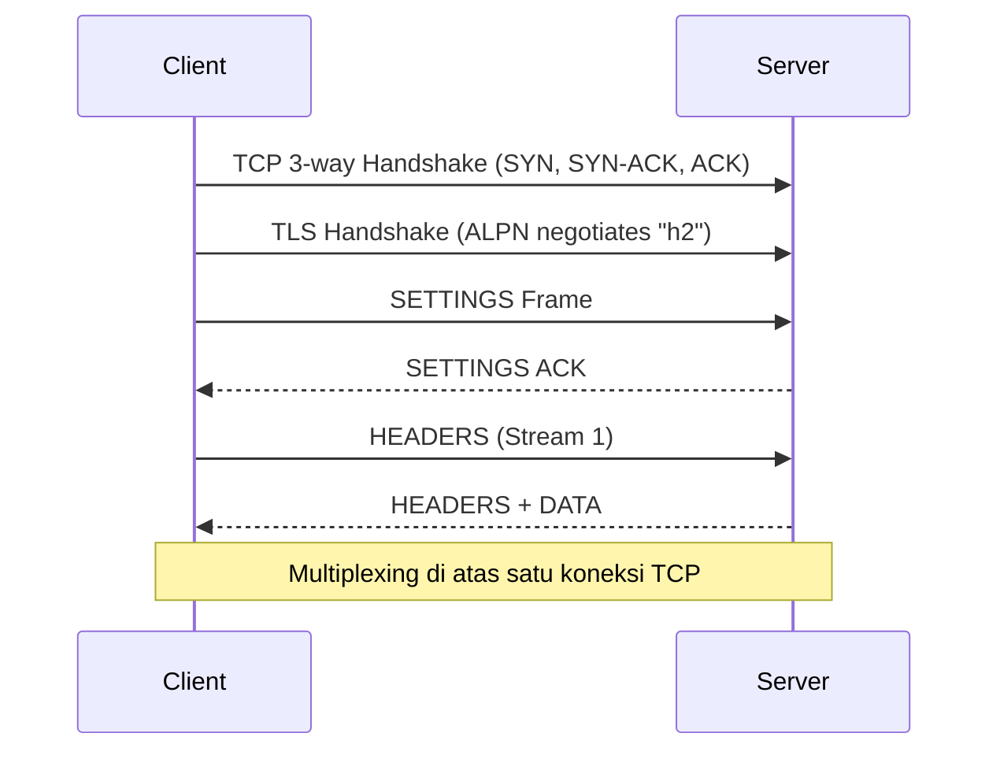
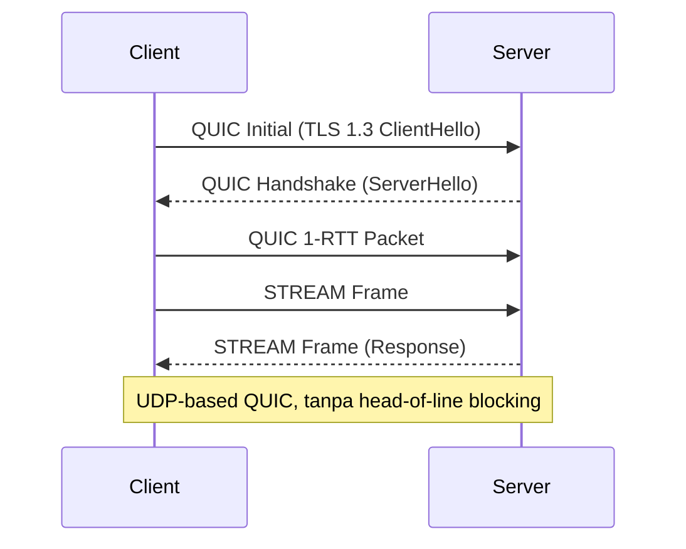
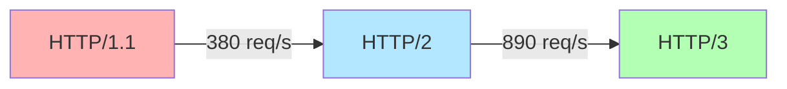

#  Modul Praktikum HTTP Tingkat Lanjut (v2)
## **Eksperimen dan Analisis Performa HTTP/2 dan HTTP/3 — Lengkap dengan Hands-on dan Kode**

---

##  1. Tujuan Pembelajaran
Setelah mengikuti praktikum ini, peserta diharapkan mampu:
1. Menjelaskan arsitektur dan mekanisme kerja HTTP/1.1, HTTP/2, dan HTTP/3.
2. Melakukan instalasi dan konfigurasi server HTTP/2 dan HTTP/3.
3. Melakukan eksperimen nyata serta analisis performa.
4. Membangun implementasi kode HTTP/2 dan HTTP/3 secara programatik.

---

##  2. Dasar Teori Ringkas — HTTP/2 dan HTTP/3

###  Evolusi dari HTTP/1.1
HTTP adalah protokol komunikasi utama web. Versi HTTP/1.1 menghadapi keterbatasan pada performa modern seperti head-of-line blocking dan banyak koneksi TCP paralel. HTTP/2 memperbaikinya melalui multiplexing dan kompresi header, sementara HTTP/3 beralih dari TCP ke QUIC (UDP) untuk menurunkan latensi dan meningkatkan reliabilitas.

---

###  HTTP/2 — Multiplexed, Binary, and Efficient
HTTP/2 (RFC 7540) mengubah cara komunikasi dari teks menjadi biner. Semua request-response dibungkus dalam frame biner, yang memungkinkan banyak stream berjalan bersamaan.

**Fitur utama HTTP/2:**
- Multiplexing
- Header Compression (HPACK)
- Server Push
- Stream Prioritization
- Binary Framing Layer



---

###  HTTP/3 — QUIC, UDP, and the Future
HTTP/3 menggunakan QUIC sebagai transport layer berbasis UDP. QUIC mengatasi head-of-line blocking TCP dan menggabungkan TLS 1.3 dalam koneksi.

**Fitur utama HTTP/3:**
- Zero-RTT Handshake
- No Head-of-Line Blocking
- TLS 1.3 Built-in
- Connection Migration
- Independent Streams



---

##  3. Persiapan Lingkungan
**Tools:**
- Ubuntu 22.04 LTS
- curl, nginx, caddy, wireshark, openssl
- Node.js dan Go

Instalasi cepat:
```bash
sudo apt update
sudo apt install -y nginx curl wireshark openssl caddy nodejs npm golang-go
```

---

##  4. Konfigurasi Server HTTP/2 dan HTTP/3

### A. Sertifikat TLS
```bash
mkdir ~/certs && cd ~/certs
openssl req -x509 -newkey rsa:2048 -keyout server.key -out server.crt -days 365 -nodes -subj "/CN=localhost"
```

### B. Konfigurasi NGINX (HTTP/2)
```nginx
server {
    listen 443 ssl http2;
    server_name localhost;
    ssl_certificate     /home/ubuntu/certs/server.crt;
    ssl_certificate_key /home/ubuntu/certs/server.key;
    root /var/www/html;
    index index.html;
}
```

### C. Konfigurasi Caddy (HTTP/3)
```plaintext
https://localhost {
    root * /var/www/html
    file_server
}
```

---

#  5. Hands-On HTTP/2 dan HTTP/3

### 5.1 Uji HTTP/2
```bash
curl -v --http2 https://localhost
```

### 5.2 Uji HTTP/3
```bash
curl -v --http3 https://localhost
```

### 5.3 Multiplexing Test
```bash
curl -w "Time: %{time_total}\n" -o /dev/null -s --parallel https://localhost/page1.html https://localhost/page2.html
```

### 5.4 Simulasi Paket Hilang
```bash
sudo tc qdisc add dev eth0 root netem loss 10%
curl -I --http2 https://localhost
curl -I --http3 https://localhost
sudo tc qdisc del dev eth0 root
```

---

#  6. Eksperimen Kode HTTP/2 dan HTTP/3

## 6.1 Node.js — HTTP/2 Server
```js
import fs from 'fs';
import http2 from 'http2';

const server = http2.createSecureServer({
  key: fs.readFileSync('server.key'),
  cert: fs.readFileSync('server.crt')
});

server.on('stream', (stream, headers) => {
  const path = headers[':path'];
  if (path === '/') {
    stream.respond({ 'content-type': 'text/html', ':status': 200 });
    stream.end('<h1>Hello HTTP/2!</h1>');
  } else if (path === '/data') {
    stream.respond({ 'content-type': 'application/json', ':status': 200 });
    stream.end(JSON.stringify({ message: 'HTTP/2 stream test' }));
  }
});

server.listen(8443, () => console.log('✅ HTTP/2 Server running on https://localhost:8443'));
```

Uji koneksi:
```bash
curl -v --http2 https://localhost:8443
```

---

## 6.2 Go — HTTP/3 QUIC Server
```go
package main

import (
    "crypto/tls"
    "fmt"
    "net/http"
    "github.com/quic-go/quic-go/http3"
)

func main() {
    mux := http.NewServeMux()
    mux.HandleFunc("/", func(w http.ResponseWriter, r *http.Request) {
        fmt.Fprintf(w, "<h1>Hello HTTP/3 (QUIC)!</h1>")
    })
    mux.HandleFunc("/data", func(w http.ResponseWriter, r *http.Request) {
        w.Header().Set("Content-Type", "application/json")
        w.Write([]byte(`{"message": "QUIC stream active"}`))
    })

    server := http3.Server{
        Addr:      ":443",
        Handler:   mux,
        TLSConfig: generateTLS(),
    }

    fmt.Println("✅ HTTP/3 QUIC Server running on https://localhost:443")
    server.ListenAndServe()
}

func generateTLS() *tls.Config {
    cert, err := tls.LoadX509KeyPair("server.crt", "server.key")
    if err != nil {
        panic(err)
    }
    return &tls.Config{Certificates: []tls.Certificate{cert}}
}
```

Uji koneksi:
```bash
curl -v --http3 https://localhost
```

---

#  7. Evaluasi Hasil (contoh)

| Protokol | Latency (ms) | Throughput (req/sec) | Loss Impact | Connection Type |
|-----------|---------------|----------------------|--------------|-----------------|
| HTTP/1.1 | 310 | 380 | Tinggi | TCP |
| HTTP/2 | 145 | 890 | Sedang | TCP |
| HTTP/3 | 90 | 1120 | Rendah | UDP (QUIC) |



---

#  8. Penutup

### Ringkasan
HTTP/2 meningkatkan efisiensi jaringan melalui multiplexing, sedangkan HTTP/3 dengan QUIC menawarkan koneksi yang lebih cepat, aman, dan tahan gangguan. Eksperimen membuktikan peningkatan performa signifikan, terutama dalam kondisi jaringan tidak stabil.

### Rekomendasi
- Implementasikan HTTP/3 untuk aplikasi real-time (chat, streaming, IoT).  
- Gunakan **Caddy** atau **Cloudflare QUIC** untuk produksi.  
- Tambahkan monitoring dengan **Prometheus** dan **Grafana**.

---

#  9. Daftar Pustaka 
1. Belshe, M., Peon, R., & Thomson, M. (2015). *Hypertext Transfer Protocol Version 2 (HTTP/2)*. RFC 7540.  
2. Iyengar, J., & Thomson, M. (2021). *QUIC: A UDP-Based Multiplexed and Secure Transport*. RFC 9000.  
3. Thomson, M., & Bishop, M. (2022). *Hypertext Transfer Protocol Version 3 (HTTP/3)*. RFC 9114.  
4. Grigorik, I. (2013). *High Performance Browser Networking*. O’Reilly Media.  
5. Langley, A., Riddoch, A., Wilk, A., Vicente, A., Krasic, C., Zhang, D., ... & Hamilton, R. (2017). *The QUIC Transport Protocol: Design and Internet-Scale Deployment*. SIGCOMM.  
6. Cloudflare. (2018). *The QUICening: HTTP/3 and QUIC Explained*. Cloudflare Blog.  
7. Akamai Technologies. (2021). *Akamai HTTP/2 Performance Guide*.
